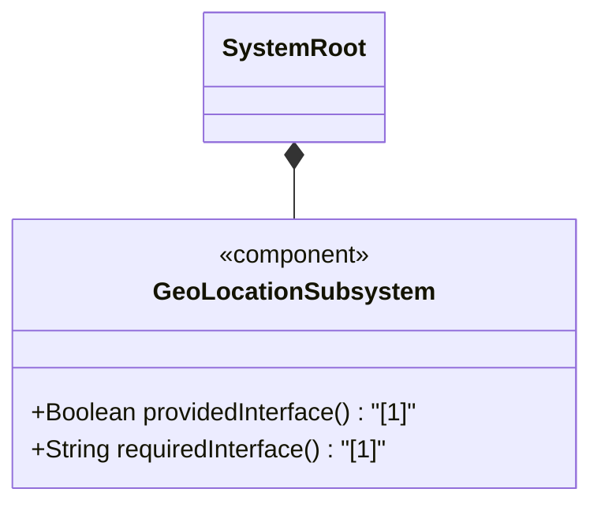
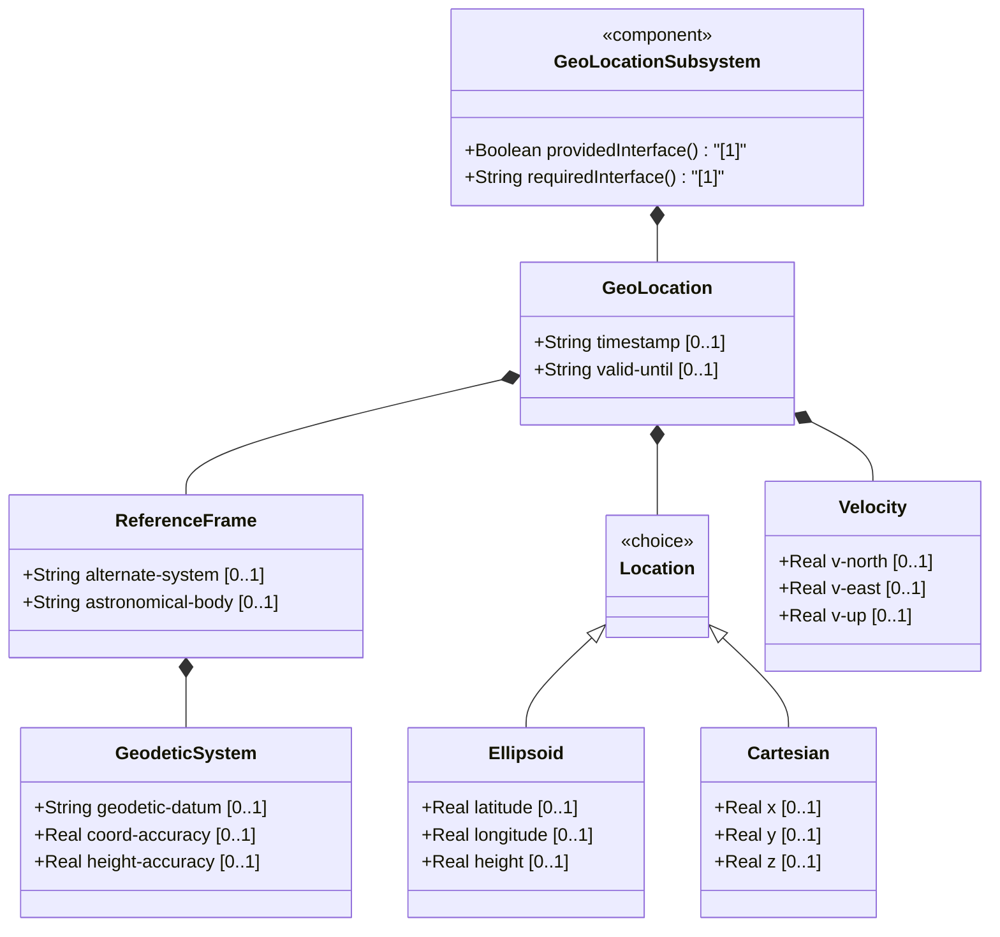
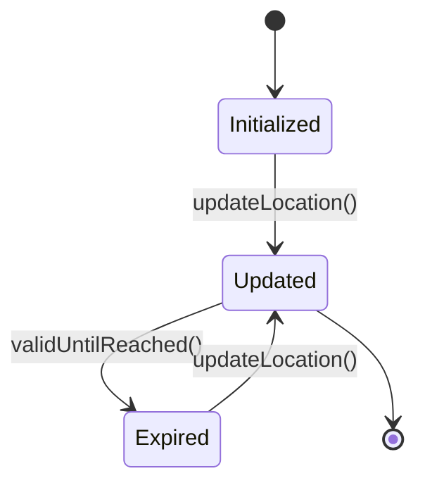

# Epic: IETF Geo Location

## 1. Context
This Epic defines the functional specifications for the `ietf-geo-location` schema module, which provides a standard grouping for specifying a geographic location on or around an astronomical object (e.g., Earth).

## 2. Requirements & Checklist
- [ ] #X - [epic-02-ni-location](https://github.com/gintatkinson/3dgs-032/blob/main/docs/epics/epic-02-ni-location.md) (Prerequisite parent Epic for imported module)
- [ ] #36 - [Parent Epic: epic-02-ni-location](https://github.com/gintatkinson/3dgs-032/blob/main/docs/epics/epic-02-ni-location.md)
- [ ] #1 - [geo-location](https://github.com/gintatkinson/3dgs-032/tree/main/docs/features/feat-06-geo-location-grouping.md) (Container)
- [ ] #2 - [reference-frame](https://github.com/gintatkinson/3dgs-032/tree/main/docs/features/feat-07-reference-frame.md) (Container)
- [ ] #3 - [geodetic-system](https://github.com/gintatkinson/3dgs-032/tree/main/docs/features/feat-08-geodetic-system.md) (Container)
- [ ] #11 - [location](https://github.com/gintatkinson/3dgs-032/tree/main/docs/features/feat-09-location-choice.md) (Choice)
- [ ] #12 - [ellipsoid](https://github.com/gintatkinson/3dgs-032/tree/main/docs/features/feat-10-location-ellipsoid.md) (Case)
- [ ] #14 - [cartesian](https://github.com/gintatkinson/3dgs-032/tree/main/docs/features/feat-11-location-cartesian.md) (Case)
- [ ] #15 - [velocity](https://github.com/gintatkinson/3dgs-032/tree/main/docs/features/feat-12-velocity.md) (Container)
- [ ] #6 - [Geo-Location Timing Attributes](https://github.com/gintatkinson/3dgs-032/blob/main/docs/features/feat-01-geo-location.md) (Realizes Epic component)
- [ ] #8 - [Feature: reference-frame](https://github.com/gintatkinson/3dgs-032/blob/main/docs/features/feat-02-reference-frame.md) (Realizes Epic component)
- [ ] #9 - [Geodetic System](https://github.com/gintatkinson/3dgs-032/blob/main/docs/features/feat-03-geodetic-system.md) (Realizes Epic component)
- [ ] #11 - [Location Choice](https://github.com/gintatkinson/3dgs-032/blob/main/docs/features/feat-04-location-choice.md) (Realizes Epic component)
- [ ] #12 - [Location Ellipsoid](https://github.com/gintatkinson/3dgs-032/blob/main/docs/features/feat-05-location-ellipsoid.md) (Realizes Epic component)
- [ ] #14 - [Location Cartesian](https://github.com/gintatkinson/3dgs-032/blob/main/docs/features/feat-06-location-cartesian.md) (Realizes Epic component)
- [ ] #15 - [Velocity](https://github.com/gintatkinson/3dgs-032/blob/main/docs/features/feat-07-velocity.md) (Realizes Epic component)
- [ ] #TBD - [Geo-Location Timing Attributes](https://github.com/gintatkinson/3dgs-032/blob/main/docs/features/feat-13-geo-location.md) (Provides Geo-Location timing logic)

### Associated Use Cases & User Stories

#### Associated Use Cases
- [ ] #24 - [Geo Location](https://github.com/gintatkinson/3dgs-032/blob/main/docs/use-cases/uc-06-geo-location-grouping.md) (Defines timing interactions for geo-location nodes)
- [ ] #25 - [Configure Reference Frame](https://github.com/gintatkinson/3dgs-032/blob/main/docs/use-cases/uc-07-reference-frame.md) (Defines the configuration of reference frames)
- [ ] #26 - [Geodetic System](https://github.com/gintatkinson/3dgs-032/blob/main/docs/use-cases/uc-08-geodetic-system.md) (Defines interactions with the geodetic system)
- [ ] #27 - [Location Choice](https://github.com/gintatkinson/3dgs-032/blob/main/docs/use-cases/uc-09-location-choice.md) (Defines the selection between coordinate schemes)
- [ ] #28 - [Location Ellipsoid](https://github.com/gintatkinson/3dgs-032/blob/main/docs/use-cases/uc-10-location-ellipsoid.md) (Defines interactions for ellipsoid coordinates)
- [ ] #29 - [Location Cartesian](https://github.com/gintatkinson/3dgs-032/blob/main/docs/use-cases/uc-11-location-cartesian.md) (Defines interactions for Cartesian coordinates)
- [ ] #30 - [Velocity](https://github.com/gintatkinson/3dgs-032/blob/main/docs/use-cases/uc-12-velocity.md) (Defines motion and heading interactions)
- [ ] #43 - [Manage Network Inventory Locations](https://github.com/gintatkinson/3dgs-032/blob/main/docs/use-cases/uc-01-locations.md) (Realizes Epic component)
- [ ] #44 - [Geo-Location (System Interaction)](https://github.com/gintatkinson/3dgs-032/blob/main/docs/use-cases/uc-02-geo-location.md) (Realizes Epic component)

#### Associated User Stories
- [ ] #21 - [Derive Speed and Heading](https://github.com/gintatkinson/3dgs-032/blob/main/docs/user-stories/us-02-derive-speed-and-heading.md) (Supports deriving speed from velocity)
- [ ] #22 - [Temporal Expiration Scenario](https://github.com/gintatkinson/3dgs-032/blob/main/docs/user-stories/us-04-location-expiration.md) (Handles geo-location validity expiration)
- [ ] #23 - [Record Geo-Location Coordinates](https://github.com/gintatkinson/3dgs-032/blob/main/docs/user-stories/us-06-record-geolocation.md) (Saves location choices and coordinates)
- [ ] #39 - [Velocity Conversion to Speed and Heading](https://github.com/gintatkinson/3dgs-032/blob/main/docs/user-stories/us-08-convert-velocity.md) (Realizes Epic component)
- [ ] #37 - [Expire Geo Location Data](https://github.com/gintatkinson/3dgs-032/blob/main/docs/user-stories/us-09-expire-location-data.md) (Realizes Epic component)

## 3. Architecture

### Subsystem Component Definition
Define the subsystem representing the Epic as a UML Component specifying provided/required interfaces and operations.

## System-Level UML Class Diagram

## State Machine Definitions

## System State Machine Diagram

## 4. Operational Considerations
The geo-location module models geographic coordinates or cartesian coordinates, which can expire or update asynchronously. Implementations should account for datum variations (WGS-84, etc) and alternate-system semantics.

## 5. Security & Governance
Position information can be highly sensitive. Access control mechanisms must restrict who can query or subscribe to geo-location models. Proper masking should be applied based on security profiles.

## Specification Context
This module defines a grouping of a container object for specifying a location on or around an astronomical object (e.g., 'earth').

## 6. Source References
Structural Schema: [ietf-geo-location@2022-02-11.yang](https://github.com/gintatkinson/3dgs-032/blob/main/standard/ietf/RFC/ietf-geo-location%402022-02-11.yang) (Clause: N/A)
Normative Specification: RFC 9179 (Clause: N/A)
