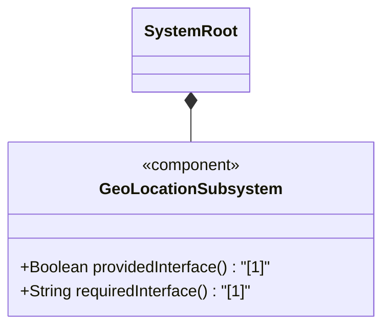
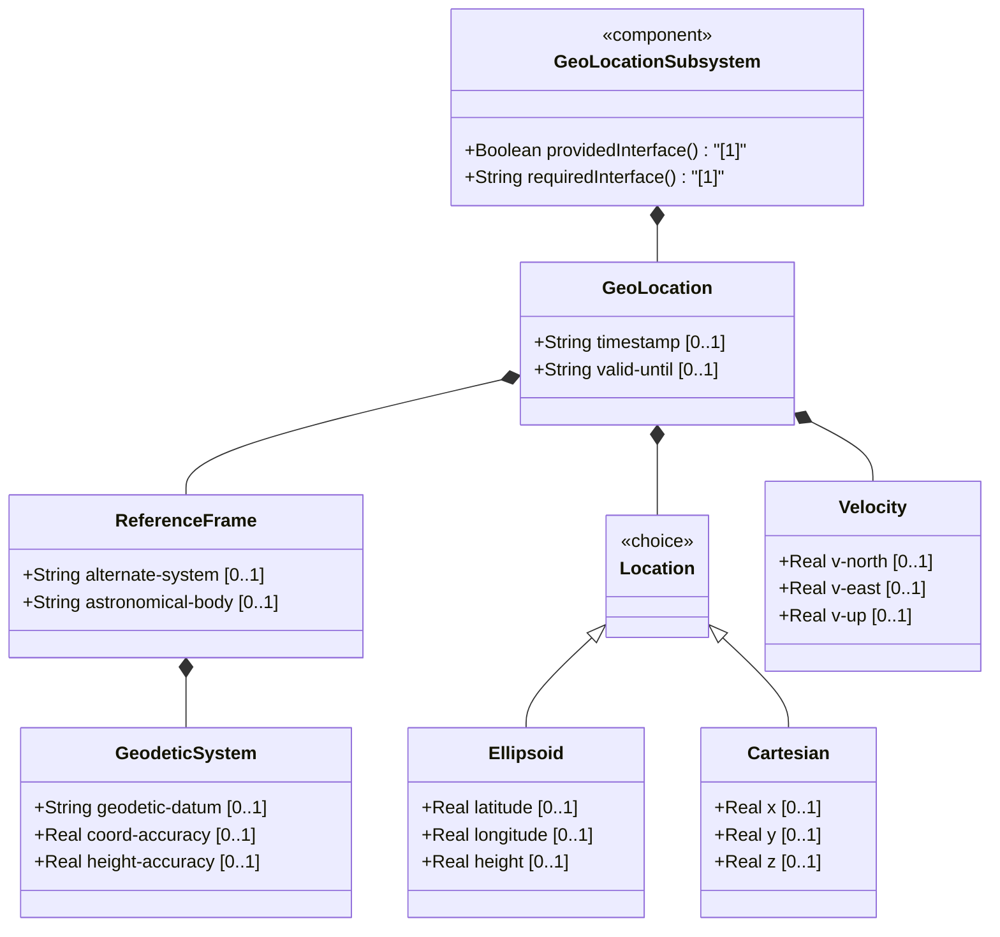
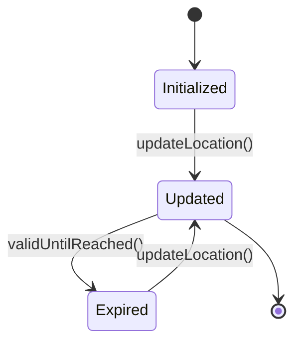

# Epic: IETF Geo Location

## 1. Context
This Epic defines the functional specifications for the `ietf-geo-location` schema module, which provides a standard grouping for specifying a geographic location on or around an astronomical object (e.g., Earth).

## 2. Requirements & Checklist
- [ ] #1 - [geo-location](https://github.com/gintatkinson/3dgs-032/tree/main/docs/features/feat-01-geo-location.md) (Container)
- [ ] #2 - [reference-frame](https://github.com/gintatkinson/3dgs-032/tree/main/docs/features/feat-02-reference-frame.md) (Container)
- [ ] #3 - [geodetic-system](https://github.com/gintatkinson/3dgs-032/tree/main/docs/features/feat-03-geodetic-system.md) (Container)
- [ ] #11 - [location](https://github.com/gintatkinson/3dgs-032/tree/main/docs/features/feat-04-location-choice.md) (Choice)
- [ ] #12 - [ellipsoid](https://github.com/gintatkinson/3dgs-032/tree/main/docs/features/feat-05-location-ellipsoid.md) (Case)
- [ ] #14 - [cartesian](https://github.com/gintatkinson/3dgs-032/tree/main/docs/features/feat-06-location-cartesian.md) (Case)
- [ ] #15 - [velocity](https://github.com/gintatkinson/3dgs-032/tree/main/docs/features/feat-07-velocity.md) (Container)

### Associated Use Cases & User Stories

#### Associated Use Cases
- [ ] #ID - [Track Astronomical Object](https://github.com/gintatkinson/3dgs-032/tree/main/docs/use-cases/uc-01-track-astronomical-object.md) (Maintain location history and predict trajectories)
- [ ] #[IssueID] - [Geo Location](https://github.com/gintatkinson/3dgs-032/blob/main/docs/use-cases/uc-01-geo-location.md) (semantic linkage justification)
- [ ] #[IssueID] - [Configure Reference Frame](https://github.com/gintatkinson/3dgs-032/blob/main/docs/use-cases/uc-02-reference-frame.md) (semantic linkage justification)
- [ ] #[IssueID] - [Geodetic System](https://github.com/gintatkinson/3dgs-032/blob/main/docs/use-cases/uc-03-geodetic-system.md) (semantic linkage justification)
- [ ] #[IssueID] - [Location Choice](https://github.com/gintatkinson/3dgs-032/blob/main/docs/use-cases/uc-04-location-choice.md) (semantic linkage justification)
- [ ] #[IssueID] - [Location Ellipsoid](https://github.com/gintatkinson/3dgs-032/blob/main/docs/use-cases/uc-05-location-ellipsoid.md) (semantic linkage justification)
- [ ] #[IssueID] - [Location Cartesian](https://github.com/gintatkinson/3dgs-032/blob/main/docs/use-cases/uc-06-location-cartesian.md) (semantic linkage justification)
- [ ] #[IssueID] - [Velocity](https://github.com/gintatkinson/3dgs-032/blob/main/docs/use-cases/uc-07-velocity.md) (semantic linkage justification)

#### Associated User Stories
- [ ] #ID - [Update Current Location](https://github.com/gintatkinson/3dgs-032/tree/main/docs/user-stories/us-01-update-current-location.md) (Allow updating location variables correctly for a specified datum)
- [ ] #21 - [Derive Speed and Heading](https://github.com/gintatkinson/3dgs-032/blob/main/docs/user-stories/us-01-derive-speed-and-heading.md) (semantic linkage justification)
- [ ] #22 - [Temporal Expiration Scenario](https://github.com/gintatkinson/3dgs-032/blob/main/docs/user-stories/us-02-location-expiration.md) (semantic linkage justification)
- [ ] #23 - [Record Geo-Location Coordinates](https://github.com/gintatkinson/3dgs-032/blob/main/docs/user-stories/us-03-record-geolocation.md) (semantic linkage justification)

## 3. Architecture

### Subsystem Component Definition
Define the subsystem representing the Epic as a UML Component specifying provided/required interfaces and operations.

## System-Level UML Class Diagram

## State Machine Definitions

## System State Machine Diagram

## 4. Operational Considerations
The geo-location module models geographic coordinates or cartesian coordinates, which can expire or update asynchronously. Implementations should account for datum variations (WGS-84, etc) and alternate-system semantics.

## 5. Security & Governance
Position information can be highly sensitive. Access control mechanisms must restrict who can query or subscribe to geo-location models. Proper masking should be applied based on security profiles.

## Specification Context
This module defines a grouping of a container object for specifying a location on or around an astronomical object (e.g., 'earth').

## 6. Source References
Structural Schema: [ietf-geo-location@2022-02-11.yang](https://github.com/gintatkinson/3dgs-032/blob/main/schema/ietf-geo-location@2022-02-11.yang) (Clause: N/A)
Normative Specification: RFC 9179 (Clause: N/A)
