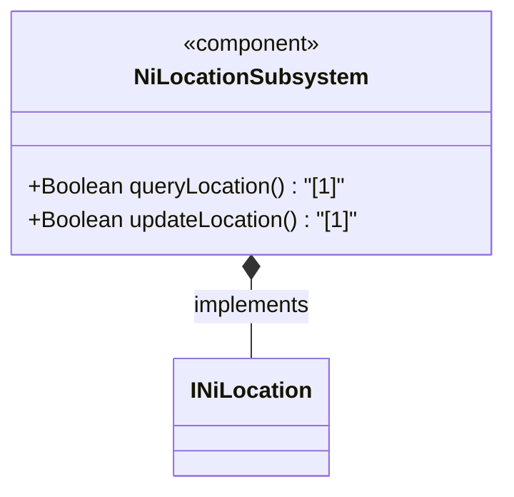
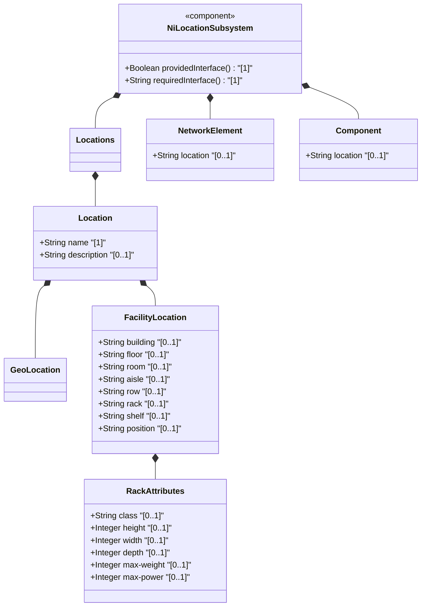
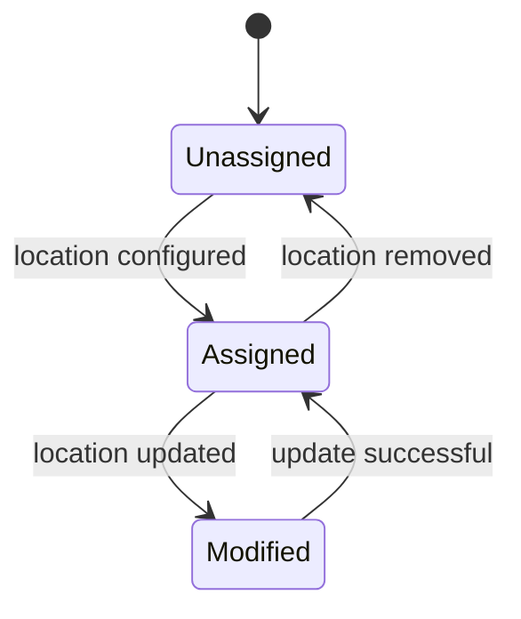

# Epic: Network Inventory Location

## 1. Context
This Epic defines the functional specification for adding physical and geographical location data to a network inventory. It covers the `ietf-ni-location` YANG module, which augments network inventory with locations, geographic coordinates, facility-specific details, and associates network elements and components with these locations.

## 2. Requirements & Checklist
- [ ] #31 - [Network Inventory Locations Container](https://github.com/gintatkinson/3dgs-032/blob/main/docs/features/feat-01-locations.md)
- [ ] #32 - [Location Geographic Coordinates](https://github.com/gintatkinson/3dgs-032/blob/main/docs/features/feat-02-geo-location.md) (Geographic location container)
- [ ] #33 - [Location Facility Information](https://github.com/gintatkinson/3dgs-032/blob/main/docs/features/feat-03-facility-location.md) (Facility location and rack attributes)
- [ ] #35 - [Network Element Location Association](https://github.com/gintatkinson/3dgs-032/blob/main/docs/features/feat-05-ne-location.md) (Network element location augment)
- [ ] #34 - [Component Location Association](https://github.com/gintatkinson/3dgs-032/blob/main/docs/features/feat-04-rack-attributes.md) (Component location augment)
- [ ] #31 - [Locations Feature](https://github.com/gintatkinson/3dgs-032/blob/main/docs/features/feat-08-locations.md) (Realizes Epic component)
- [ ] #32 - [Feature: Geo Location](https://github.com/gintatkinson/3dgs-032/blob/main/docs/features/feat-09-ni-geo-location.md) (Realizes Epic component)
- [ ] #33 - [Facility Location](https://github.com/gintatkinson/3dgs-032/blob/main/docs/features/feat-10-facility-location.md) (Realizes Epic component)
- [ ] #34 - [Rack Attributes](https://github.com/gintatkinson/3dgs-032/blob/main/docs/features/feat-11-rack-attributes.md) (Realizes Epic component)
- [ ] #35 - [Network Element and Component Location Augments](https://github.com/gintatkinson/3dgs-032/blob/main/docs/features/feat-12-ne-location.md) (Realizes Epic component)

### Associated Use Cases & User Stories

#### Associated Use Cases
- [x] #1 - Manage Network Inventory Locations (https://github.com/repo/blob/main/docs/use-cases/uc-01-manage-locations.md)
- [ ] #43 - [Manage Network Inventory Locations](https://github.com/gintatkinson/3dgs-032/blob/main/docs/use-cases/uc-01-locations.md) (Realizes Epic component)
- [ ] #44 - [Geo-Location (System Interaction)](https://github.com/gintatkinson/3dgs-032/blob/main/docs/use-cases/uc-02-geo-location.md) (Realizes Epic component)
- [ ] #45 - [Facility Location](https://github.com/gintatkinson/3dgs-032/blob/main/docs/use-cases/uc-03-facility-location.md) (Realizes Epic component)
- [ ] #46 - [Rack Attributes](https://github.com/gintatkinson/3dgs-032/blob/main/docs/use-cases/uc-04-rack-attributes.md) (Realizes Epic component)
- [ ] #47 - [Assign Location to Network Element](https://github.com/gintatkinson/3dgs-032/blob/main/docs/use-cases/uc-05-ne-location.md) (Realizes Epic component)
- [ ] #50 - [Components](https://github.com/gintatkinson/3dgs-032/blob/main/docs/use-cases/uc-16-components.md) (semantic linkage justification)
- [ ] #45 - [Facility Location](https://github.com/gintatkinson/3dgs-032/blob/main/docs/use-cases/uc-18-facility-location.md) (semantic linkage justification)
- [ ] #[IssueID] - [Manage Network Elements](https://github.com/gintatkinson/3dgs-032/blob/main/docs/use-cases/uc-99-network-elements.md) (semantic linkage justification)

#### Associated User Stories
- [x] #1 - As an operator, I want to assign a physical location to a network element (https://github.com/repo/blob/main/docs/user-stories/us-01-assign-ne-location.md)
- [ ] #38 - [Assign Facility Location](https://github.com/gintatkinson/3dgs-032/blob/main/docs/user-stories/us-07-assign-facility-location.md) (Realizes Epic component)
- [ ] #37 - [Expire Geo Location Data](https://github.com/gintatkinson/3dgs-032/blob/main/docs/user-stories/us-09-expire-location-data.md) (Realizes Epic component)

## 3. Architecture

### Subsystem Component Definition
Define the subsystem representing the Epic as a UML Component specifying provided/required interfaces and operations.

## System-Level UML Class Diagram

## State Machine Definitions

## System State Machine Diagram

## 4. Operational Considerations
Locations must be accurately maintained to ensure physical operations and maintenance tasks can be correctly routed. Rack attributes (height, width, depth, weight, power) are critical for data center capacity planning and operational safety.

## 5. Security & Governance
Physical rack security is classified using identity references such as `rack-standard`, `rack-secure-baseline`, `rack-secure-medium`, and `rack-secure-high`. Access to view or modify location data within the inventory system should be restricted to authorized users according to governance policies.

## Specification Context
"This YANG module defines a model for Network Inventory location."
"Augment the network inventory with a list of locations."
"Augment the network element with a location reference."
"Augment the component with a location reference."

## 6. Source References
Structural Schema: [ietf-ni-location.yang](schema/ietf-ni-location.yang) (Clause: N/A)
Normative Specification: RFC XXXX: A YANG Data Model for Network Inventory location. (Clause: N/A)

