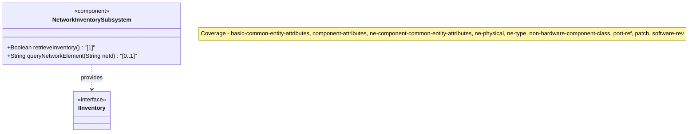
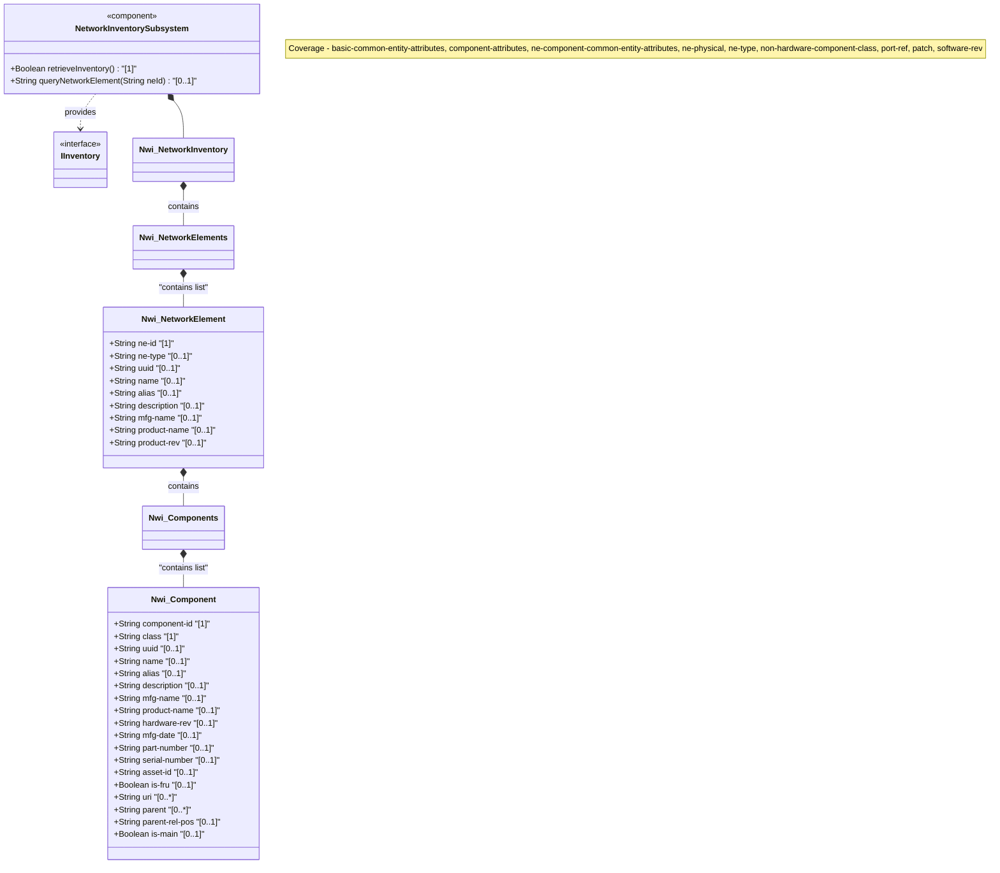
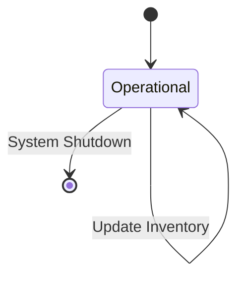

# Epic: Network Inventory Bounded Context

## 1. Context
This Bounded Context defines a base model for retrieving network inventory, conforming to the Network Management Datastore Architecture (NMDA). It specifies the top-level container for network inventory, network elements, and their hierarchically nested hardware and non-hardware components.

## 2. Requirements & Checklist
- [ ] #TBD - [Parent Epic: epic-01-geo-location.md](https://github.com/gintatkinson/digital-pipeline-repo/blob/main/docs/epics/epic-01-geo-location.md) (Prerequisite parent Epic for imported module)
- [ ] #51 - [Feature: Network Inventory (network-inventory)](https://github.com/gintatkinson/digital-pipeline-repo/blob/main/docs/features/feat-14-network-inventory.md)
- [ ] #54 - [Feature: Network Elements (network-elements)](https://github.com/gintatkinson/digital-pipeline-repo/blob/main/docs/features/feat-15-network-elements.md)
- [ ] #57 - [Feature: Components (components)](https://github.com/gintatkinson/digital-pipeline-repo/blob/main/docs/features/feat-16-components.md)
- [ ] #58 - [Feature: Software Revision (software-rev)](https://github.com/gintatkinson/digital-pipeline-repo/blob/main/docs/features/feat-17-software-rev.md)
- [ ] #59 - [Feature: Software Patch (patch)](https://github.com/gintatkinson/digital-pipeline-repo/blob/main/docs/features/feat-18-patch.md)

### Associated Use Cases & User Stories

#### Associated Use Cases
- [ ] #TBD - [Retrieve Network Inventory](https://github.com/gintatkinson/digital-pipeline-repo/blob/main/docs/use-cases/uc-retrieve-inventory.md)

#### Associated User Stories
- [ ] #TBD - [View Network Elements](https://github.com/gintatkinson/digital-pipeline-repo/blob/main/docs/user-stories/us-view-network-elements.md)

## 3. Architecture

### Subsystem Component Definition
Define the subsystem representing the Epic as a UML Component specifying provided/required interfaces and operations.

## System-Level UML Class Diagram

## State Machine Definitions

## System State Machine Diagram

## 4. Operational Considerations
The network inventory model is operational state and read-only. The inventory may grow significantly in size, so paging, filtering, and efficient retrieval mechanisms should be implemented. Data synchronization with physical devices should be managed to prevent stale representations.

## 5. Security & Governance
Access to inventory information requires proper authentication and authorization. MAC addresses, serial numbers, and physical coordinates might be considered sensitive or identifiable information and subject to role-based access control and network slice access policies.

## Specification Context
This module defines a base model for retrieving network inventory.
The model fully conforms to the Network Management Datastore Architecture (NMDA).

## 6. Source References
Structural Schema: [ietf-network-inventory.yang](file:///Users/perkunas/jail/3dgs-032/schema/ietf-network-inventory.yang) (Clause: N/A)
Normative Specification: [draft-ietf-ivy-network-inventory-yang](https://datatracker.ietf.org/doc/html/draft-ietf-ivy-network-inventory-yang) (Clause: N/A)
