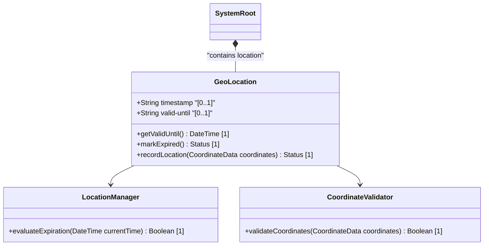

# Feature: Geo-Location Timing Attributes

## Parent Epic
- [ ] #5 - [epic-01-geo-location](https://github.com/gintatkinson/3dgs-032/tree/main/docs/epics/epic-01-geo-location.md) (Contains the timing attributes for geo-location)

## Description
This feature specifies the timing and expiration attributes (`timestamp` and `valid-until`) for a location on an astronomical body. These attributes indicate when a geo-location was recorded and when it expires.

## UML Class Diagram


## Interface Requirements

### 1. Test Data Shape
```json
{
  "timestamp": "2026-08-01T13:38:00+08:00",
  "valid-until": "2026-08-02T13:38:00+08:00"
}
```

### 2. Validation & Constraints
- `timestamp`: Must be a valid `yang:date-and-time` string format.
- `valid-until`: Must be a valid `yang:date-and-time` string format. If unspecified, the geo-location has no specific expiration time.

### 3. Visual Layout & Arrangement
- The timing attributes should be presented in a details panel or property table.
- Enforce CSS resets (box-sizing), scoped naming (CSS Modules/BEM) to avoid specificity conflicts, layout containment parameters (restricting containment to outer layout splitters and forbidding it on scrollable child panels).
- Valid DOM nesting for tree structures must be observed.

### 4. Interactive Flow & States
- Provide clear read-only visual representation for timing values.
- If in an editable context, mandate computed-style assertions (such as verifying scroll dimensions or highlight colors) in the test guidelines for visual or active selection states.

## Given-When-Then Acceptance Criteria

**Scenario 1: Viewing a location with a timestamp and expiration**
- **Given** a geo-location record exists with a `timestamp` and a `valid-until` time
- **When** the user views the geo-location details
- **Then** the interface displays both the recorded time and the expiration time

**Scenario 2: Viewing a location without an expiration**
- **Given** a geo-location record exists with a `timestamp` but no `valid-until` time
- **When** the user views the geo-location details
- **Then** the interface indicates the location has no specific expiration time

## Specification Context (Verbatim)
timestamp:
  Reference time when location was recorded.

valid-until:
  The timestamp for which this geo-location is valid until.
  If unspecified, the geo-location has no specific
  expiration time.

## Source References
Structural Schema: [ietf-geo-location@2022-02-11.yang](file:///Users/perkunas/jail/3dgs-032/schema/ietf-geo-location@2022-02-11.yang) (Clause: geo-location)
Normative Specification: [RFC 9179](https://www.rfc-editor.org/info/rfc9179) (Clause: 6.1)

## Logical UI & Layout Bindings
- **Target LUI Component:** PropertyGrid
- **Target Layout Container ID:** properties_view
- **Data Source Bindings:** /ietf-geo-location:geo-location
