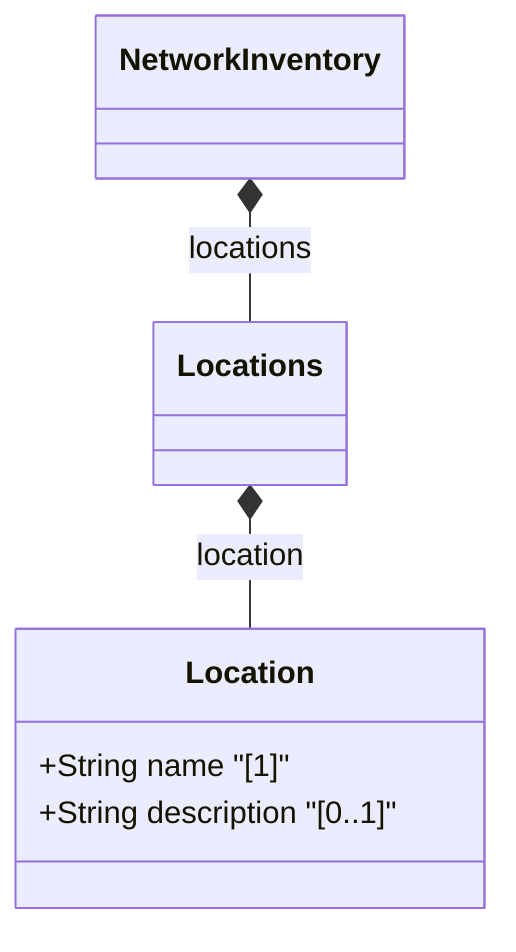

# Feature: Locations Feature

## Parent Epic
- [ ] #36 - [Network Inventory Location](https://github.com/gintatkinson/3dgs-032/blob/main/docs/epics/epic-01-ni-location.md) (semantic linkage: parent bounded context)

## Description
This feature provides the capability to manage a list of locations within the network inventory. It includes the `locations` container and the `location` list, which records the basic attributes of a location such as its unique name and textual description.

## UML Class Diagram


## Interface Requirements

<!-- For UI Interfaces (interface_type: ui) -->
### 1. Test Data Shape
```json
{
  "locations": {
    "location": [
      {
        "name": "LOC-001",
        "description": "Primary Data Center"
      }
    ]
  }
}
```

### 2. Validation & Constraints
- `name`: Must be a unique string serving as the key for the location list.
- `description`: Optional textual description of the location.

### 3. Visual Layout & Arrangement
- The locations list is displayed in a table view representing the network inventory locations.
- The layout must use CSS resets (box-sizing), scoped naming (CSS Modules/BEM) to avoid specificity conflicts, layout containment parameters (restricting containment to outer layout splitters and forbidding it on scrollable child panels), and valid DOM nesting for tree structures (recursive lists nested inside parent list-items).

### 4. Interactive Flow & States
- The table should support read-only viewing of locations.
- Selecting a location row should highlight the item.
- Mandate computed-style assertions (such as verifying scroll dimensions or highlight colors) in the test guidelines for visual or active selection states.

## Given-When-Then Acceptance Criteria
- **Given** the network inventory system is initialized
- **When** the locations list is queried
- **Then** the system should return the list of locations with their `name` and `description` attributes

## Specification Context (Verbatim)
```text
  augment "/nwi:network-inventory" {
    description
      "Augment the network inventory with a list of locations.";
    container locations {
      description
        "A container for a list of locations.";
      list location {
        key "name";
        description
          "A list of locations.";
...
    leaf name {
      type string;
      description
        "A unique name for the location.";
    }
    leaf description {
      type string;
      description
        "A textual description of the location.";
    }
```

## Source References
Structural Schema: [ietf-ni-location.yang](file:///Users/perkunas/jail/3dgs-032/schema/ietf-ni-location.yang) (Clause: augment "/nwi:network-inventory")
Normative Specification: [RFC XXXX](https://datatracker.ietf.org/doc/draft-ietf-ivy-network-inventory-location/) (Clause: N/A)

## Logical UI & Layout Bindings
- **Target LUI Component:** TableView
- **Target Layout Container ID:** components_table
- **Data Source Bindings:** /nwi:network-inventory/nil:locations/nil:location

> [!WARNING]
> **Mermaid Block Closing Constraints & Code Fence Integrity:**
> - Every Mermaid diagram MUST be strictly closed with ```` ``` ```` on a new line. Leaking Mermaid blocks (e.g. having headings like `##` inside an unclosed diagram) or stray/unclosed code fences will fail downstream validation checks.
> - Ensure there are no stray backticks or unmatched code fences in the document.
> - **All Mermaid syntax constraints are defined in `rules/platform-independence.md` and MUST be observed in full** — including the prohibition on curly braces in class member lines, colons in class members and note strings, stereotypes on relationship lines, and semicolons in `Note` and message text. Do not maintain a local subset here; subsets drift (issue #289).
