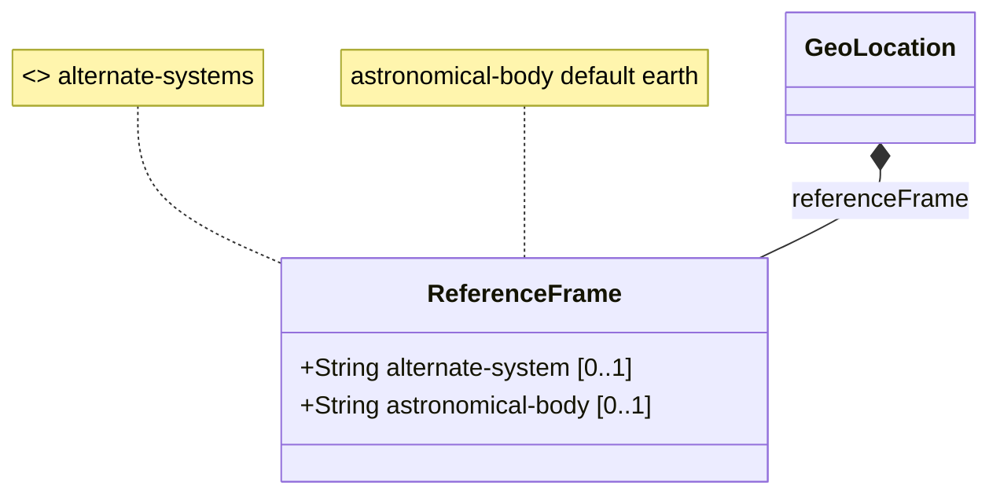

# Feature: reference-frame

## Parent Epic
- [ ] #5 - [Geo Location Epic](https://github.com/gintatkinson/3dgs-032/tree/main/docs/epics/epic-02-geo-location.md) (Defines the reference frame subsystem context)

## Description
The Frame of Reference for the location values.

## UML Class Diagram


## Interface Requirements

### 1. Test Data Shape
```json
{
  "alternate-system": "my-custom-system",
  "astronomical-body": "earth"
}
```

### 2. Validation & Constraints
- `alternate-system`: Optional string. Conditioned on feature guard `alternate-systems`.
- `astronomical-body`: Optional string. Pattern constraint `[ -@\\[-\\^_-~]*`. Default value is `earth`.

### 3. Visual Layout & Arrangement
- The reference frame data should be displayed in a property grid or details panel.
- Enforce CSS resets (box-sizing), scoped naming (CSS Modules/BEM) to avoid specificity conflicts.
- Implement layout containment parameters (restricting containment to outer layout splitters and forbidding it on scrollable child panels).
- Ensure valid DOM nesting for tree structures.

### 4. Interactive Flow & States
- Fields are generally read-only in telemetry views but may be editable during configuration.
- Appropriate error states must be displayed if the pattern constraint for `astronomical-body` is violated.
- Mandate computed-style assertions (such as verifying scroll dimensions or highlight colors) in the test guidelines for visual or active selection states.

## Given-When-Then Acceptance Criteria
- **Given** a location requires a reference frame, **When** the reference frame is queried, **Then** the `astronomical-body` must default to `earth` if not explicitly provided.
- **Given** a reference frame is instantiated, **When** `astronomical-body` is set, **Then** it must pass the pattern constraint `[ -@\\[-\\^_-~]*`.
- **Given** a reference frame is instantiated, **When** `alternate-system` is set, **Then** it must be accepted only if the `alternate-systems` feature guard is active.

## Specification Context (Verbatim)
The Frame of Reference for the location values.
The `alternate-system` is the system in which the astronomical body and geodetic-datum is defined.
The `astronomical-body` is an astronomical body as named by the International Astronomical Union.

## Source References
Structural Schema: [ietf-geo-location@2022-02-11.yang](https://github.com/gintatkinson/3dgs-032/blob/main/schema/ietf-geo-location@2022-02-11.yang) (Clause: N/A)
Normative Specification: [RFC 9179](https://datatracker.ietf.org/doc/html/rfc9179) (Clause: N/A)

## Logical UI & Layout Bindings
- **Target LUI Component:** PropertyGrid
- **Target Layout Container ID:** properties_view
- **Data Source Bindings:** /ietf-geo-location:geo-location/ietf-geo-location:reference-frame
