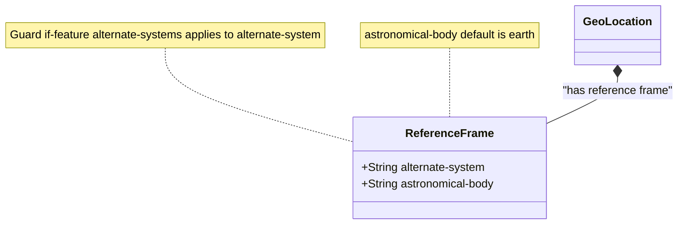

# Feature: Reference Frame

## Parent Epic
- [ ] #000 - [Geo Location Epic](https://github.com/gintatkinson/3dgs-032/tree/main/docs/epics/epic-01-geo-location.md) (Defines the reference frame subsystem context)

## Description
This feature specifies the Frame of Reference for the location values, including the astronomical body and the ability to define alternate systems.

## UML Class Diagram


## Interface Requirements

### 1. Test Data Shape
```json
{
  "alternate-system": "virtual-reality-1",
  "astronomical-body": "earth"
}
```

### 2. Validation & Constraints
- `alternate-system`: Optional string. The system in which the astronomical body and geodetic-datum is defined. Conditionally present if `alternate-systems` feature is supported.
- `astronomical-body`: Optional string.
  - Pattern: `[ -@\[-\^_-~]*`
  - Default: `earth`
  - Constraints: The ASCII value SHOULD have uppercase converted to lowercase and not include control characters (values 32..64, and 91..126). Any preceding 'the' in the name SHOULD NOT be included.

### 3. Visual Layout & Arrangement
- Provide a standard property panel to display reference frame values.
- Enforce CSS resets (box-sizing), scoped naming (CSS Modules/BEM) to avoid specificity conflicts, layout containment parameters (restricting containment to outer layout splitters and forbidding it on scrollable child panels), and valid DOM nesting for tree structures (recursive lists nested inside parent list-items).

### 4. Interactive Flow & States
- If the `alternate-systems` feature is not active, `alternate-system` should not be editable or displayed.
- Mandate computed-style assertions (such as verifying scroll dimensions or highlight colors) in the test guidelines for visual or active selection states.

## Given-When-Then Acceptance Criteria

**Scenario: Configure Astronomical Body**
- **Given** the user is viewing the reference frame configuration
- **When** the user inputs an astronomical body like "moon"
- **Then** the system validates it against the character pattern constraint and accepts it

**Scenario: Default Astronomical Body Fallback**
- **Given** the reference frame is initialized without an explicit astronomical body
- **When** the system resolves the value
- **Then** it defaults to "earth"

## Specification Context (Verbatim)
"The Frame of Reference for the location values.
The system in which the astronomical body and geodetic-datum is defined. Normally, this value is not present and the system is the natural universe; however, when present, this value allows for specifying alternate systems (e.g., virtual realities). An alternate-system modifies the definition (but not the type) of the other values in the reference frame.
An astronomical body as named by the International Astronomical Union (IAU) or according to the alternate system if specified. Examples include 'sun' (our star), 'earth' (our planet), 'moon' (our moon), 'enceladus' (a moon of Saturn), 'ceres' (an asteroid), and '67p/churyumov-gerasimenko (a comet). The ASCII value SHOULD have uppercase converted to lowercase and not include control characters (i.e., values 32..64, and 91..126). Any preceding 'the' in the name SHOULD NOT be included."

## Source References
Structural Schema: [ietf-geo-location@2022-02-11.yang](file:///Users/perkunas/jail/3dgs-032/schema/ietf-geo-location@2022-02-11.yang) (Clause: geo-location/reference-frame)
Normative Specification: [RFC 9179](https://www.rfc-editor.org/info/rfc9179) (Clause: Section 6.1)

## Logical UI & Layout Bindings
- **Target LUI Component:** PropertyGrid
- **Target Layout Container ID:** properties_view
- **Data Source Bindings:** 
  - `/ietf-geo-location:geo-location/ietf-geo-location:reference-frame`
