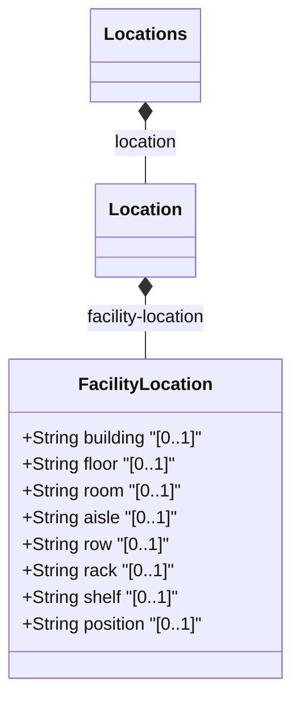

# Feature: Facility Location

## Parent Epic
- [ ] #36 - [Network Inventory Location](https://github.com/gintatkinson/3dgs-032/blob/main/docs/epics/epic-01-ni-location.md) (semantic linkage: parent bounded context)

## Description
This feature defines the facility-specific location information for a network inventory location. It provides attributes to describe the physical placement within a facility, such as the building, floor, room, aisle, row, rack, shelf, and position.

## UML Class Diagram


## Interface Requirements

### 1. Test Data Shape
```json
{
  "building": "HQ",
  "floor": "1",
  "room": "Server Room A",
  "aisle": "A1",
  "row": "R1",
  "rack": "Rack-42",
  "shelf": "Shelf-3",
  "position": "U12"
}
```

### 2. Validation & Constraints
- `building`: String. The building name or identifier.
- `floor`: String. The floor number or identifier.
- `room`: String. The room name or identifier.
- `aisle`: String. The aisle identifier.
- `row`: String. The row identifier.
- `rack`: String. The rack identifier.
- `shelf`: String. The shelf identifier.
- `position`: String. The position within the rack or shelf.

### 3. Visual Layout & Arrangement
- Abstract grouping: Display the facility location fields in a properties view or a dedicated form layout.
- Use scoped naming (CSS Modules/BEM) to avoid specificity conflicts.
- Implement CSS resets (box-sizing) and valid DOM nesting.
- Avoid nesting scrollable child panels within layout splitters.

### 4. Interactive Flow & States
- Read-only state: Display fields as simple text labels.
- Edit state: Provide text input fields for each attribute.
- Mandate computed-style assertions in test guidelines for highlight colors during active selection.

## Given-When-Then Acceptance Criteria

**Scenario:** View facility location information
- **Given** a network location with facility details is configured
- **When** the user accesses the location details view
- **Then** the building, floor, room, aisle, row, rack, shelf, and position are displayed correctly

**Scenario:** Edit facility location information
- **Given** the user has edit permissions for a network location
- **When** the user updates the facility location fields
- **Then** the system validates the inputs as strings and saves the updated facility location

## Specification Context (Verbatim)
Grouping for facility-specific location information.
- building: The building name or identifier.
- floor: The floor number or identifier.
- room: The room name or identifier.
- aisle: The aisle identifier.
- row: The row identifier.
- rack: The rack identifier.
- shelf: The shelf identifier.
- position: The position within the rack or shelf.

## Source References
Structural Schema: [ietf-ni-location.yang](file:///Users/perkunas/jail/3dgs-032/schema/ietf-ni-location.yang) (Clause: facility-location)
Normative Specification: [RFC 9179](https://datatracker.ietf.org/doc/rfc9179/) (Clause: facility-location)

## Logical UI & Layout Bindings
- **Target LUI Component:** TableView
- **Target Layout Container ID:** components_table
- **Data Source Bindings:**
  - `/nwi:network-inventory/nil:locations/nil:location/nil:facility-location/nil:building`
  - `/nwi:network-inventory/nil:locations/nil:location/nil:facility-location/nil:floor`
  - `/nwi:network-inventory/nil:locations/nil:location/nil:facility-location/nil:room`
  - `/nwi:network-inventory/nil:locations/nil:location/nil:facility-location/nil:aisle`
  - `/nwi:network-inventory/nil:locations/nil:location/nil:facility-location/nil:row`
  - `/nwi:network-inventory/nil:locations/nil:location/nil:facility-location/nil:rack`
  - `/nwi:network-inventory/nil:locations/nil:location/nil:facility-location/nil:shelf`
  - `/nwi:network-inventory/nil:locations/nil:location/nil:facility-location/nil:position`
