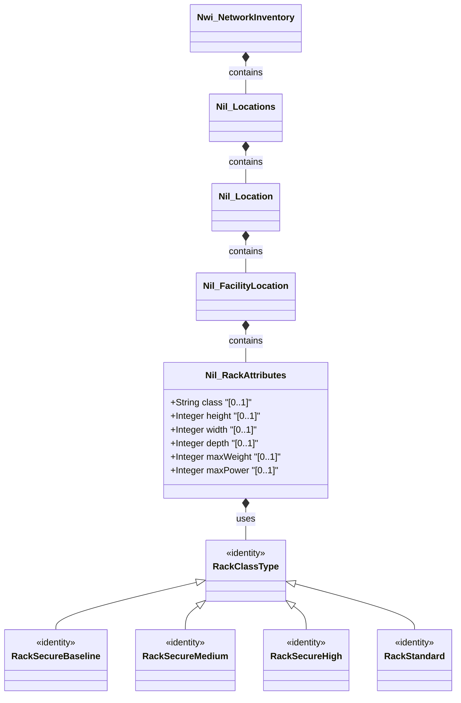

# Feature: Rack Attributes

## Parent Epic
- [ ] #36 - [Network Inventory Location](https://github.com/gintatkinson/3dgs-032/blob/main/docs/epics/epic-01-ni-location.md) (semantic linkage: parent bounded context)

## Description
This feature specifies the rack attributes for a facility location within the network inventory. It includes physical dimensions such as height, width, and depth, as well as operational constraints like maximum weight and maximum power capacity. It also specifies the physical security classification of the rack.

## UML Class Diagram


## Interface Requirements

### 1. Test Data Shape
```json
{
  "class": "rack-secure-baseline",
  "height": 42,
  "width": 600,
  "depth": 1000,
  "max-weight": 1000,
  "max-power": 5000
}
```

### 2. Validation & Constraints
- `class`: String representing an identityref to `rack-class-type` (e.g., `rack-standard`, `rack-secure-baseline`, `rack-secure-medium`, `rack-secure-high`).
- `height`: Unsigned 32-bit integer, representing rack units (U).
- `width`: Unsigned 32-bit integer, representing millimeters.
- `depth`: Unsigned 32-bit integer, representing millimeters.
- `max-weight`: Unsigned 32-bit integer, representing kilograms.
- `max-power`: Unsigned 32-bit integer, representing watts.

### 3. Visual Layout & Arrangement
- The rack attributes should be displayed in a detail view or properties table when a facility location is selected.
- Enforce CSS resets (box-sizing) and scoped naming (CSS Modules/BEM) to avoid specificity conflicts.
- Implement strict layout containment parameters, restricting containment to outer layout splitters and forbidding it on scrollable child panels.
- Ensure valid DOM nesting for tree structures (recursive lists nested inside parent list-items).

### 4. Interactive Flow & States
- Fields are read-only when viewing location details, transitioning to editable fields during an update operation.
- Mandate computed-style assertions (such as verifying scroll dimensions or highlight colors) in the test guidelines for visual or active selection states.

## Given-When-Then Acceptance Criteria

- **Given** a facility location is selected in the network inventory, **When** the rack attributes section is viewed, **Then** the UI must display the rack class, height, width, depth, maximum weight, and maximum power with their respective units (U, millimeters, kilograms, watts).
- **Given** the user is viewing rack attributes, **When** the `height` value is provided, **Then** it must be formatted as an unsigned integer representing rack units (U).
- **Given** the user is editing rack attributes, **When** an invalid negative value is entered for any dimensional or capacity attribute, **Then** the system must reject the input and display a validation error.

## Specification Context (Verbatim)
Grouping for rack attributes.
The class of the rack based on physical security.
The height of the rack in rack units (U).
The width of the rack in millimeters.
The depth of the rack in millimeters.
The maximum weight capacity of the rack.
The maximum power capacity of the rack.

## Source References
Structural Schema: [ietf-ni-location.yang](file:///Users/perkunas/jail/3dgs-032/schema/ietf-ni-location.yang) (Clause: rack-attributes)
Normative Specification: [RFC XXXX: A YANG Data Model for Network Inventory location.](https://datatracker.ietf.org/) (Clause: rack-attributes)

## Logical UI & Layout Bindings
- **Target LUI Component:** TableView
- **Target Layout Container ID:** components_table
- **Data Source Bindings:** /nwi:network-inventory/nil:locations/nil:location/nil:facility-location/nil:rack-attributes
