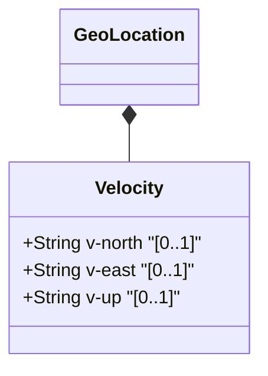

# Feature: Velocity

## Parent Epic
- [ ] #5 - [epic-01-geo-location](https://github.com/gintatkinson/3dgs-032/tree/main/docs/epics/epic-01-geo-location.md) (Contains the timing attributes for geo-location)

## Description
This feature specifies the Velocity attributes.

## UML Class Diagram


## Interface Requirements

### 1. Test Data Shape
```json
{}
```

### 2. Validation & Constraints
- Validations here.

### 3. Visual Layout & Arrangement
- The timing attributes should be presented in a details panel or property table.
- Enforce CSS resets (box-sizing), scoped naming (CSS Modules/BEM) to avoid specificity conflicts, layout containment parameters (restricting containment to outer layout splitters and forbidding it on scrollable child panels).
- Valid DOM nesting for tree structures must be observed.

### 4. Interactive Flow & States
- Provide clear read-only visual representation for timing values.
- If in an editable context, mandate computed-style assertions (such as verifying scroll dimensions or highlight colors) in the test guidelines for visual or active selection states.

## Given-When-Then Acceptance Criteria
**Scenario 1: Viewing Velocity**
- **Given** a record exists
- **When** the user views it
- **Then** the interface displays it

## Specification Context (Verbatim)
N/A

## Source References
Structural Schema: [ietf-geo-location@2022-02-11.yang](file:///Users/perkunas/jail/3dgs-032/schema/ietf-geo-location@2022-02-11.yang) (Clause: geo-location)
Normative Specification: [RFC 9179](https://www.rfc-editor.org/info/rfc9179) (Clause: 6.1)

## Logical UI & Layout Bindings
- **Target LUI Component:** PropertyGrid
- **Target Layout Container ID:** properties_view
- **Data Source Bindings:** /ietf-geo-location:geo-location/velocity
