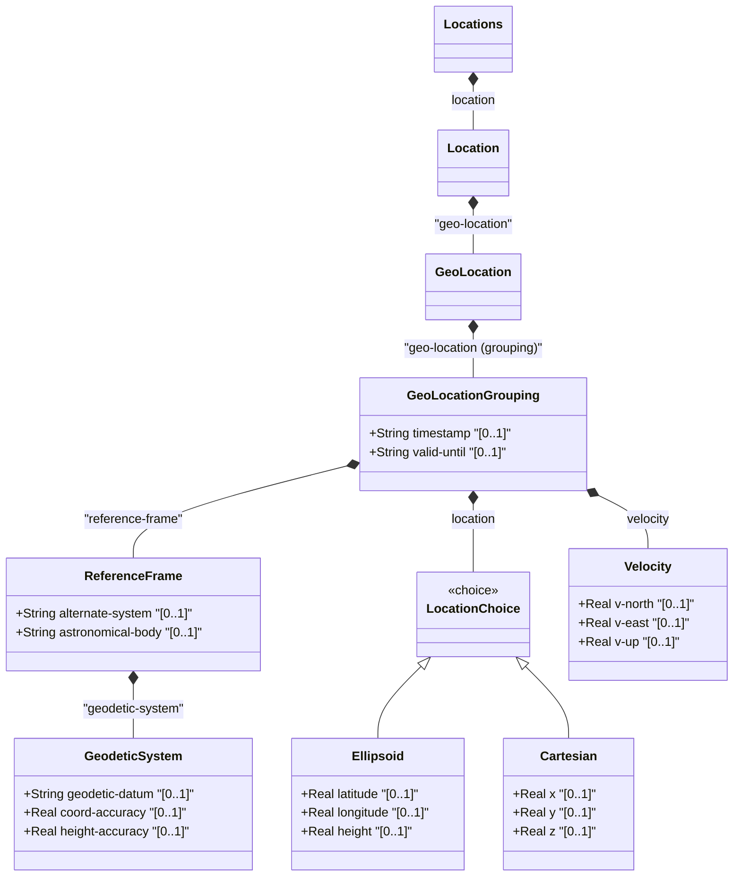

# Feature: Geo Location

## Parent Epic
- [ ] #36 - [Network Inventory Location](https://github.com/gintatkinson/3dgs-032/blob/main/docs/epics/epic-01-ni-location.md) (semantic linkage: parent bounded context)

## Description
This feature provides the geographic location information for a network element or location, allowing representation of coordinates in different geodetic systems (ellipsoid or cartesian) as well as velocity and timestamps.

## UML Class Diagram


## Interface Requirements

### 1. Test Data Shape
```json
{
  "geo-location": {
    "geo-location": {
      "reference-frame": {
        "astronomical-body": "earth",
        "geodetic-system": {
          "geodetic-datum": "wgs-84",
          "coord-accuracy": 2.5
        }
      },
      "ellipsoid": {
        "latitude": 45.123456,
        "longitude": 9.123456,
        "height": 100.5
      },
      "velocity": {
        "v-north": 1.2,
        "v-east": 0.5,
        "v-up": 0.0
      },
      "timestamp": "2026-08-01T12:00:00Z"
    }
  }
}
```

### 2. Validation & Constraints
- `astronomical-body` is limited by pattern `[ -@\[-\^_-~]*`, default is 'earth'.
- `geodetic-datum` is limited by pattern `[ -@\[-\^_-~]*`, default is 'wgs-84'.
- `coord-accuracy` and `height-accuracy` are Real with fraction-digits 6.
- `latitude` and `longitude` are Real with fraction-digits 16.
- `height`, `x`, `y`, `z` are Real with fraction-digits 6.
- `v-north`, `v-east`, `v-up` are Real with fraction-digits 12.
- `timestamp` and `valid-until` must follow standard YANG date-and-time format.

### 3. Visual Layout & Arrangement
- The layout should be abstractly grouped in a Property Grid panel.
- Ensure CSS resets (box-sizing) and scoped naming (CSS Modules/BEM) to avoid specificity conflicts.
- Apply layout containment parameters (restricting containment to outer layout splitters and forbidding it on scrollable child panels).
- Maintain valid DOM nesting for tree structures (recursive lists nested inside parent list-items).

### 4. Interactive Flow & States
- State changes (read-only, edit, empty, loading, error highlighting) must be supported.
- Computed-style assertions (such as verifying scroll dimensions or highlight colors) in the test guidelines are mandated for visual or active selection states.

## Given-When-Then Acceptance Criteria
- Given a network element location, when valid ellipsoid geo-location data is provided, then the system must store the latitude, longitude, and height accurately.
- Given geo-location data, when cartesian location data is provided, then the system must correctly store the x, y, z coordinates.
- Given geo-location data, when velocity data is provided, then the system must accurately record v-north, v-east, and v-up values.

## Specification Context (Verbatim)
This module defines a grouping of a container object for specifying a location on or around an astronomical object (e.g., 'earth').

A location on an astronomical body (e.g., 'earth') somewhere in a universe.

The Frame of Reference for the location values.

The system in which the astronomical body and geodetic-datum is defined.

The geodetic system of the location data.

The location data either in latitude/longitude or Cartesian values.

If the object is in motion, the velocity vector describes this motion at the time given by the timestamp.

## Source References
Structural Schema: [ietf-ni-location.yang](file:///Users/perkunas/jail/3dgs-032/schema/ietf-ni-location.yang) (Clause: 1)
Normative Specification: [RFC 9179](https://www.rfc-editor.org/info/rfc9179) (Clause: 1)

## Logical UI & Layout Bindings
- **Target LUI Component:** TableView
- **Target Layout Container ID:** elements_view
- **Data Source Bindings:**
  - `/nwi:network-inventory/nil:locations/nil:location/nil:geo-location`
  - `/nwi:network-inventory/nil:locations/nil:location/nil:geo-location/nil:geo-location`
  - `/nwi:network-inventory/nil:locations/nil:location/nil:geo-location/nil:geo-location/nil:reference-frame`
  - `/nwi:network-inventory/nil:locations/nil:location/nil:geo-location/nil:geo-location/nil:latitude`
  - `/nwi:network-inventory/nil:locations/nil:location/nil:geo-location/nil:geo-location/nil:longitude`
  - `/nwi:network-inventory/nil:locations/nil:location/nil:geo-location/nil:geo-location/nil:height`
  - `/nwi:network-inventory/nil:locations/nil:location/nil:geo-location/nil:geo-location/nil:velocity`
