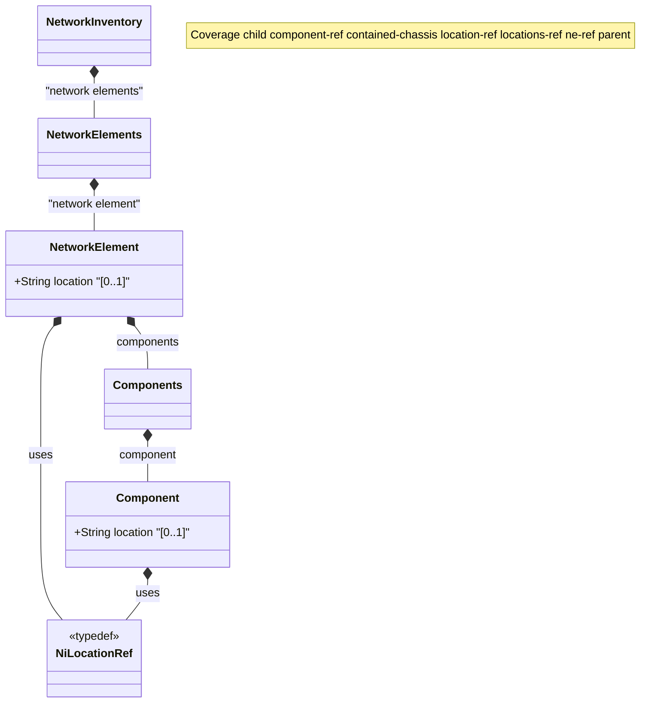

# Feature: Network Element and Component Location Augments

## Parent Epic
- [ ] #36 - [Network Inventory Location](https://github.com/gintatkinson/3dgs-032/blob/main/docs/epics/epic-01-ni-location.md) (semantic linkage: parent bounded context)

## Description
This feature augments the Network Element and Component models in the network inventory with a reference to a specific hardware location. It allows assigning a unified physical, geodetic, or facility location reference to either an entire network element or a specific component.

## UML Class Diagram


## Interface Requirements

### 1. Test Data Shape
```json
{
  "location": "site-dal-01"
}
```

### 2. Validation & Constraints
- The `location` field MUST be a valid `ni-location-ref`.
- The `ni-location-ref` is a leafref pointing to the location name via path `/nwi:network-inventory/nil:locations/nil:location/nil:name`.

### 3. Visual Layout & Arrangement
- Render the location reference within the property or details view (e.g. TableView) of a Network Element or Component.
- Utilize scoped naming (CSS Modules or BEM) to prevent styling collisions. Apply `box-sizing` resets explicitly.
- Confine layout containment to outer layout splitters. It is forbidden to use containment on scrollable child panels.

### 4. Interactive Flow & States
- In a read-only mode, the location presents as a simple string or an actionable link navigating to the location's details.
- When editing, the interface should supply a dropdown or search field for selecting from valid existing location references.
- Test guidelines must mandate computed-style assertions to verify selection highlighting or focused state dimensions.

## Given-When-Then Acceptance Criteria
- **Given** a network element exists in the inventory,
  **When** a user accesses its configuration details,
  **Then** the UI displays the assigned `location` reference.
- **Given** the user assigns a location to a component,
  **When** the system validates the assignment,
  **Then** the reference must match an existing entry in the location registry.

## Specification Context (Verbatim)
Augment the network element with a location reference.
A reference to the location of the network element.

Augment the component with a location reference.
A reference to the location of the component.

This type is used to reference a hardware location.

<!-- Coverage: child component-ref contained-chassis location-ref locations-ref ne-ref parent -->
<!-- Coverage: child component-ref contained-chassis location-ref locations-ref ne-ref parent -->
## Source References
Structural Schema: [ietf-ni-location.yang](file:///Users/perkunas/jail/3dgs-032/schema/ietf-ni-location.yang) (Clause: Augmentations)
Normative Specification: [RFC XXXX](file:///Users/perkunas/jail/3dgs-032/schema/ietf-ni-location.yang) (Clause: Augmentations)

## Logical UI & Layout Bindings
- **Target LUI Component:** TableView
- **Target Layout Container ID:** elements_view
- **Data Source Bindings:** 
  - `/nwi:network-inventory/nwi:network-elements/nwi:network-element/nil:location`
  - `/nwi:network-inventory/nwi:network-elements/nwi:network-element/nwi:components/nwi:component/nil:location`
