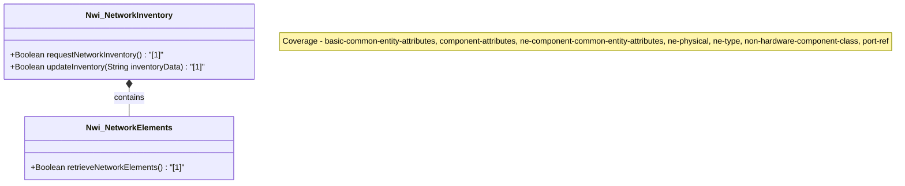

# Feature: Network Inventory Root

## Parent Epic
- [ ] #1 - [Network Inventory](https://github.com/gintatkinson/digital-pipeline-repo/blob/main/docs/epics/epic-03-network-inventory.md) (Semantic linkage to the root inventory module)

## Description
Top-level container for network inventory. It acts as the root layout and contains no direct data leaves, only the child container Nwi_NetworkElements.

## UML Class Diagram


## Interface Requirements

### 1. Test Data Shape
```json
{
  "network-inventory": {
    "network-elements": {}
  }
}
```

### 2. Validation & Constraints
- **State**: Read-only (`config false`).
- **Structure**: No direct data leaves; serves as a structural root container.

### 3. Visual Layout & Arrangement
- Acts as the root container for the network inventory hierarchy.
- Enforce CSS resets (box-sizing), scoped naming (CSS Modules/BEM) to avoid specificity conflicts.
- Implement layout containment parameters (restricting containment to outer layout splitters and forbidding it on scrollable child panels).
- Ensure valid DOM nesting for tree structures (recursive lists nested inside parent list-items).

### 4. Interactive Flow & States
- Displays the root level of the inventory.
- Mandate computed-style assertions (such as verifying scroll dimensions or highlight colors) in the test guidelines for visual or active selection states.

## Given-When-Then Acceptance Criteria
- **Given** a request to view the network inventory,
- **When** the structural root is accessed,
- **Then** it should provide the root container for network elements without direct data leaves.

## Specification Context (Verbatim)
"Top-level container for network inventory."

## Source References
Structural Schema: [ietf-network-inventory.yang](file:///Users/perkunas/jail/3dgs-032/schema/ietf-network-inventory.yang) (Clause: network-inventory)
Normative Specification: [draft-ietf-ivy-network-inventory-yang.txt](file:///Users/perkunas/jail/3dgs-032/docs/draft-ietf-ivy-network-inventory-yang.txt) (Clause: network-inventory)

## Logical UI & Layout Bindings
- **Target LUI Component:** HierarchyTreeSelector
- **Target Layout Container ID:** resource_tree
- **Data Source Bindings:** /nwi:network-inventory
