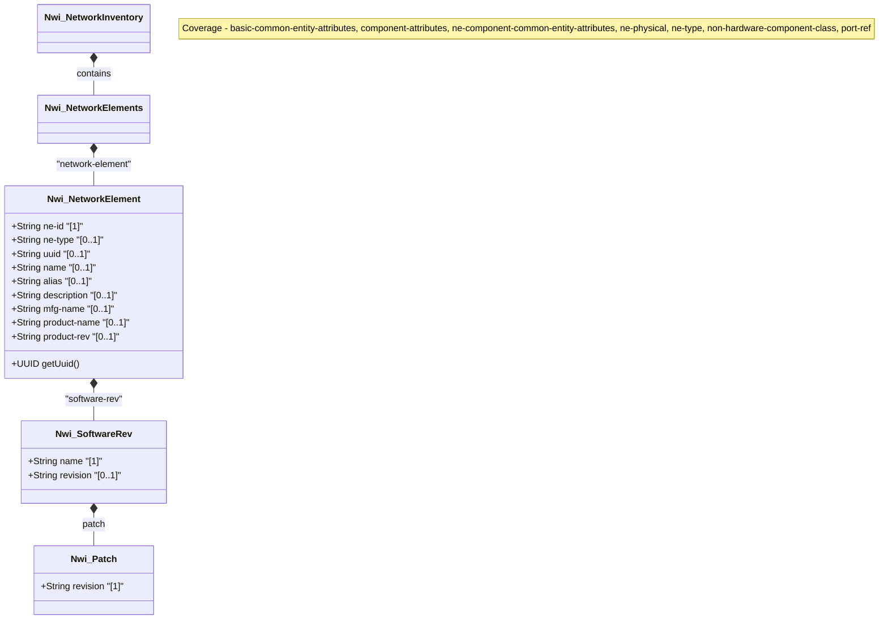

# Feature: Network Elements

## Parent Epic
- [ ] #TBD - [epic-03-network-inventory.md](https://github.com/gintatkinson/digital-pipeline-repo/blob/main/docs/epics/epic-03-network-inventory.md) (Implements structural layout)

## Description
This feature provides the specification for the Nwi_NetworkElements container and its nested Nwi_NetworkElement list, representing the physical and logical network elements (NEs) managed within the network inventory.

## UML Class Diagram


## Interface Requirements

### 1. Test Data Shape
```json
{
  "nwi:network-elements": {
    "network-element": [
      {
        "ne-id": "NE-12345",
        "ne-type": "nwi ne-physical",
        "uuid": "f81d4fae-7dec-11d0-a765-00a0c91e6bf6",
        "name": "Core-Router-1",
        "alias": "CR1",
        "description": "Main core router in Data Center A",
        "mfg-name": "VendorX",
        "product-name": "Router 9000",
        "product-rev": "v1.2",
        "software-rev": [
          {
            "name": "OS-Image",
            "revision": "14.2.1",
            "patch": [
              {
                "revision": "p1"
              }
            ]
          }
        ]
      }
    ]
  }
}
```

### 2. Validation & Constraints
- **ne-id**: Mandatory (`[1]`). String. Uniquely identifies the NE in a network. Used as the list key.
- **ne-type**: Optional (`[0..1]`). Identityref (base `nwi:ne-type`). Default is `"nwi ne-physical"`.
- **uuid**: Optional (`[0..1]`). Type `yang:uuid`. Must conform to UUID formatting.
- **name**: Optional (`[0..1]`). String. The name of the entity, as specified by a network operator. Can be a locally unique value in operational state if not configured.
- **alias**: Optional (`[0..1]`). String. Alias name specified by a network operator.
- **description**: Optional (`[0..1]`). String. Textual description.
- **mfg-name**: Optional (`[0..1]`). String. Name of the manufacturer.
- **product-name**: Optional (`[0..1]`). String. Vendor-specific and human-interpretable string describing the entity type.
- **product-rev**: Optional (`[0..1]`). String. Vendor-specific product revision string.
- **software-rev** (list): 
  - **name**: Mandatory (`[1]`). String. Vendor-specific name of the software module. Used as the list key.
  - **revision**: Optional (`[0..1]`). String. Vendor-specific revision string of the software module.
  - **patch** (list):
    - **revision**: Mandatory (`[1]`). String. Vendor-specific revision string of the software patch. Used as the list key.

### 3. Visual Layout & Arrangement
- Display the network elements in a tabular structure with sortable and filterable columns.
- Enforce CSS resets (box-sizing) and scoped naming (CSS Modules/BEM) to avoid specificity conflicts.
- Implement layout containment parameters (restricting containment to outer layout splitters and forbidding it on scrollable child panels).
- Use valid DOM nesting for tree structures or expanded rows for showing `software-rev` and `patch` details nested inside parent list-items.

### 4. Interactive Flow & States
- **Empty State**: Display a placeholder graphic and message when no network elements are discovered or configured.
- **Loading State**: Show a skeleton loader or spinner while fetching network element data.
- **Error State**: Highlight rows with fetch or validation errors. Provide tooltips for error details.
- **Selection State**: Rows should be selectable. Ensure computed-style assertions (such as verifying scroll dimensions or highlight colors) in the test guidelines for visual or active selection states.

## Given-When-Then Acceptance Criteria

- **Given** the network inventory system is active,
  **When** a user views the network elements view,
  **Then** a table of network elements is displayed, showing key attributes like `ne-id`, `name`, `ne-type`, and `mfg-name`.

- **Given** a network element contains software revisions,
  **When** the user expands the network element details,
  **Then** the `software-rev` list is displayed, including nested `patch` revisions.

- **Given** a new network element is added,
  **When** it lacks an explicit `ne-type`,
  **Then** the system assigns the default value `"nwi ne-physical"`.

## Specification Context (Verbatim)
The top-level container for the list of network elements within the network.
The network-element list contains network elements within the network. It includes basic common entity attributes (uuid, name, alias, description) and component common attributes (software-rev, mfg-name, product-name, product-rev).

## Source References
Structural Schema: [ietf-network-inventory.yang](https://datatracker.ietf.org/doc/html/draft-ietf-ivy-network-inventory-yang) (Clause: network-elements)
Normative Specification: [draft-ietf-ivy-network-inventory-yang.txt](https://datatracker.ietf.org/doc/html/draft-ietf-ivy-network-inventory-yang) (Clause: 3)

## Logical UI & Layout Bindings
- **Target LUI Component:** TableView
- **Target Layout Container ID:** elements_view
- **Data Source Bindings:** /nwi:network-inventory/nwi:network-elements/nwi:network-element
