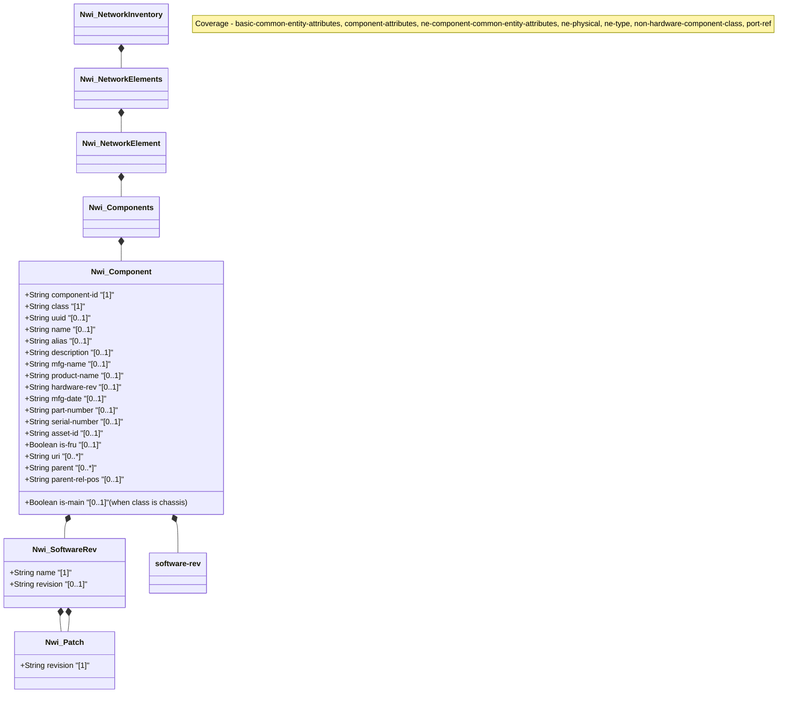

# Feature: Components

## Parent Epic
- [ ] #TBD - [Network Inventory](https://github.com/gintatkinson/digital-pipeline-repo/blob/main/docs/epics/epic-03-network-inventory.md) (Implements structural layout)

## Description
This feature provides the capability to retrieve and manage the components within a network element. The components are managed as a list, and each component has various attributes representing hardware, software, manufacturing details, identifiers, and relational hierarchies.

## UML Class Diagram


## Interface Requirements

<!-- For UI Interfaces (interface_type: ui) -->
### 1. Test Data Shape
```json
{
  "components": {
    "component": [
      {
        "component-id": "chassis-1",
        "class": "ianahw:chassis",
        "uuid": "550e8400-e29b-41d4-a716-446655440000",
        "name": "Chassis 1",
        "alias": "Main Chassis",
        "description": "Primary router chassis",
        "mfg-name": "Vendor A",
        "product-name": "Router-X100",
        "hardware-rev": "1.0",
        "mfg-date": "2025-01-01T00:00:00Z",
        "part-number": "PN-100",
        "serial-number": "SN-123456",
        "asset-id": "ASSET-001",
        "is-fru": true,
        "uri": ["http://example.com/chassis/1"],
        "parent": [],
        "is-main": true,
        "software-rev": [
          {
            "name": "OS-Image",
            "revision": "v10.5.2",
            "patch": [
              {
                "revision": "patch-23"
              }
            ]
          }
        ]
      }
    ]
  }
}
```

### 2. Validation & Constraints
- `component-id`: string, mandatory identifier for the component within the NE.
- `class`: identityref (ianahw:hardware-class or nwi:non-hardware-component-class), mandatory.
- `uuid`: yang:uuid format.
- `name`: string.
- `alias`: string.
- `description`: string.
- `software-rev`: list, keyed by `name` (string).
  - `revision`: string.
  - `patch`: list, keyed by `revision` (string).
- `mfg-name`: string.
- `product-name`: string.
- `hardware-rev`: string.
- `mfg-date`: yang:date-and-time format.
- `part-number`: string.
- `serial-number`: string.
- `asset-id`: string.
- `is-fru`: boolean.
- `uri`: leaf-list of inet:uri format.
- `parent`: leaf-list of leafref to `../../component/component-id`.
- `parent-rel-pos`: string, applicable only when `count(../parent) < 2`.
- `is-main`: boolean, applicable only when `derived-from-or-self(../nwi:class, 'ianahw:chassis')`.

### 3. Visual Layout & Arrangement
- Display the components in a table layout (`TableView`) representing the list.
- Organize columns for key attributes: Component ID, Class, Name, Product Name, Serial Number, Is FRU, Parent.
- Provide expandable rows or a side panel to view full details (UUID, MFG Date, revisions, software patches).
- Enforce CSS resets (box-sizing), scoped naming (CSS Modules/BEM) to avoid specificity conflicts.
- Constrain layout containment to outer layout splitters, forbidding it on scrollable child panels.
- Ensure valid DOM nesting for tree structures if relational hierarchies (`parent`) are rendered visually.

### 4. Interactive Flow & States
- State Management: Empty states for no components, loading spinners during data fetch, and error highlighting for missing references or failed queries.
- Read-only data presentation (config false).
- Mandate computed-style assertions in test guidelines for visual or active selection states (e.g. verifying scroll dimensions or highlight colors of selected table rows).

## Given-When-Then Acceptance Criteria

**Scenario 1: Component list retrieval**
- **Given** a network element containing multiple components.
- **When** the components container is retrieved.
- **Then** the list of components is returned, each with its mandatory `component-id` and `class` attributes.

**Scenario 2: Parent relationship and relative position**
- **Given** a component that is a child of a single parent component.
- **When** its attributes are retrieved.
- **Then** the `parent` list contains exactly one reference, and the `parent-rel-pos` attribute is applicable and valid.

**Scenario 3: Main chassis indication**
- **Given** a component whose `class` is derived from `ianahw:chassis`.
- **When** the component's attributes are evaluated.
- **Then** the `is-main` attribute is applicable and indicates whether the chassis takes the 'main' role.

**Scenario 4: Software and patch revisions**
- **Given** a component running software.
- **When** the `software-rev` list is queried.
- **Then** the list of software modules is returned, each keyed by `name`, with an optional `revision` and a list of applied `patch` revisions.

## Specification Context (Verbatim)
The YANG data model for network inventory mainly follows the same approach of [RFC8348] and reports the network hardware inventory as a list of components with different types (e.g., chassis, module, and port).
In addition to the common attributes defined for network elements and components in Section 3.1, the following attributes are defined for the components:
component-id:
The identifier that uniquely identifies the component within the NE. It can be assigned by the NE or by the server.
class:
The type of component (e.g., chassis, module, port). See Section 3 for the definition of component types.
hardware-rev:
The vendor-specific hardware revision string for the component.
The preferred value is the hardware revision identifier actually printed on the component itself (if present).
mfg-date:
The date of manufacturing of the component.
part-number:
The vendor-specific part number of the component type.
It is expected that vendors assign unique part numbers to different component types within the scope of the vendor.
Although the part number is often an alphanumeric string and not a number, this document uses this term since it is widely used and well known in the industry.
serial-number:
The vendor-specific serial number of the component instance.
It is expected that vendors assign unique serial numbers to different component instances at least within the scope of the part-number.
Although the serial number is often an alphanumeric string and not a number, this document uses this term since it is widely used and well known in the industry.
asset-id:
An asset tracking identifier for the component, provided by a network operator.
is-fru:
Indicates whether or not a component is considered a 'field-replaceable unit' by the vendor.

## Source References
Structural Schema: [ietf-network-inventory.yang](file:///Users/perkunas/jail/3dgs-032/schema/ietf-network-inventory.yang) (Clause: network-inventory)
Normative Specification: [draft-ietf-ivy-network-inventory-yang](file:///Users/perkunas/jail/3dgs-032/docs/draft-ietf-ivy-network-inventory-yang.txt) (Clause: 3.3)

## Logical UI & Layout Bindings
- **Target LUI Component:** PropertyGrid
- **Target Layout Container ID:** properties_view
- **Data Source Bindings:** /nwi:network-inventory/nwi:network-elements/nwi:network-element/nwi:components/nwi:component
