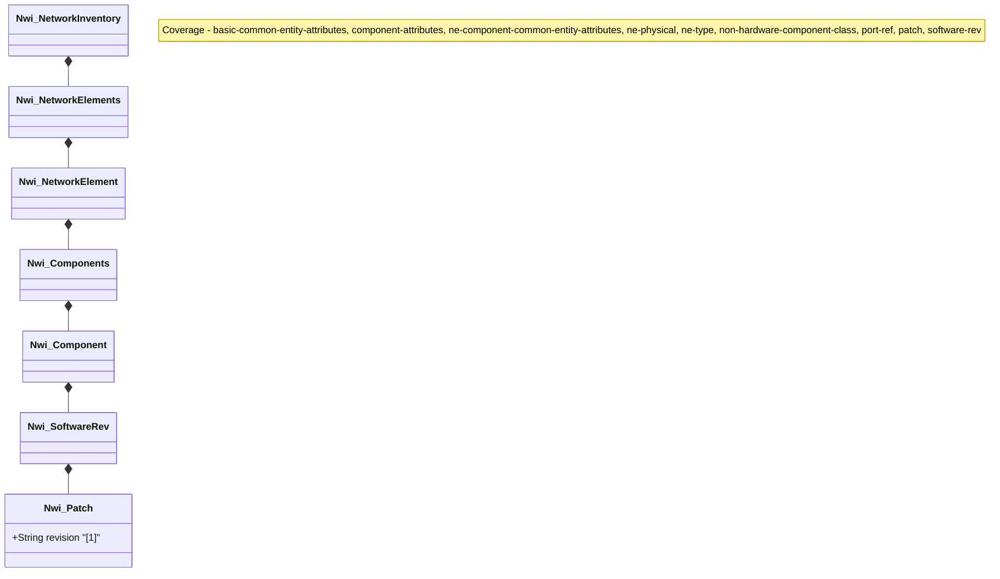

# Feature: Software Patch

## Parent Epic
- [ ] #TBD - [Network Inventory](https://github.com/gintatkinson/digital-pipeline-repo/blob/main/docs/epics/epic-03-network-inventory.md)

## Description
This feature provides the capability to retrieve and manage software patches applied to a specific software revision.

## UML Class Diagram


## Interface Requirements

### 1. Test Data Shape
```json
{
  "patch": [
    {
      "revision": "patch-23"
    }
  ]
}
```

### 2. Validation & Constraints
- `revision`: string, mandatory identifier.

### 3. Visual Layout & Arrangement
- Display in a table layout.

### 4. Interactive Flow & States
- Read-only data presentation.

## Given-When-Then Acceptance Criteria
- **Given** a software revision on a component.
- **When** the `patch` list is queried.
- **Then** the list of applied software patches is returned.

## Specification Context (Verbatim)
N/A

## Source References
Structural Schema: [ietf-network-inventory.yang](file:///Users/perkunas/jail/3dgs-032/schema/ietf-network-inventory.yang) (Clause: network-inventory)
Normative Specification: [draft-ietf-ivy-network-inventory-yang](file:///Users/perkunas/jail/3dgs-032/docs/draft-ietf-ivy-network-inventory-yang.txt) (Clause: 3.3)

## Logical UI & Layout Bindings
- **Target LUI Component:** PropertyGrid
- **Target Layout Container ID:** properties_view
- **Data Source Bindings:** /nwi:network-inventory/nwi:network-elements/nwi:network-element/nwi:components/nwi:component/nwi:software-rev/nwi:patch
