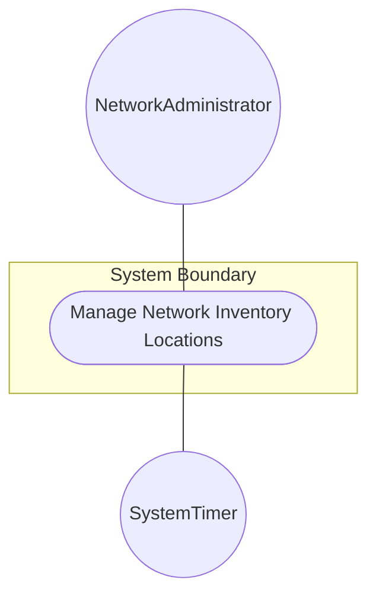
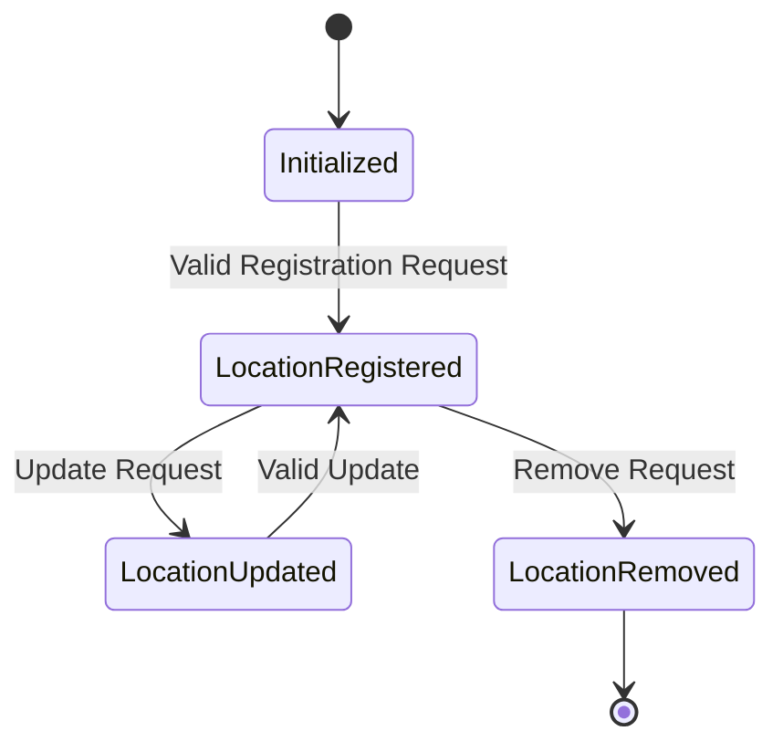

# Use Case: Manage Network Inventory Locations

## Parent Epic
- [ ] #36 - [Network Inventory Location](https://github.com/gintatkinson/3dgs-032/blob/main/docs/epics/epic-02-ni-location.md) (semantic linkage: parent bounded context)

## 1. Actors
- **Primary Actor:** NetworkAdministrator
- **Secondary Actors:** SystemTimer

## 2. Preconditions
- The network inventory system is initialized and accessible.
- The `NetworkAdministrator` is authenticated and authorized to modify the network inventory.

## 3. Trigger
The `NetworkAdministrator` submits a request to add, update, or remove a location in the network inventory.

## 4. Main Success Scenario (Basic Flow)
1. `NetworkAdministrator` requests to create a new location, providing attributes such as `id`, `name`, `type`, and `description`.
2. The system validates the provided attributes.
3. The system registers the new location in the `locations` list.
4. The system confirms the successful creation to the `NetworkAdministrator`.

## 5. Alternate and Exception Flows
- **5a. Duplicate Location ID (Branches from Basic Flow step 2):**
  1. The system detects that the provided `id` or `name` already exists in the `locations` list.
  2. The system aborts the transaction and returns a validation error to the `NetworkAdministrator`, prompting for a unique identifier.
- **5b. Invalid Parent Location Reference (Branches from Basic Flow step 2):**
  1. The system detects that the `parent` location reference points to a non-existent location ID.
  2. The system aborts the transaction, discards the state change, and notifies the `NetworkAdministrator` of the invalid reference.

## 6. Postconditions (Guarantees)
- **Success Guarantee:** The requested location is successfully added to, updated in, or removed from the network inventory `locations` container.
- **Failure Guarantee:** The system state is left unmodified and the network inventory remains consistent.

## UML Diagrams
### Use Case Diagram

### State Machine Diagram

## 7. Operational Context
"The Network Inventory location model is to record physical locations, such as sites, building, equipment rooms, racks, and so on. Additionally, it includes provisions for physical addresses or geo-location data (geographic coordinates). The location model augments the base network inventory to enrich NEs with location information."

## 8. Realization Matrix
### Required User Stories
- [ ] #38 - [Assign Facility Location](https://github.com/gintatkinson/3dgs-032/blob/main/docs/user-stories/us-07-assign-facility-location.md) (semantic linkage: Location container provides the target records to be assigned)
- [ ] #37 - [Expire Geo Location Data](https://github.com/gintatkinson/3dgs-032/blob/main/docs/user-stories/us-09-expire-location-data.md) (semantic linkage: Location container contains the valid-until expiry logic)
### Required Features
- [ ] #31 - [Locations Feature](https://github.com/gintatkinson/3dgs-032/blob/main/docs/features/feat-08-locations.md) (semantic linkage: Provides the structural implementation for the locations container)

## Source References
Structural Schema: [ietf-ni-location.yang](file:///Users/perkunas/jail/3dgs-032/schema/ietf-ni-location.yang)
Normative Specification: [draft-ietf-ivy-network-inventory-location](file:///Users/perkunas/jail/3dgs-032/docs/draft-ietf-ivy-network-inventory-location.md)
