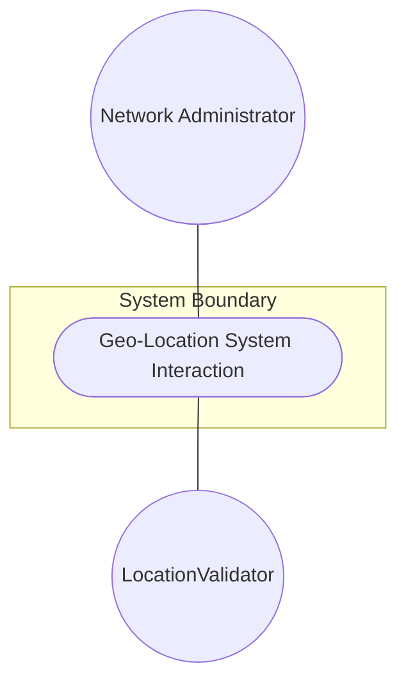
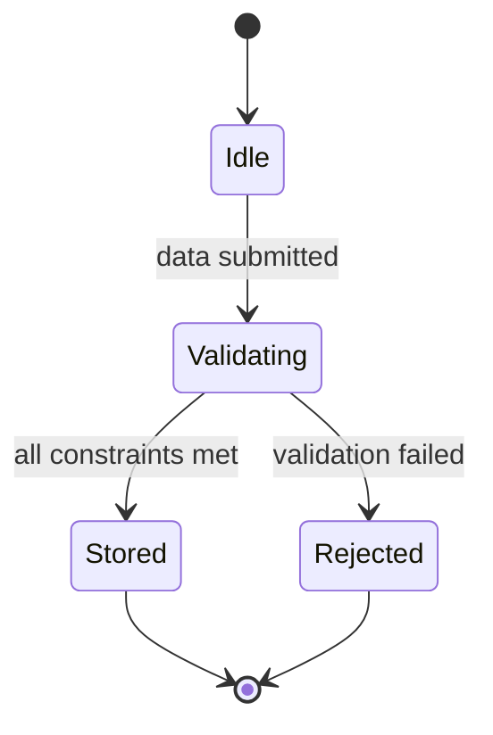

# Use Case: Geo-Location (System Interaction)

## Parent Epic
- [ ] #36 - [Network Inventory Location](https://github.com/gintatkinson/3dgs-032/blob/main/docs/epics/epic-02-ni-location.md) (Provides the bounded context for location data associated with network elements)

## 1. Actors
- **Primary Actor:** Network Administrator
- **Secondary Actors:** LocationValidator

## 2. Preconditions
- The network element or inventory location object exists in the system.
- The system is ready to receive geographic location data.

## 3. Trigger
The Network Administrator initiates a record or update of geo-location data for a specific location or network element.

## 4. Main Success Scenario (Basic Flow)
1. Network Administrator submits geo-location data (including reference frame, coordinates, velocity, and timestamps) for a location.
2. The system receives the data and invokes LocationValidator to check the data against structural constraints.
3. LocationValidator confirms all data fields meet required patterns and precisions.
4. The system stores the validated geo-location data (including latitude/longitude/height or cartesian coordinates, velocity, and timestamps).
5. The system confirms successful storage and notifies the Network Administrator.

## 5. Alternate and Exception Flows
- **5a. Invalid astronomical-body pattern (Branches from Basic Flow step 3):**
  1. LocationValidator detects that `astronomical-body` violates the `[ -@\[-\^_-~]*` pattern.
  2. The system aborts the transaction, rejects the invalid data, and returns a validation error to the Network Administrator.
- **5b. Invalid geodetic-datum pattern (Branches from Basic Flow step 3):**
  1. LocationValidator detects that `geodetic-datum` violates the `[ -@\[-\^_-~]*` pattern.
  2. The system aborts the transaction, rejects the invalid data, and returns a validation error to the Network Administrator.
- **5c. Invalid coord-accuracy or height-accuracy precision (Branches from Basic Flow step 3):**
  1. LocationValidator detects that `coord-accuracy` or `height-accuracy` exceeds the 6 fraction-digits limit.
  2. The system aborts the transaction, rejects the invalid data, and returns a validation error to the Network Administrator.
- **5d. Invalid latitude or longitude precision (Branches from Basic Flow step 3):**
  1. LocationValidator detects that `latitude` or `longitude` exceeds the 16 fraction-digits limit.
  2. The system aborts the transaction, rejects the invalid data, and returns a validation error to the Network Administrator.
- **5e. Invalid height, x, y, z precision (Branches from Basic Flow step 3):**
  1. LocationValidator detects that `height`, `x`, `y`, or `z` exceeds the 6 fraction-digits limit.
  2. The system aborts the transaction, rejects the invalid data, and returns a validation error to the Network Administrator.
- **5f. Invalid velocity precision (Branches from Basic Flow step 3):**
  1. LocationValidator detects that `v-north`, `v-east`, or `v-up` exceeds the 12 fraction-digits limit.
  2. The system aborts the transaction, rejects the invalid data, and returns a validation error to the Network Administrator.
- **5g. Invalid timestamp format (Branches from Basic Flow step 3):**
  1. LocationValidator detects that `timestamp` or `valid-until` does not follow the standard YANG date-and-time format.
  2. The system aborts the transaction, rejects the invalid data, and returns a validation error to the Network Administrator.

## 6. Postconditions (Guarantees)
- **Success Guarantee:** The geo-location data is successfully validated, stored in the system, and associated with the target location.
- **Failure Guarantee:** No geo-location data is saved, and the system state remains unchanged.

## UML Diagrams
### Use Case Diagram

### State Machine Diagram

## 7. Operational Context
"This module defines a grouping of a container object for specifying a location on or around an astronomical object (e.g., 'earth'). A location on an astronomical body (e.g., 'earth') somewhere in a universe. The location data either in latitude/longitude or Cartesian values."

## 8. Realization Matrix
### Required User Stories
- [ ] #23 - [Record Geo-Location Coordinates](https://github.com/gintatkinson/3dgs-032/blob/main/docs/user-stories/us-06-record-geolocation.md) (Provides the scenario for recording the coordinate values)
- [ ] #22 - [Temporal Expiration Scenario](https://github.com/gintatkinson/3dgs-032/blob/main/docs/user-stories/us-04-location-expiration.md) (Defines timestamp expiration logic)
- [ ] #21 - [Derive Speed and Heading](https://github.com/gintatkinson/3dgs-032/blob/main/docs/user-stories/us-02-derive-speed-and-heading.md) (Processes velocity data into derived metrics)

### Required Features
- [ ] #32 - [Feature: Geo Location](https://github.com/gintatkinson/3dgs-032/blob/main/docs/features/feat-09-ni-geo-location.md) (Provides the core schema, properties, and constraints for geo-location)

## Source References
Structural Schema: [ietf-ni-location.yang](file:///Users/perkunas/jail/3dgs-032/schema/ietf-ni-location.yang)
Normative Specification: [RFC 9179](https://www.rfc-editor.org/info/rfc9179)
