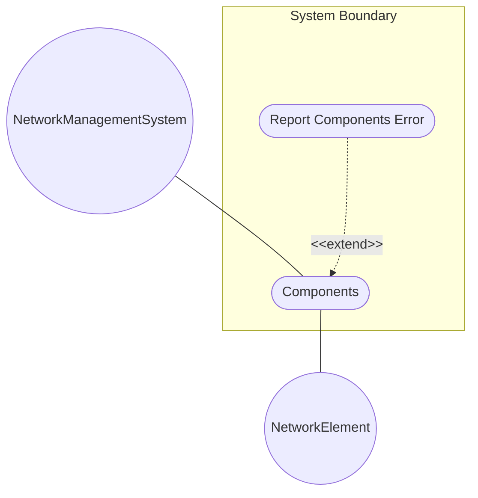
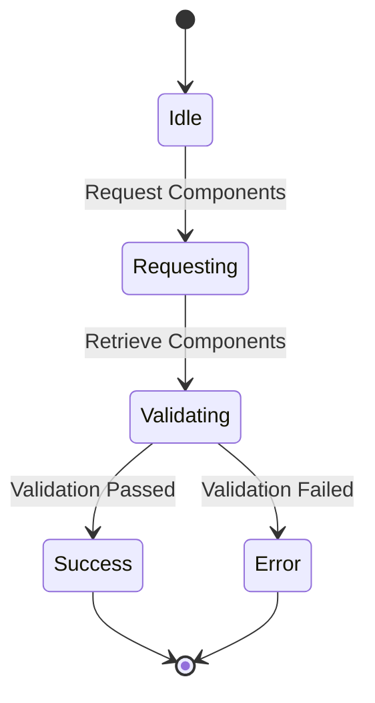

# Use Case: Components

## Parent Epic
- [ ] #60 - [Network Inventory Bounded Context](https://github.com/gintatkinson/digital-pipeline-repo/blob/main/docs/epics/epic-03-network-inventory.md) (Implements structural layout)

## 1. Actors
- **Primary Actor:** NetworkManagementSystem
- **Secondary Actors:** NetworkElement

## 2. Preconditions
- The Network Element must be active and reachable.
- The `network-element` instance must exist in the inventory.

## 3. Trigger
The NetworkManagementSystem requests the list of components for a specific network element.

## 4. Main Success Scenario (Basic Flow)
1. NetworkManagementSystem requests the components container from the NetworkElement.
2. NetworkElement retrieves the list of components and their attributes.
3. NetworkElement validates all components have a valid `component-id` and `class`, and all optional fields match expected formats.
4. NetworkElement returns the list of components to the NetworkManagementSystem.

## 5. Alternate and Exception Flows
- **5a. Missing Component ID (Branches from Basic Flow step 3):**
  1. NetworkElement detects a component is missing the mandatory `component-id`.
  2. NetworkElement aborts the transaction, logs an error, and returns a validation error to the NetworkManagementSystem.
- **5b. Missing Class (Branches from Basic Flow step 3):**
  1. NetworkElement detects a component is missing the mandatory `class` identityref.
  2. NetworkElement aborts the transaction, logs an error, and returns a validation error to the NetworkManagementSystem.
- **5c. Invalid UUID Format (Branches from Basic Flow step 3):**
  1. NetworkElement detects a component has an invalid `uuid` format.
  2. NetworkElement aborts the transaction, logs an error, and returns a validation error to the NetworkManagementSystem.
- **5d. Invalid Name Format (Branches from Basic Flow step 3):**
  1. NetworkElement detects a component has an invalid `name` string format.
  2. NetworkElement aborts the transaction, logs an error, and returns a validation error to the NetworkManagementSystem.
- **5e. Invalid Alias Format (Branches from Basic Flow step 3):**
  1. NetworkElement detects a component has an invalid `alias` string format.
  2. NetworkElement aborts the transaction, logs an error, and returns a validation error to the NetworkManagementSystem.
- **5f. Invalid Description Format (Branches from Basic Flow step 3):**
  1. NetworkElement detects a component has an invalid `description` string format.
  2. NetworkElement aborts the transaction, logs an error, and returns a validation error to the NetworkManagementSystem.
- **5g. Invalid Software Revision List (Branches from Basic Flow step 3):**
  1. NetworkElement detects an invalid `software-rev` list.
  2. NetworkElement aborts the transaction, logs an error, and returns a validation error to the NetworkManagementSystem.
- **5h. Invalid Software Revision Key (Branches from Basic Flow step 3):**
  1. NetworkElement detects a missing or invalid `revision` key in `software-rev`.
  2. NetworkElement aborts the transaction, logs an error, and returns a validation error to the NetworkManagementSystem.
- **5i. Invalid Patch List (Branches from Basic Flow step 3):**
  1. NetworkElement detects an invalid `patch` list within `software-rev`.
  2. NetworkElement aborts the transaction, logs an error, and returns a validation error to the NetworkManagementSystem.
- **5j. Invalid Mfg Name Format (Branches from Basic Flow step 3):**
  1. NetworkElement detects a component has an invalid `mfg-name` string format.
  2. NetworkElement aborts the transaction, logs an error, and returns a validation error to the NetworkManagementSystem.
- **5k. Invalid Product Name Format (Branches from Basic Flow step 3):**
  1. NetworkElement detects a component has an invalid `product-name` string format.
  2. NetworkElement aborts the transaction, logs an error, and returns a validation error to the NetworkManagementSystem.
- **5l. Invalid Hardware Rev Format (Branches from Basic Flow step 3):**
  1. NetworkElement detects a component has an invalid `hardware-rev` string format.
  2. NetworkElement aborts the transaction, logs an error, and returns a validation error to the NetworkManagementSystem.
- **5m. Invalid Mfg Date Format (Branches from Basic Flow step 3):**
  1. NetworkElement detects a component has an invalid `mfg-date` yang:date-and-time format.
  2. NetworkElement aborts the transaction, logs an error, and returns a validation error to the NetworkManagementSystem.
- **5n. Invalid Part Number Format (Branches from Basic Flow step 3):**
  1. NetworkElement detects a component has an invalid `part-number` string format.
  2. NetworkElement aborts the transaction, logs an error, and returns a validation error to the NetworkManagementSystem.
- **5o. Invalid Serial Number Format (Branches from Basic Flow step 3):**
  1. NetworkElement detects a component has an invalid `serial-number` string format.
  2. NetworkElement aborts the transaction, logs an error, and returns a validation error to the NetworkManagementSystem.
- **5p. Invalid Asset ID Format (Branches from Basic Flow step 3):**
  1. NetworkElement detects a component has an invalid `asset-id` string format.
  2. NetworkElement aborts the transaction, logs an error, and returns a validation error to the NetworkManagementSystem.
- **5q. Invalid Is FRU Format (Branches from Basic Flow step 3):**
  1. NetworkElement detects a component has an invalid `is-fru` boolean format.
  2. NetworkElement aborts the transaction, logs an error, and returns a validation error to the NetworkManagementSystem.
- **5r. Invalid URI Format (Branches from Basic Flow step 3):**
  1. NetworkElement detects a component has an invalid `uri` inet:uri format.
  2. NetworkElement aborts the transaction, logs an error, and returns a validation error to the NetworkManagementSystem.
- **5s. Invalid Parent Format (Branches from Basic Flow step 3):**
  1. NetworkElement detects a component has an invalid `parent` leafref format.
  2. NetworkElement aborts the transaction, logs an error, and returns a validation error to the NetworkManagementSystem.
- **5t. Invalid Parent Relative Pos Format (Branches from Basic Flow step 3):**
  1. NetworkElement detects a component has an invalid `parent-rel-pos` format.
  2. NetworkElement aborts the transaction, logs an error, and returns a validation error to the NetworkManagementSystem.
- **5u. Invalid Is Main Format (Branches from Basic Flow step 3):**
  1. NetworkElement detects a component has an invalid `is-main` boolean format.
  2. NetworkElement aborts the transaction, logs an error, and returns a validation error to the NetworkManagementSystem.

## 6. Postconditions (Guarantees)
- **Success Guarantee:** The components container is successfully returned with all mandatory attributes validated.
- **Failure Guarantee:** The components are not returned and the NetworkManagementSystem is notified of the validation failure.

## UML Diagrams
### Use Case Diagram

### State Machine Diagram

## 7. Operational Context
The YANG data model for network inventory mainly follows the same approach of [RFC8348] and reports the network hardware inventory as a list of components with different types (e.g., chassis, module, and port).

## 8. Realization Matrix
### Required User Stories
- [ ] #38 - [Assign Facility Location](https://github.com/gintatkinson/digital-pipeline-repo/blob/main/docs/user-stories/us-07-assign-facility-location.md) (semantic linkage: Location reference can be assigned to a component)
### Required Features
- [ ] #57 - [Components](https://github.com/gintatkinson/digital-pipeline-repo/blob/main/docs/features/feat-16-components.md) (Provides the capability to retrieve and manage the components within a network element)

## Source References
Structural Schema: [ietf-network-inventory.yang](file:///Users/perkunas/jail/3dgs-032/schema/ietf-network-inventory.yang)
Normative Specification: [draft-ietf-ivy-network-inventory-yang.txt](file:///Users/perkunas/jail/3dgs-032/docs/draft-ietf-ivy-network-inventory-yang.txt)
