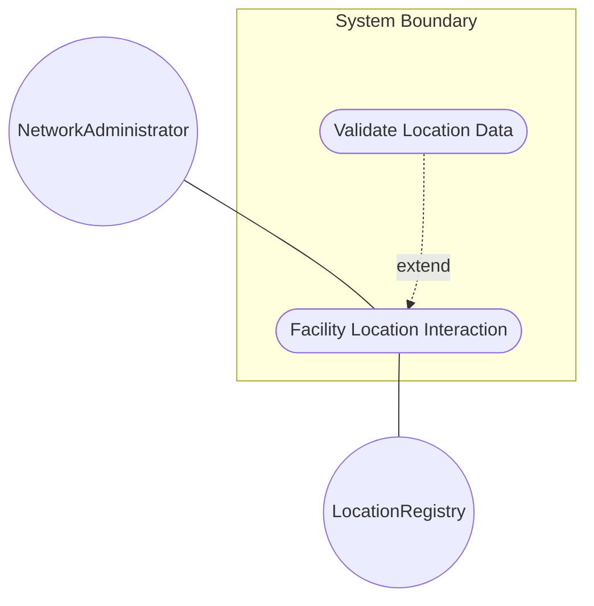
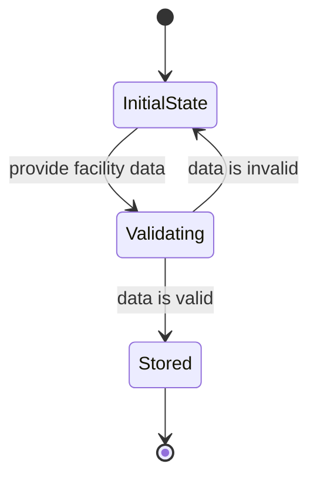

# Use Case: Facility Location

## Parent Epic
- [ ] #36 - [Network Inventory Location](https://github.com/gintatkinson/3dgs-032/blob/main/docs/epics/epic-01-ni-location.md) (semantic linkage: parent bounded context)

## 1. Actors
- **Primary Actor:** NetworkAdministrator
- **Secondary Actors:** LocationRegistry, NetworkInventory

## 2. Preconditions
- The network inventory system is initialized.
- The location hierarchy is configured in the system.

## 3. Trigger
The NetworkAdministrator wants to record or view the facility-specific location information (building, floor, room, aisle, row, rack, shelf, position).

## 4. Main Success Scenario (Basic Flow)
1. NetworkAdministrator provides the facility location attributes to the system.
2. LocationRegistry validates the input formats against string expectations.
3. LocationRegistry stores the facility location under the specified network inventory location.
4. System acknowledges the successful creation or update of the facility location.

## 5. Alternate and Exception Flows
- **5a. Invalid String Format (Branches from Basic Flow step 2):**
  1. LocationRegistry detects that one or more inputs do not conform to the expected string type.
  2. LocationRegistry aborts the transaction, discards the changes, and notifies NetworkAdministrator of validation failure.

- **5b. Missing Location Reference (Branches from Basic Flow step 2):**
  1. LocationRegistry detects that the parent location does not exist in the inventory.
  2. LocationRegistry aborts the transaction, rolls back the state, and notifies NetworkAdministrator.

- **5c. Missing Address (Branches from Basic Flow step 2):**
  1. LocationRegistry detects that the address is invalid.
  2. LocationRegistry aborts the transaction.

- **5d. Missing City (Branches from Basic Flow step 2):**
  1. LocationRegistry detects that the city is invalid.
  2. LocationRegistry aborts the transaction.

- **5e. Missing Country Code (Branches from Basic Flow step 2):**
  1. LocationRegistry detects that the country code is invalid.
  2. LocationRegistry aborts the transaction.

- **5f. Missing Postal Code (Branches from Basic Flow step 2):**
  1. LocationRegistry detects that the postal code is invalid.
  2. LocationRegistry aborts the transaction.

- **5g. Missing State (Branches from Basic Flow step 2):**
  1. LocationRegistry detects that the state is invalid.
  2. LocationRegistry aborts the transaction.

- **5h. Missing Physical Address (Branches from Basic Flow step 2):**
  1. LocationRegistry detects that the physical address is invalid.
  2. LocationRegistry aborts the transaction.

## 6. Postconditions (Guarantees)
- **Success Guarantee:** The facility location data is successfully linked to the location and persistently stored.
- **Failure Guarantee:** The facility location remains unchanged, and no invalid data is stored.

## UML Diagrams
### Use Case Diagram

### State Machine Diagram

## 7. Operational Context
"NEs can be grouped by location to provide more information for network planning, deployment, and maintenance. The location can reflect outdoor or indoor information. An indoor location may be represented as a building, room, or other similar organizational structures."

## 8. Realization Matrix
### Required User Stories
- [ ] #38 - [Assign Facility Location](https://github.com/gintatkinson/3dgs-032/blob/main/docs/user-stories/us-07-assign-facility-location.md) (semantic linkage: Provides behavioral flow for location assignment)
### Required Features
- [ ] #33 - [Facility Location](https://github.com/gintatkinson/3dgs-032/blob/main/docs/features/feat-10-facility-location.md) (semantic linkage: Provides structural attributes for facility location)

## Source References
Structural Schema: [ietf-ni-location.yang](file:///Users/perkunas/jail/3dgs-032/schema/ietf-ni-location.yang)
Normative Specification: [draft-ietf-ivy-network-inventory-location](file:///Users/perkunas/jail/3dgs-032/docs/draft-ietf-ivy-network-inventory-location.md)
