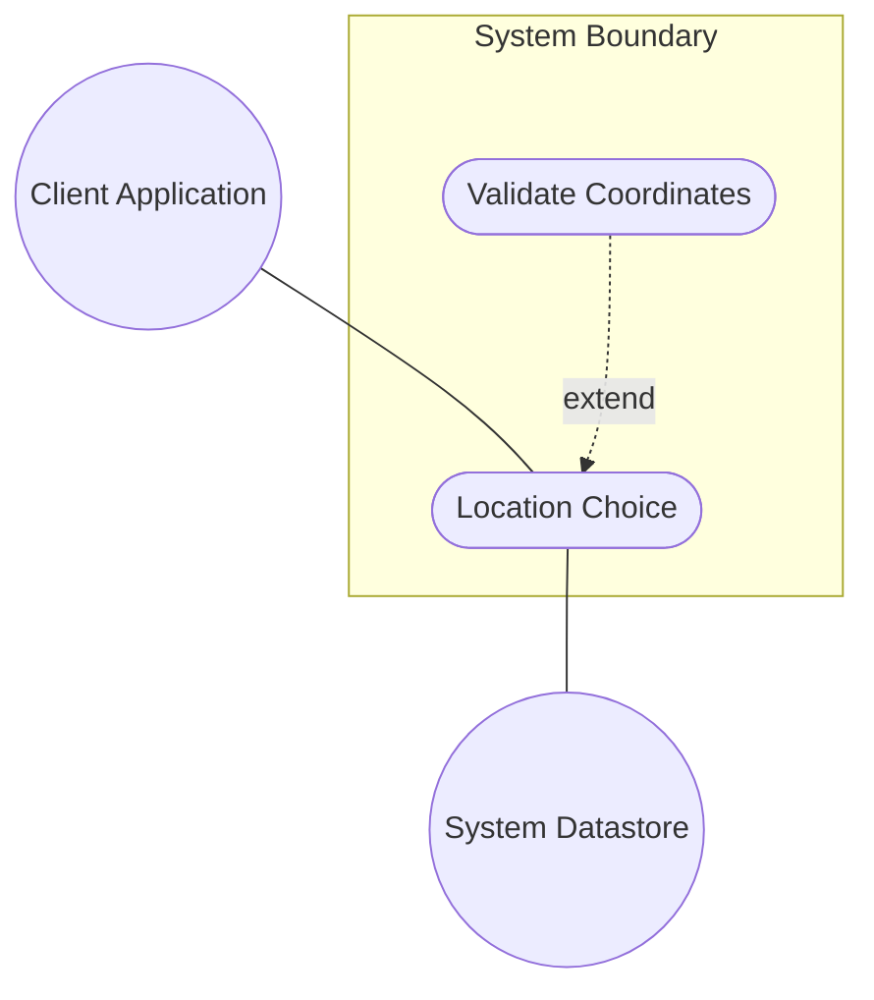
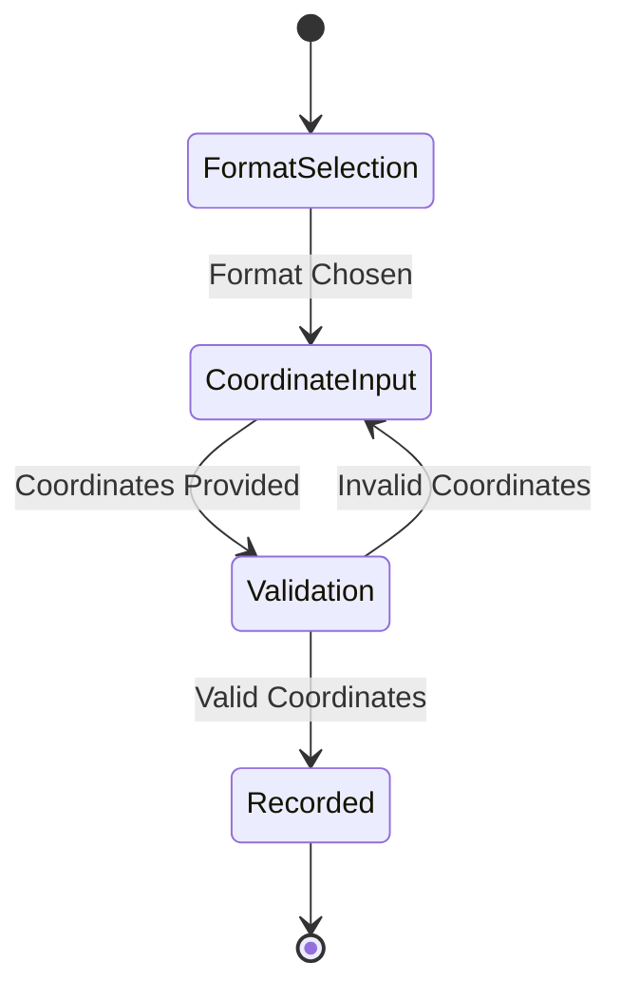

# Use Case: Location Choice

## Parent Epic
- [ ] #5 - [epic-01-geo-location](https://github.com/gintatkinson/3dgs-032/tree/main/docs/epics/epic-01-geo-location.md) (Provides the overarching goal for locating an entity geographically)

## 1. Actors
- **Primary Actor:** User or Client Application
- **Secondary Actors:** System Datastore

## 2. Preconditions
- The geographic location's reference frame has been defined or defaults have been adopted.
- The user has initiated the creation or modification of a geographic location.

## 3. Trigger
User or Client Application selects the format for location coordinates (ellipsoid or cartesian).

## 4. Main Success Scenario (Basic Flow)
1. User or Client Application chooses the location coordinate format.
2. System initializes the corresponding location data structure for the choice.
3. User or Client Application provides the coordinate values corresponding to the choice (either latitude/longitude/height or x/y/z).
4. System validates the input coordinates against the schema bounds and rules.
5. System records the location coordinates and associates them with the overarching geographic location.

## 5. Alternate and Exception Flows
- **5a. Invalid Coordinate Values (Branches from Basic Flow step 4):**
  1. System detects that the provided coordinates exceed allowed boundaries or are malformed.
  2. System aborts the transaction, returns a validation error, and returns to step 3 of the Main Success Scenario.
- **5b. Invalid Choice Format (Branches from Basic Flow step 2):**
  1. System detects an unsupported format for location coordinates.
  2. System aborts the transaction, returns an error message, and notifies the User or Client Application.

## 6. Postconditions (Guarantees)
- **Success Guarantee:** The location choice is correctly instantiated and the coordinates are accurately recorded.
- **Failure Guarantee:** The geographic location remains unchanged and no invalid data is stored.

## UML Diagrams
### Use Case Diagram

### State Machine Diagram

## 7. Operational Context
"This is the location on, or relative to, the astronomical object. It is specified using two or three coordinate values. These values are given either as 'latitude', 'longitude', and an optional 'height', or as Cartesian coordinates of 'x', 'y', and 'z'."

## 8. Realization Matrix
### Required User Stories
- [ ] #20 - [Record Geo-Location Coordinates](https://github.com/gintatkinson/3dgs-032/blob/main/docs/user-stories/us-03-record-geolocation.md) (Records location coordinates)

### Required Features
- [ ] #11 - [Feature: Location Choice](https://github.com/gintatkinson/3dgs-032/tree/main/docs/features/feat-04-location-choice.md) (Specifies the UI, validation, and presentation details for the Location Choice)

## Source References
Structural Schema: [ietf-geo-location@2022-02-11.yang](file:///Users/perkunas/jail/3dgs-032/schema/ietf-geo-location@2022-02-11.yang)
Normative Specification: [RFC 9179](https://www.rfc-editor.org/info/rfc9179)
