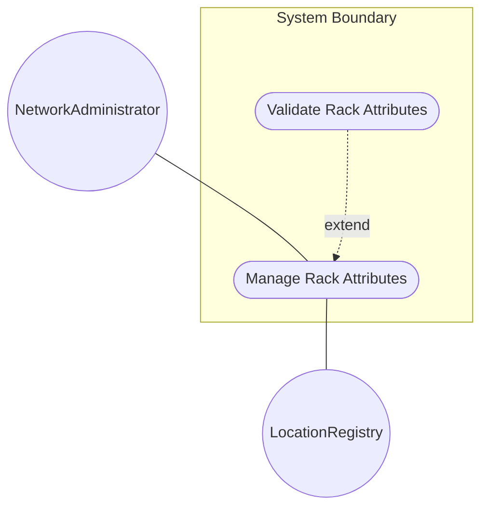
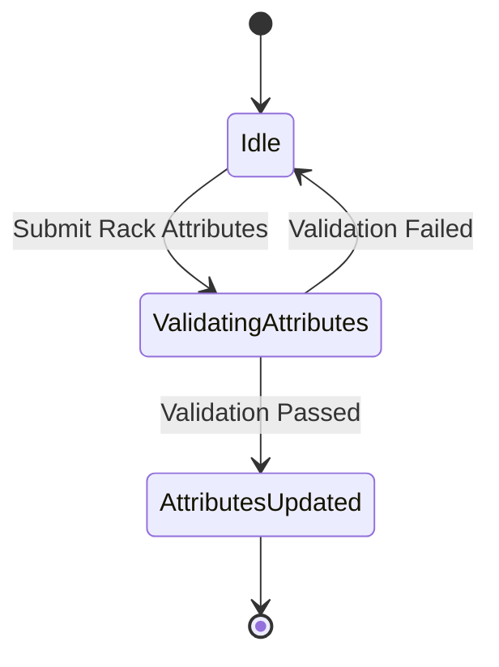

# Use Case: Rack Attributes

## Parent Epic
- [ ] #36 - [Network Inventory Location](https://github.com/gintatkinson/3dgs-032/blob/main/docs/epics/epic-02-ni-location.md) (semantic linkage: parent bounded context)

## 1. Actors
- **Primary Actor:** NetworkAdministrator
- **Secondary Actors:** LocationRegistry

## 2. Preconditions
- A FacilityLocation object must exist within a Location in the network inventory.
- The administrator must have authorized privileges to view or update location details.

## 3. Trigger
The NetworkAdministrator initiates an update or attempts to view the rack attributes for a specific facility location.

## 4. Main Success Scenario (Basic Flow)
1. NetworkAdministrator provides the rack attributes including class, height, width, depth, maximum weight, and maximum power.
2. System validates all provided attribute values against their defined schemas and constraints.
3. System persists the updated rack attributes to the target FacilityLocation.
4. System confirms the successful update of rack attributes to the NetworkAdministrator.

## 5. Alternate and Exception Flows
- **5a. Invalid Rack Class (Branches from Basic Flow step 2):**
  1. System detects that the `class` value is not a valid `rack-class-type` identityref.
  2. System rejects the input, displays a validation error, and returns to step 1 of the Main Success Scenario.
- **5b. Invalid Height Value (Branches from Basic Flow step 2):**
  1. System detects that `height` is not a valid unsigned integer or is negative.
  2. System rejects the input, displays a validation error, and returns to step 1 of the Main Success Scenario.
- **5c. Invalid Width Value (Branches from Basic Flow step 2):**
  1. System detects that `width` is not a valid unsigned integer or is negative.
  2. System rejects the input, displays a validation error, and returns to step 1 of the Main Success Scenario.
- **5d. Invalid Depth Value (Branches from Basic Flow step 2):**
  1. System detects that `depth` is not a valid unsigned integer or is negative.
  2. System rejects the input, displays a validation error, and returns to step 1 of the Main Success Scenario.
- **5e. Invalid Max Weight Value (Branches from Basic Flow step 2):**
  1. System detects that `max-weight` is not a valid unsigned integer or is negative.
  2. System rejects the input, displays a validation error, and returns to step 1 of the Main Success Scenario.
- **5f. Invalid Max Power Value (Branches from Basic Flow step 2):**
  1. System detects that `max-power` is not a valid unsigned integer or is negative.
  2. System rejects the input, displays a validation error, and returns to step 1 of the Main Success Scenario.

## 6. Postconditions (Guarantees)
- **Success Guarantee:** The FacilityLocation is updated with the valid rack attributes and physical constraints.
- **Failure Guarantee:** The rack attributes remain unchanged, and the system state is preserved with any active transaction aborted.

## UML Diagrams
### Use Case Diagram

### State Machine Diagram

## 7. Operational Context
Locations must be accurately maintained to ensure physical operations and maintenance tasks can be correctly routed. Rack attributes (height, width, depth, weight, power) are critical for data center capacity planning and operational safety.

## 8. Realization Matrix
### Required User Stories
- [ ] #38 - [Assign Facility Location](https://github.com/gintatkinson/3dgs-032/blob/main/docs/user-stories/us-07-assign-facility-location.md) (semantic linkage: provides the behavioral flow assigning location that contains the rack attributes)
### Required Features
- [ ] #34 - [Rack Attributes](https://github.com/gintatkinson/3dgs-032/blob/main/docs/features/feat-11-rack-attributes.md) (semantic linkage: provides the structural validation and layout logic for rack attributes)

## Source References
Structural Schema: [ietf-ni-location.yang](file:///Users/perkunas/jail/3dgs-032/schema/ietf-ni-location.yang)
Normative Specification: [RFC XXXX: A YANG Data Model for Network Inventory location.](https://datatracker.ietf.org/)
