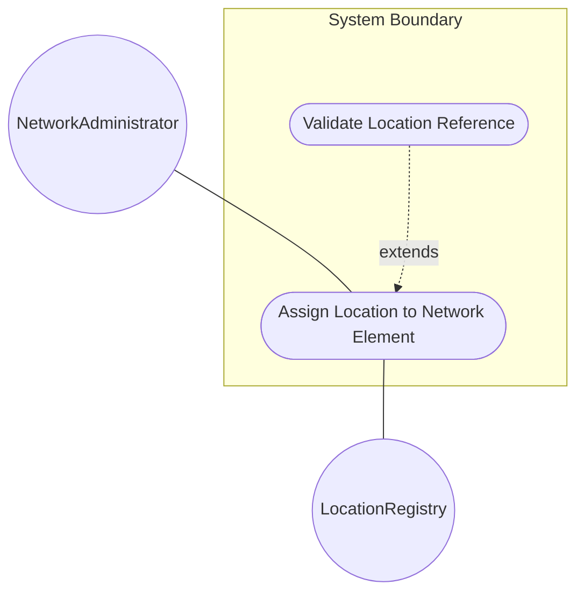
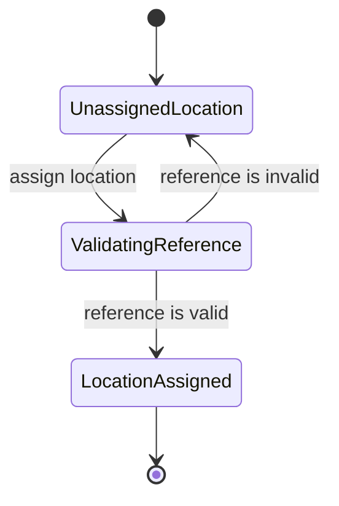

# Use Case: Assign Location to Network Element

## Parent Epic
- [ ] #36 - [Network Inventory Location](https://github.com/gintatkinson/3dgs-032/blob/main/docs/epics/epic-02-ni-location.md) (semantic linkage: parent bounded context)

## 1. Actors
- **Primary Actor:** NetworkAdministrator
- **Secondary Actors:** LocationRegistry

## 2. Preconditions
- The Network Element exists in the network inventory.
- The target location exists in the LocationRegistry.

## 3. Trigger
The NetworkAdministrator selects a Network Element to assign a physical location reference.

## 4. Main Success Scenario (Basic Flow)
1. NetworkAdministrator requests to assign a location to a Network Element by providing a location reference string.
2. System looks up the location reference in the LocationRegistry.
3. System confirms the location reference is a valid `ni-location-ref`.
4. System confirms the `ni-location-ref` successfully resolves to the correct location path.
5. System links the Network Element to the specified location.
6. System notifies the NetworkAdministrator that the assignment was successful.

## 5. Alternate and Exception Flows
- **5a. Invalid Location Reference (Branches from Basic Flow step 3):**
  1. System determines that the provided location reference is not a valid `ni-location-ref`.
  2. System aborts the assignment, returns an error message to the NetworkAdministrator, and returns to step 1 of the Main Success Scenario.
- **5b. Invalid Leafref Path (Branches from Basic Flow step 4):**
  1. System determines that the `ni-location-ref` does not point to the location name via the required path `/nwi:network-inventory/nil:locations/nil:location/nil:name`.
  2. System aborts the transaction, discards the change, and notifies the NetworkAdministrator of the invalid path error.

## 6. Postconditions (Guarantees)
- **Success Guarantee:** The Network Element is successfully associated with the specified location reference.
- **Failure Guarantee:** The Network Element's location assignment remains unchanged and any invalid assignment attempt is rejected.

## UML Diagrams
### Use Case Diagram

### State Machine Diagram

## 7. Operational Context
"The Network Inventory location model is to record physical locations... The location model augments the base network inventory to enrich NEs with location information."

## 8. Realization Matrix
### Required User Stories
- [ ] #38 - [Assign Facility Location](https://github.com/gintatkinson/3dgs-032/blob/main/docs/user-stories/us-07-assign-facility-location.md) (semantic linkage: Specifies the user flow for assigning a location reference to a Network Element)
### Required Features
- [ ] #35 - [Network Element and Component Location Augments](https://github.com/gintatkinson/3dgs-032/blob/main/docs/features/feat-12-ne-location.md) (semantic linkage: Provides the data structure and schema augmentation for NE locations)

## Source References
Structural Schema: [ietf-ni-location.yang](schema/ietf-ni-location.yang)
Normative Specification: [draft-ietf-ivy-network-inventory-location](docs/draft-ietf-ivy-network-inventory-location.md)
