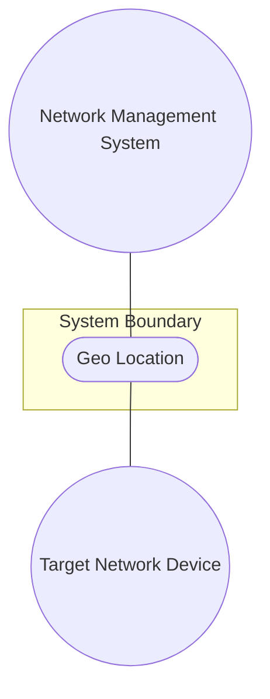
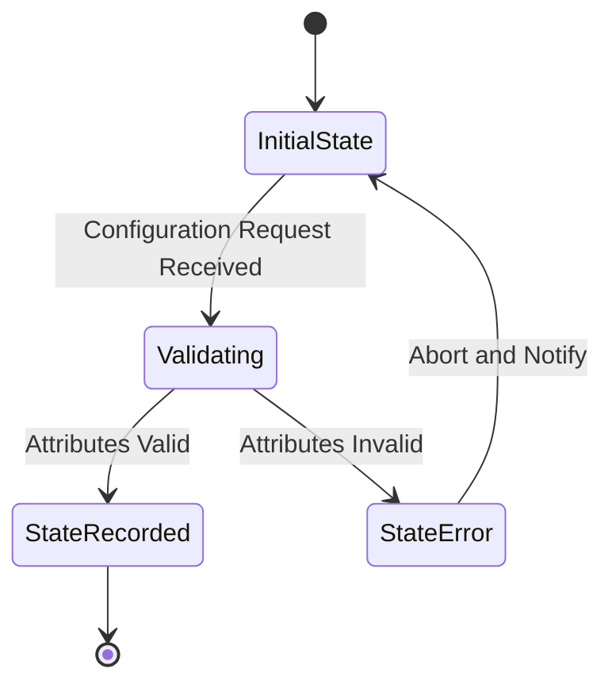

# Use Case: Geo Location

## Parent Epic
- [x] #5 - [epic-02-geo-location](https://github.com/gintatkinson/3dgs-032/tree/main/docs/epics/epic-02-geo-location.md) (Provides the overarching scope for geographic locations)

## 1. Actors
- **Primary Actor:** Network Management System (NMS)
- **Secondary Actors:** Target Network Device

## 2. Preconditions
- The target network device is provisioned.
- The geographic location details are known to the system.

## 3. Trigger
The Network Management System requests to record the geographic location of the target network device.

## 4. Main Success Scenario (Basic Flow)
1. Network Management System sends a geographic location configuration payload.
2. System validates the timing attributes against required formats.
3. System records the geo-location of the Target Network Device.
4. System acknowledges the successful configuration to the Network Management System.

## 5. Alternate and Exception Flows
- **5a. Invalid Timestamp Format (Branches from Basic Flow step 2):**
  1. System detects the timestamp is not a valid date-and-time string format.
  2. System aborts the transaction, rolls back the configuration state, and notifies the Network Management System of the validation error.
- **5b. Invalid Expiration Format (Branches from Basic Flow step 2):**
  1. System detects the valid-until attribute is provided but is not a valid date-and-time string format.
  2. System aborts the transaction, rolls back the configuration state, and notifies the Network Management System of the validation error.

## 6. Postconditions (Guarantees)
- **Success Guarantee:** The geo-location and timing attributes are recorded on the target device.
- **Failure Guarantee:** The configuration is aborted, the system state is rolled back, and the device's location remains unchanged.

## UML Diagrams
### Use Case Diagram

### State Machine Diagram

## 7. Operational Context
"In many applications, we would like to specify the location of something geographically. Some examples of locations in networking might be the location of data centers, a rack in an Internet exchange point, a router, a firewall, a port on some device, or it could be the endpoints of a fiber, or perhaps the failure point along a fiber."

## 8. Realization Matrix
### Required User Stories
- [ ] #22 - [Temporal Expiration Scenario](https://github.com/gintatkinson/3dgs-032/blob/main/docs/user-stories/us-04-location-expiration.md) (Sets expiration constraints)

### Required Features
- [x] #1 - [Geo-Location Timing Attributes](https://github.com/gintatkinson/3dgs-032/tree/main/docs/features/feat-06-geo-location-grouping.md) (Provides the timing properties and validation constraints for the geo-location container)

## Source References
Structural Schema: [ietf-geo-location@2022-02-11.yang](https://github.com/gintatkinson/3dgs-032/blob/main/schema/ietf-geo-location@2022-02-11.yang)
Normative Specification: [RFC 9179](https://www.rfc-editor.org/info/rfc9179)
