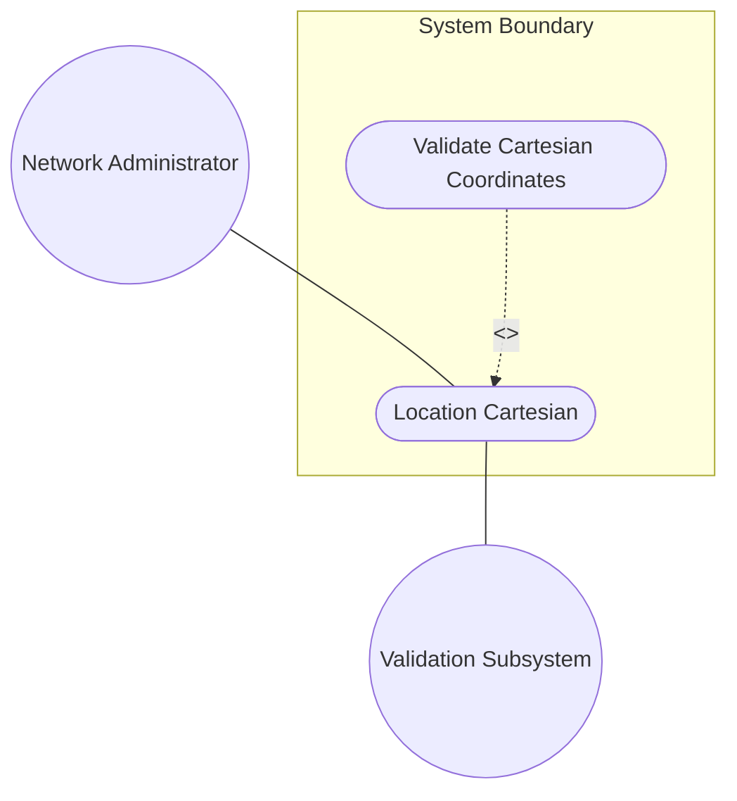
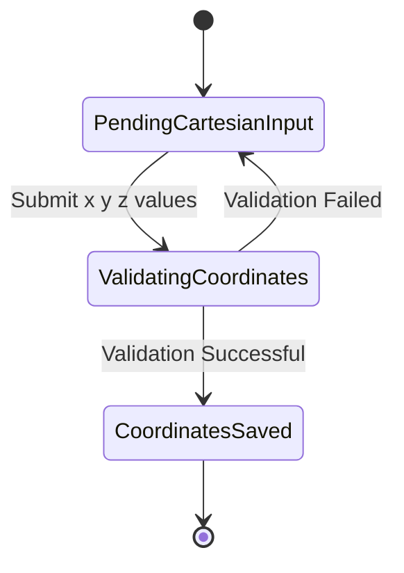

# Use Case: Location Cartesian

## Parent Epic
- [ ] #5 - [epic-01-geo-location](https://github.com/gintatkinson/3dgs-032/tree/main/docs/epics/epic-01-geo-location.md) (Provides the overarching geo-location entity context)

## 1. Actors
- **Primary Actor:** Network Administrator / System Client
- **Secondary Actors:** Validation Subsystem

## 2. Preconditions
- The system is initialized with a `geo-location` context.
- The `location` choice configuration is active and the `geodetic-datum` is established.

## 3. Trigger
The Primary Actor provides Cartesian coordinate updates (x, y, and z) to define the location.

## 4. Main Success Scenario (Basic Flow)
1. Network Administrator submits Cartesian coordinate values (x, y, z) in fractions of meters.
2. Validation Subsystem verifies the submitted values against the constraints defined by the active `geodetic-datum`.
3. System persists the `cartesian` coordinates within the `geo-location` record and transitions to a saved state.

## 5. Alternate and Exception Flows
- **5a. Invalid Cartesian Coordinate Value (Branches from Basic Flow step 2):**
  1. Validation Subsystem detects that the `x`, `y`, or `z` coordinate value is out of bounds or violates schema constraints.
  2. System aborts the transaction, discards the invalid location update, and notifies the Network Administrator of the validation error.
- **5b. Unresolvable Geodetic Datum (Branches from Basic Flow step 2):**
  1. Validation Subsystem detects that the `geodetic-datum` required to interpret the Cartesian coordinates is missing or invalid.
  2. System aborts the transaction, prevents the Cartesian location update, and notifies the Network Administrator to configure the geodetic system first.

## 6. Postconditions (Guarantees)
- **Success Guarantee:** The `cartesian` location coordinates are successfully saved and associated with the `geo-location` record.
- **Failure Guarantee:** The system state remains unchanged; no invalid Cartesian coordinates are persisted.

## UML Diagrams
### Use Case Diagram

### State Machine Diagram

## 7. Operational Context
"For the Cartesian choice, 'x', 'y', and 'z' are in fractions of meters. In both choices, the exact meanings of all the values are defined by the 'geodetic-datum' value in Section 2.1."

## 8. Realization Matrix
### Required User Stories
- [ ] #23 - [Record Geo-Location Coordinates](https://github.com/gintatkinson/3dgs-032/blob/main/docs/user-stories/us-03-record-geolocation.md) (Records location coordinates)

### Required Features
- [ ] #14 - [Location Cartesian](https://github.com/gintatkinson/3dgs-032/tree/main/docs/features/feat-06-location-cartesian.md) (Specifies the Cartesian attributes, schemas, and UI layout for the Cartesian location choice)

## Source References
Structural Schema: [ietf-geo-location@2022-02-11.yang](file:///Users/perkunas/jail/3dgs-032/schema/ietf-geo-location@2022-02-11.yang)
Normative Specification: [RFC 9179](https://www.rfc-editor.org/info/rfc9179)
