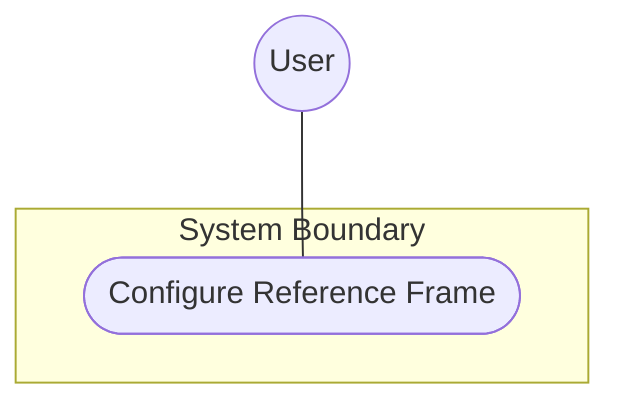
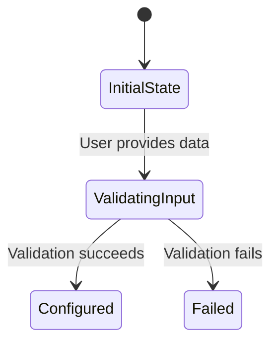

# Use Case: Configure Reference Frame

## Parent Epic
- [ ] #5 - [Geo Location Epic](https://github.com/gintatkinson/3dgs-032/blob/main/docs/epics/epic-02-geo-location.md) (Provides the overarching system context for geographical location)

## 1. Actors
- **Primary Actor:** User
- **Secondary Actors:** None

## 2. Preconditions
- The GeoLocation context is instantiated.
- The system is ready to accept configuration input for a location.

## 3. Trigger
The User initiates the configuration of a location's frame of reference.

## 4. Main Success Scenario (Basic Flow)
1. User provides reference frame data including astronomical-body and alternate-system.
2. System validates the astronomical-body pattern and alternate-system feature guard.
3. System applies the reference frame configuration to the geo-location object.

## 5. Alternate and Exception Flows
- **5a. Invalid astronomical-body pattern (Branches from Basic Flow step 2):**
  1. System detects the astronomical-body value violates the pattern constraint.
  2. System aborts the transaction, rolls back configuration state, and notifies User.
- **5b. Inactive alternate-systems feature guard (Branches from Basic Flow step 2):**
  1. System detects the alternate-system value is provided but the alternate-systems feature guard is not active.
  2. System aborts the transaction, rolls back configuration state, and notifies User.

## 6. Postconditions (Guarantees)
- **Success Guarantee:** The reference frame is successfully configured and persisted in the geo-location object.
- **Failure Guarantee:** The geo-location object remains in its previous state and the User is notified of the configuration error.

## UML Diagrams
### Use Case Diagram

### State Machine Diagram

## 7. Operational Context
The frame of reference ('reference-frame') defines what the location values refer to and their meaning. The referred-to object can be any astronomical body. It could be a planet such as Earth or Mars, a moon such as Enceladus, an asteroid such as Ceres, or even a comet such as 1P/Halley.

## 8. Realization Matrix
### Required User Stories
- [ ] #23 - [Record Geo-Location Coordinates](https://github.com/gintatkinson/3dgs-032/blob/main/docs/user-stories/us-06-record-geolocation.md) (Records location coordinates)

### Required Features
- [ ] #8 - [Feature: reference-frame](https://github.com/gintatkinson/3dgs-032/blob/main/docs/features/feat-07-reference-frame.md) (Defines the UI and constraints for the reference-frame container)

## Source References
Structural Schema: [ietf-geo-location@2022-02-11.yang](https://github.com/gintatkinson/3dgs-032/blob/main/schema/ietf-geo-location@2022-02-11.yang)
Normative Specification: [RFC 9179](https://datatracker.ietf.org/doc/html/rfc9179)
