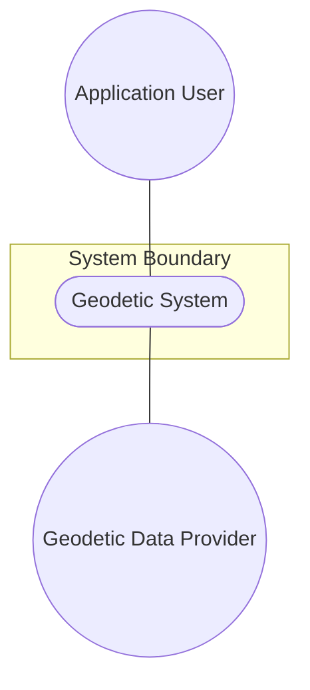
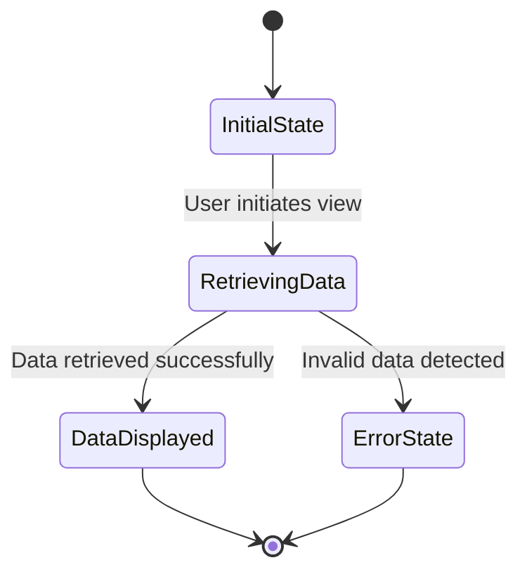

# Use Case: Geodetic System

## Parent Epic
- [ ] #5 - [epic-02-geo-location](https://github.com/gintatkinson/3dgs-032/tree/main/docs/epics/epic-02-geo-location.md) (Contains the timing attributes for geo-location)

## 1. Actors
- **Primary Actor:** Application User
- **Secondary Actors:** Geodetic Data Provider

## 2. Preconditions
- The Reference Frame object has been initialized.
- The User is viewing or editing a location record.

## 3. Trigger
The User views or sets the geodetic system data for a geographic location.

## 4. Main Success Scenario (Basic Flow)
1. Application User initiates view of geodetic system data.
2. System retrieves the `geodetic-datum`, `coord-accuracy`, and `height-accuracy` values.
3. System displays the geodetic system data to the Application User.
4. Application User reviews the geodetic system data.

## 5. Alternate and Exception Flows
- **5a. Missing Geodetic Datum (Branches from Basic Flow step 2):**
  1. System detects that `geodetic-datum` is not present.
  2. System transitions to display a default value (e.g., WGS-84) and returns to step 3 of the Main Success Scenario.
- **5b. Invalid Accuracy Value (Branches from Basic Flow step 2):**
  1. System detects an invalid or out-of-range value for `coord-accuracy` or `height-accuracy`.
  2. System aborts the transaction, logs the error, and notifies the Application User.

## 6. Postconditions (Guarantees)
- **Success Guarantee:** The geodetic system data is accurately displayed or set for the location.
- **Failure Guarantee:** The system displays an error and leaves the location data unmodified.

## UML Diagrams
### Use Case Diagram

### State Machine Diagram

## 7. Operational Context
> The geodetic system of the location data. A geodetic-datum defining the meaning of latitude, longitude, and height. The default when the astronomical body is 'earth' is 'wgs-84', which is used by the Global Positioning System (GPS).

## 8. Realization Matrix
### Required User Stories
- [ ] #23 - [Record Geo-Location Coordinates](https://github.com/gintatkinson/3dgs-032/blob/main/docs/user-stories/us-06-record-geolocation.md) (Records location coordinates)

### Required Features
- [ ] #9 - [Feature: Geodetic System](https://github.com/gintatkinson/3dgs-032/tree/main/docs/features/feat-08-geodetic-system.md) (Specifies the Geodetic System attributes and their layout)

## Source References
Structural Schema: [ietf-geo-location@2022-02-11.yang](file:///Users/perkunas/jail/3dgs-032/schema/ietf-geo-location@2022-02-11.yang)
Normative Specification: [RFC 9179](https://www.rfc-editor.org/info/rfc9179)
