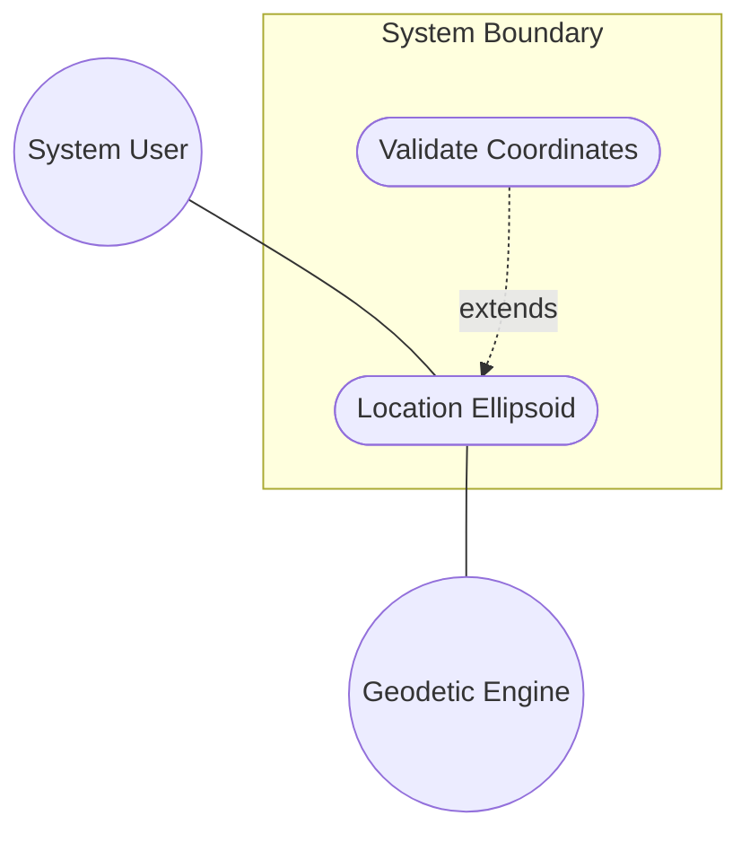
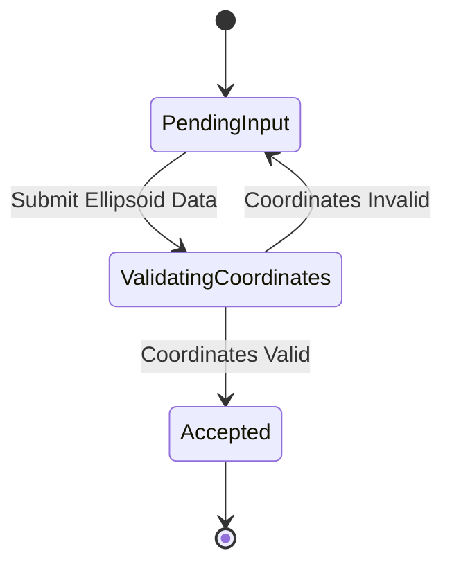

# Use Case: Location Ellipsoid

## Parent Epic
- [ ] #5 - [epic-02-geo-location](https://github.com/gintatkinson/3dgs-032/tree/main/docs/epics/epic-02-geo-location.md) (Provides the overarching epic for IETF geographic location context)

## 1. Actors
- **Primary Actor:** System User
- **Secondary Actors:** Geodetic Engine

## 2. Preconditions
- The geo-location context is active and initialized.
- A location choice is being specified.
- The reference frame (geodetic-datum) has been established to interpret coordinates.

## 3. Trigger
The Primary Actor provides location data using the ellipsoidal coordinate format (latitude, longitude, and optional height).

## 4. Main Success Scenario (Basic Flow)
1. System User submits ellipsoidal location coordinates containing latitude, longitude, and height.
2. System validates the latitude against the decimal degrees format (fraction-digits 16).
3. System validates the longitude against the decimal degrees format (fraction-digits 16).
4. System validates the height against fractional meters format (fraction-digits 6).
5. System accepts the ellipsoidal coordinates and binds them to the location model.
6. System displays the visual representation of the ellipsoidal location in the UI.

## 5. Alternate and Exception Flows
- **5a. Invalid Coordinate Precision (Branches from Basic Flow step 2):**
  1. System detects that latitude or longitude exceeds the supported 16 fraction-digits precision.
  2. System aborts the transaction, logs a precision error, and returns to step 1 of the Main Success Scenario.
- **5b. Invalid Height Precision (Branches from Basic Flow step 4):**
  1. System detects that height exceeds the supported 6 fraction-digits precision.
  2. System aborts the transaction, logs a validation error, and returns to step 1 of the Main Success Scenario.

## 6. Postconditions (Guarantees)
- **Success Guarantee:** The ellipsoidal coordinates (latitude, longitude, height) are successfully persisted and presented in the system.
- **Failure Guarantee:** The system state remains unchanged, and invalid coordinates are rejected without partial application.

## UML Diagrams
### Use Case Diagram

### State Machine Diagram

## 7. Operational Context
"For the standard location choice, 'latitude' and 'longitude' are specified as decimal degrees, and the 'height' value is in fractions of meters... The exact meanings of all the values are defined by the 'geodetic-datum' value." (RFC 9179 Section 2.2)

## 8. Realization Matrix
### Required User Stories
- [ ] #23 - [Record Geo-Location Coordinates](https://github.com/gintatkinson/3dgs-032/blob/main/docs/user-stories/us-06-record-geolocation.md) (Records location coordinates)

### Required Features
- [ ] #12 - [Feature: Location Ellipsoid](https://github.com/gintatkinson/3dgs-032/tree/main/docs/features/feat-10-location-ellipsoid.md) (Specifies the UI properties for ellipsoidal coordinates)

## Source References
Structural Schema: [ietf-geo-location@2022-02-11.yang](file:///Users/perkunas/jail/3dgs-032/schema/ietf-geo-location@2022-02-11.yang)
Normative Specification: [RFC 9179](https://www.rfc-editor.org/info/rfc9179)
