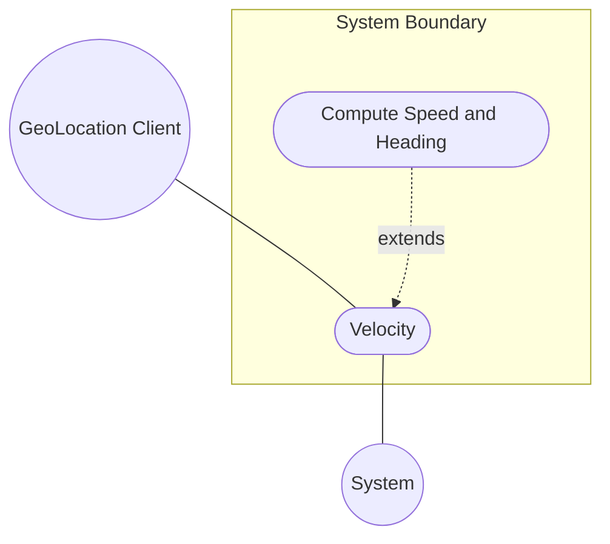
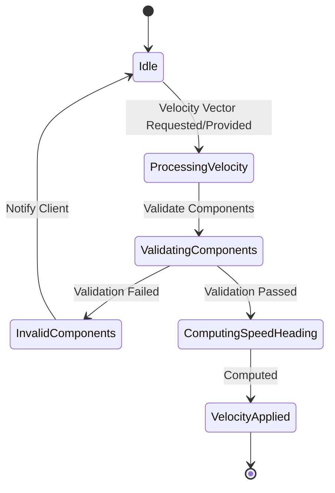

# Use Case: Velocity

## Parent Epic
- [x] #5 - [Epic: IETF Geo Location](https://github.com/gintatkinson/3dgs-032/tree/main/docs/epics/epic-02-geo-location.md) (Contains the velocity attributes for geo-location)

## 1. Actors
- **Primary Actor:** GeoLocation Client
- **Secondary Actors:** System

## 2. Preconditions
- The geo-location context is established.
- The object must be in relatively stable motion.

## 3. Trigger
The GeoLocation Client requests or provides motion information for a geo-location.

## 4. Main Success Scenario (Basic Flow)
1. GeoLocation Client requests to update or view the velocity of a geo-location.
2. System processes the velocity components (v-north, v-east, and v-up).
3. System applies the values relative to true north and the center of mass as defined by the geodetic system.
4. System computes speed and heading if required.
5. System returns or confirms the applied velocity vector.

## 5. Alternate and Exception Flows
- **5a. Invalid Velocity Components (Branches from Basic Flow step 2):**
  1. System detects invalid or malformed values for v-north, v-east, or v-up.
  2. System rejects the input, logs an error, and returns to step 1 of the Main Success Scenario.
- **5b. Complex Motion Detected (Branches from Basic Flow step 2):**
  1. System detects the object is changing location frequently in non-simple ways (beyond relatively stable motion).
  2. System ignores the velocity vector, requires more frequent location queries, and notifies GeoLocation Client.

## 6. Postconditions (Guarantees)
- **Success Guarantee:** The velocity vector is successfully captured and the rate of change is applied to the object's geo-location context.
- **Failure Guarantee:** The velocity state remains unchanged and the client is notified of the failure.

## UML Diagrams
### Use Case Diagram

### State Machine Diagram

## 7. Operational Context
"Support is added for objects in relatively stable motion. For objects in relatively stable motion, the grouping provides a three-dimensional vector value. The components of the vector are 'v-north', 'v-east', and 'v-up', which are all given in fractional meters per second. The values 'v-north' and 'v-east' are relative to true north as defined by the reference frame for the astronomical body; 'v-up' is perpendicular to the plane defined by 'v-north' and 'v-east', and is pointed away from the center of mass. Tracking more complex forms of motion is outside the scope of this work." (RFC 9179, Section 2.3)

## 8. Realization Matrix
### Required User Stories
- [ ] #21 - [Derive Speed and Heading](https://github.com/gintatkinson/3dgs-032/blob/main/docs/user-stories/us-02-derive-speed-and-heading.md) (Calculates velocity metrics)

### Required Features
- [ ] #15 - [Velocity](https://github.com/gintatkinson/3dgs-032/tree/main/docs/features/feat-12-velocity.md) (Specifies the velocity attributes for geo-location)

## Source References
Structural Schema: [ietf-geo-location@2022-02-11.yang](https://github.com/YangModels/yang/blob/main/standard/ietf/RFC/ietf-geo-location%402022-02-11.yang)
Normative Specification: [RFC 9179](https://www.rfc-editor.org/info/rfc9179)
