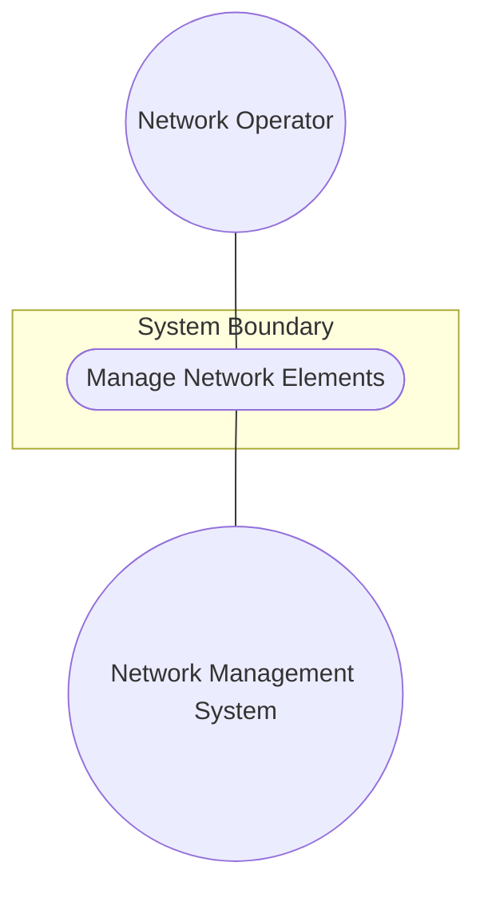
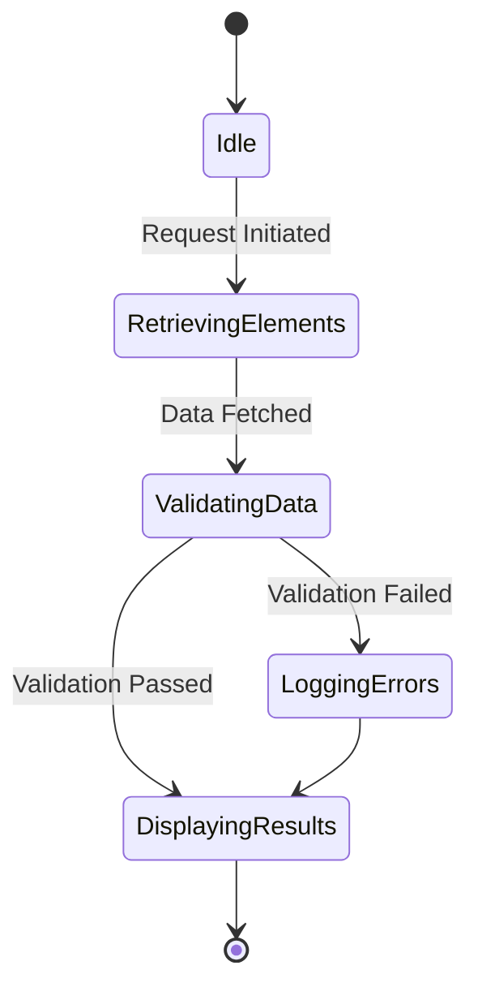

# Use Case: Manage Network Elements

## Parent Epic
- [ ] #60 - [Network Inventory Bounded Context](https://github.com/gintatkinson/digital-pipeline-repo/blob/main/docs/epics/epic-03-network-inventory.md) (Provides the bounded context for managing network inventory elements)

## 1. Actors
- **Primary Actor:** Network Operator
- **Secondary Actors:** Network Management System

## 2. Preconditions
- The network inventory system is initialized and operational.
- The user is authenticated and has sufficient authorization to view or manage network elements.

## 3. Trigger
The Network Operator initiates a request to discover, retrieve, or update the list of network elements in the network inventory.

## 4. Main Success Scenario (Basic Flow)
1. The Network Operator requests the network inventory system to display or retrieve network elements.
2. The Network Management System processes the request and fetches the network elements from the datastore.
3. The system validates the presence of mandatory `ne-id` and correctly formatted `uuid` for each element.
4. The system validates any nested `software-rev` and `patch` components.
5. The system successfully returns the formatted list of network elements to the Network Operator.

## 5. Alternate and Exception Flows
- **5a. Missing Network Element ID (Branches from Basic Flow step 3):**
  1. The Network Management System detects that a network element is missing the mandatory `ne-id` attribute.
  2. The Network Management System aborts the retrieval for that element, logs a validation error, and returns to step 5 of the Main Success Scenario.
- **5b. Invalid UUID Format (Branches from Basic Flow step 3):**
  1. The Network Management System detects that the `uuid` attribute of a network element does not conform to the standard UUID formatting.
  2. The Network Management System rejects the element data, logs a format validation error, and returns to step 5 of the Main Success Scenario.
- **5c. Missing Software Revision Name (Branches from Basic Flow step 4):**
  1. The Network Management System detects that a nested `software-rev` entry is missing the mandatory `name` attribute.
  2. The Network Management System aborts the processing of the specific software revision list, logs a schema violation error, and returns to step 5 of the Main Success Scenario.
- **5d. Missing Patch Revision (Branches from Basic Flow step 4):**
  1. The Network Management System detects that a nested `patch` entry is missing the mandatory `revision` attribute.
  2. The Network Management System skips the invalid patch entry, records a structural anomaly, and returns to step 5 of the Main Success Scenario.
- **5e. Invalid NE Type Reference (Branches from Basic Flow step 3):**
  1. The Network Management System detects that `ne-type` references an unknown identity.
  2. The Network Management System rejects the element, logs an identityref error, and returns to step 5 of the Main Success Scenario.
- **5f. Invalid Name Length (Branches from Basic Flow step 3):**
  1. The Network Management System detects that the `name` string exceeds the allowed length limits.
  2. The Network Management System truncates or rejects the name, logs a string format error, and returns to step 5 of the Main Success Scenario.
- **5g. Invalid Alias Format (Branches from Basic Flow step 3):**
  1. The Network Management System detects that the `alias` attribute contains forbidden characters.
  2. The Network Management System rejects the field, logs a validation error, and returns to step 5 of the Main Success Scenario.
- **5h. Invalid Description (Branches from Basic Flow step 3):**
  1. The Network Management System detects an encoding issue in the `description` string.
  2. The Network Management System strips the invalid characters, logs an encoding warning, and returns to step 5 of the Main Success Scenario.
- **5i. Invalid Manufacturer Name (Branches from Basic Flow step 3):**
  1. The Network Management System detects that `mfg-name` is invalid or empty when explicitly required by policy.
  2. The Network Management System logs a policy violation and returns to step 5 of the Main Success Scenario.
- **5j. Invalid Product Name (Branches from Basic Flow step 3):**
  1. The Network Management System detects that `product-name` is malformed.
  2. The Network Management System rejects the data, logs a validation error, and returns to step 5 of the Main Success Scenario.
- **5k. Invalid Product Revision (Branches from Basic Flow step 3):**
  1. The Network Management System detects an improperly formatted `product-rev`.
  2. The Network Management System logs the warning and returns to step 5 of the Main Success Scenario.
- **5l. Invalid Software Revision Version (Branches from Basic Flow step 4):**
  1. The Network Management System detects an improperly formatted `software-rev/revision` string.
  2. The Network Management System logs the formatting error and returns to step 5 of the Main Success Scenario.
- **5m. Duplicate Network Element ID (Branches from Basic Flow step 3):**
  1. The Network Management System detects a duplicate `ne-id` in the network inventory list.
  2. The Network Management System rejects the duplicate entry to maintain list key uniqueness, logs a constraint violation, and returns to step 5 of the Main Success Scenario.
- **5n. Structural Schema Violation (Branches from Basic Flow step 3):**
  1. The Network Management System detects an unexpected or malformed element within the `network-element` list.
  2. The Network Management System skips the element, logs a structural schema error, and returns to step 5 of the Main Success Scenario.

## 6. Postconditions (Guarantees)
- **Success Guarantee:** The network elements are successfully retrieved, validated, and presented to the Network Operator with all nested software and patch revisions accurately reflected.
- **Failure Guarantee:** In the event of a critical failure, the operation is aborted without altering the datastore, and the Network Operator receives a notification of the failure.

## UML Diagrams
### Use Case Diagram

### State Machine Diagram

## 7. Operational Context
The network-element list contains network elements within the network. It includes basic common entity attributes (uuid, name, alias, description) and component common attributes (software-rev, mfg-name, product-name, product-rev).

## 8. Realization Matrix
### Required User Stories
- [ ] #38 - [Assign Facility Location](https://github.com/gintatkinson/digital-pipeline-repo/blob/main/docs/user-stories/us-07-assign-facility-location.md) (semantic linkage: Network Elements are targets for location assignments)
### Required Features
- [ ] #54 - [Network Elements](https://github.com/gintatkinson/digital-pipeline-repo/blob/main/docs/features/feat-15-network-elements.md) (Provides the specification for the Nwi_NetworkElements container and nested lists)

## Source References
Structural Schema: [ietf-network-inventory.yang](https://datatracker.ietf.org/doc/html/draft-ietf-ivy-network-inventory-yang)
Normative Specification: [draft-ietf-ivy-network-inventory-yang.txt](https://datatracker.ietf.org/doc/html/draft-ietf-ivy-network-inventory-yang)
