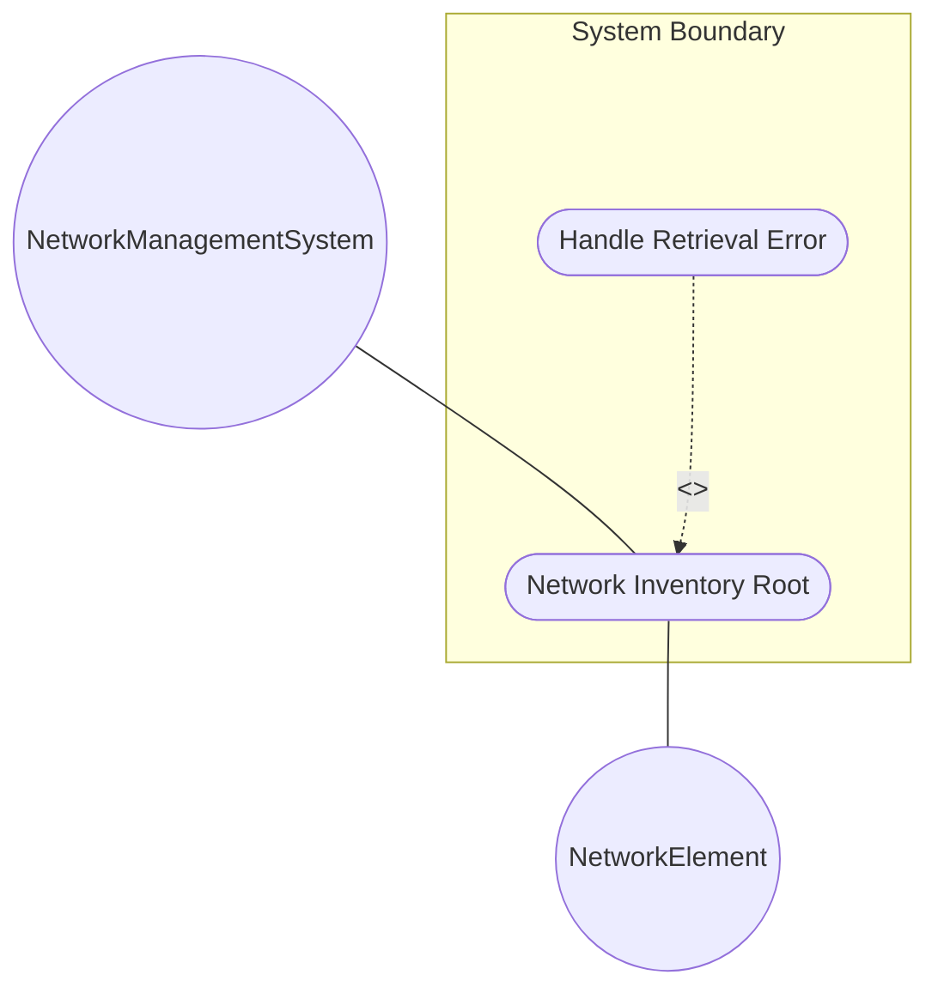
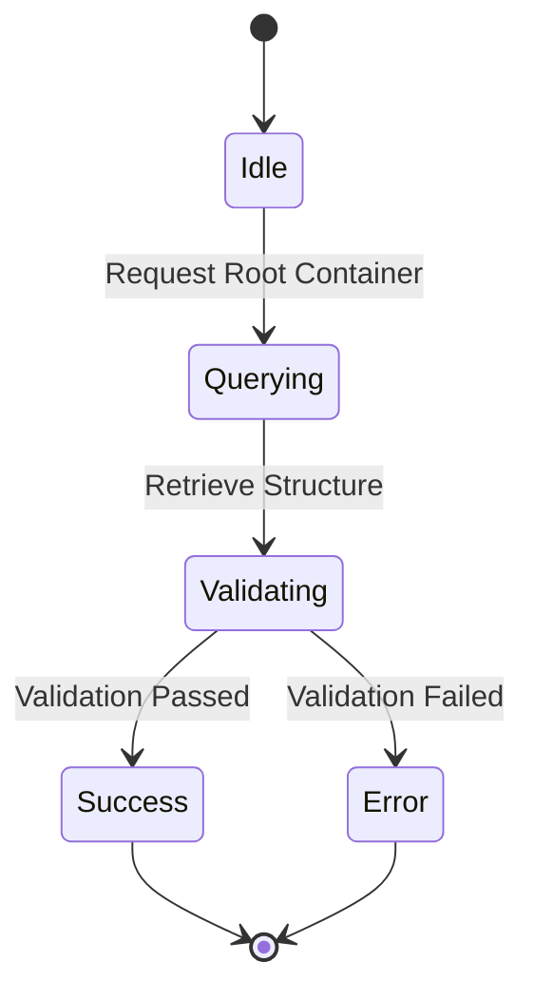

# Use Case: Network Inventory Root

## Parent Epic
- [ ] #1 - [Network Inventory](https://github.com/gintatkinson/digital-pipeline-repo/blob/main/docs/epics/epic-03-network-inventory.md) (semantic linkage: Network Inventory Root container is part of the Network Inventory bounded context)

## 1. Actors
- **Primary Actor:** NetworkManagementSystem
- **Secondary Actors:** NetworkElement

## 2. Preconditions
- The system has initialized the network inventory datastore.
- The `network-inventory` root container is accessible.

## 3. Trigger
NetworkManagementSystem requests the retrieval of the structural root for the network inventory.

## 4. Main Success Scenario (Basic Flow)
1. NetworkManagementSystem requests the `network-inventory` container.
2. The System queries the root datastore for the container structure.
3. The System validates access and ensures the root container exists.
4. The System returns the empty or populated structural root container to the NetworkManagementSystem.

## 5. Alternate and Exception Flows
- **5a. Datastore Unreachable (Branches from Basic Flow step 2):**
  1. The System fails to connect to the underlying root datastore.
  2. The System aborts the transaction, transitions to an error state, and returns a service unavailable error to the NetworkManagementSystem.
- **5b. Unauthorized Access (Branches from Basic Flow step 3):**
  1. The System detects that the NetworkManagementSystem lacks read permissions.
  2. The System aborts the transaction, logs an unauthorized access attempt, and returns a permission denied error.

## 6. Postconditions (Guarantees)
- **Success Guarantee:** The `network-inventory` structural root container is successfully returned.
- **Failure Guarantee:** The transaction is aborted and an appropriate error response is returned without exposing the inventory structure.

## UML Diagrams
### Use Case Diagram

### State Machine Diagram

## 7. Operational Context
"Top-level container for network inventory."

## 8. Realization Matrix
### Required User Stories
- [ ] #61 - [Hierarchical Inventory Aggregation](https://github.com/gintatkinson/digital-pipeline-repo/blob/main/docs/user-stories/us-11-hierarchical-inventory-aggregation.md) (semantic linkage: implements the hierarchical aggregation scenario) (Provides hierarchical inventory logic)
### Required Features
- [ ] #52 - [Network Inventory Root](https://github.com/gintatkinson/digital-pipeline-repo/blob/main/docs/features/feat-14-network-inventory.md) (Provides the Network Inventory Root container structure)

## Source References
Structural Schema: [ietf-network-inventory.yang](file:///Users/perkunas/jail/3dgs-032/schema/ietf-network-inventory.yang)
Normative Specification: [draft-ietf-ivy-network-inventory-yang.txt](file:///Users/perkunas/jail/3dgs-032/docs/draft-ietf-ivy-network-inventory-yang.txt)
