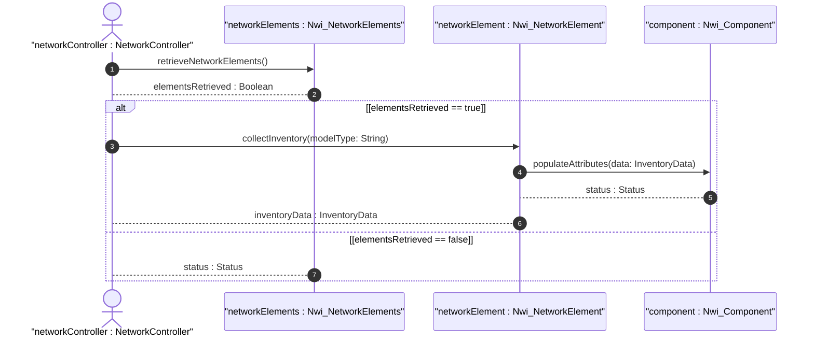
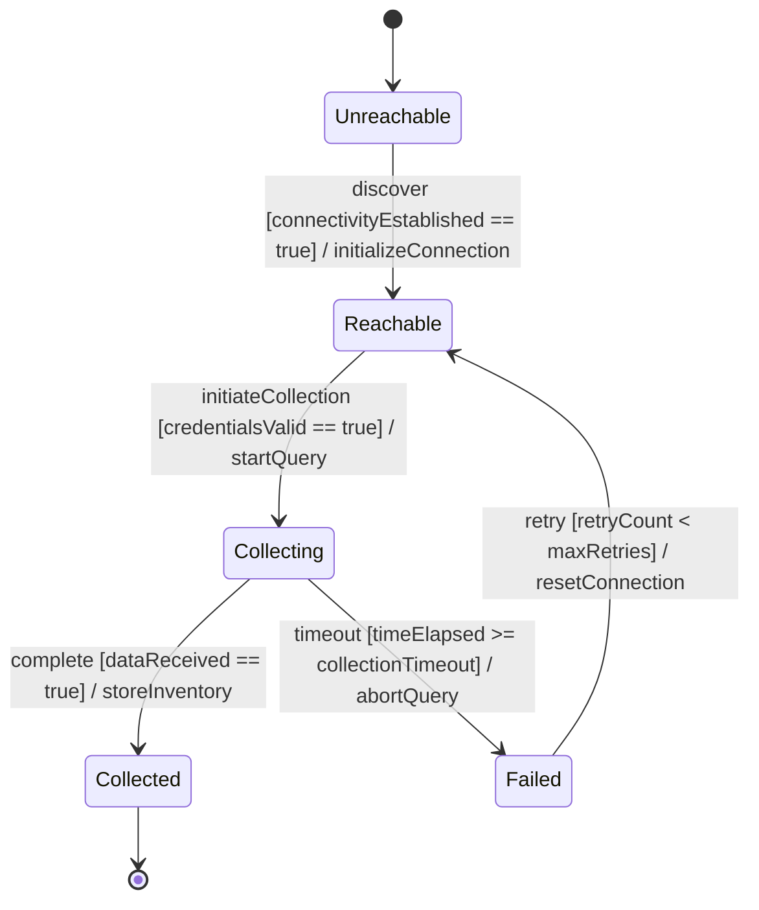

# User Story: Device-level Inventory Collection

## Parent Epic
- [ ] #TBD - [Network Inventory](https://github.com/gintatkinson/digital-pipeline-repo/blob/main/docs/epics/epic-03-network-inventory.md) (Aggregates inventory operations)

## Domain Object Mapping
- **Primary Domain Objects:** Nwi_NetworkElement, Nwi_Component
- **Actor/Role:** Network Controller (External System)

## BDD Scenario (OOA/OOD Realization)
**Given** a physical network element is accessible and reachable on the network
**When** the Network Controller initiates an inventory collection procedure
**Then** the hardware components and software revisions are retrieved and stored into the inventory model

## UML Sequence Diagram

## UML State Machine Diagram

## Operational Context
The Network Controller collects hardware and software inventory data from physical network elements to maintain an accurate and up-to-date repository of deployed resources. This enables capacity planning, maintenance, and operational assurance functions.

## Required Features Matrix
- [ ] #TBD - [Network Elements](https://github.com/gintatkinson/digital-pipeline-repo/blob/main/docs/features/feat-15-network-elements.md) (Provides the target structure for storing top-level network element data)
- [ ] #TBD - [Components](https://github.com/gintatkinson/digital-pipeline-repo/blob/main/docs/features/feat-16-components.md) (Provides the target structure for storing hardware and software component details)

## Source References
Structural Schema: [ietf-network-inventory.yang](https://datatracker.ietf.org/doc/html/draft-ietf-ivy-network-inventory-yang)
Normative Specification: [draft-ietf-ivy-network-inventory-yang.txt](https://datatracker.ietf.org/doc/html/draft-ietf-ivy-network-inventory-yang)
