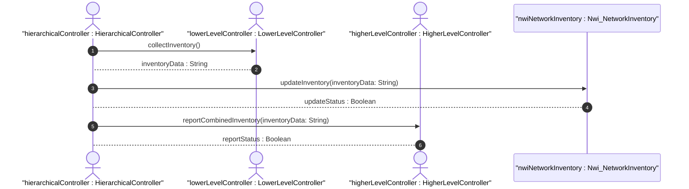

# User Story: Hierarchical Inventory Aggregation

## Parent Epic
- [ ] #1 - [Network Inventory](https://github.com/gintatkinson/digital-pipeline-repo/blob/main/docs/epics/epic-03-network-inventory.md) (Contextual epic for network inventory operations)

## Domain Object Mapping
- **Primary Domain Objects:** Nwi_NetworkInventory, Nwi_NetworkElements
- **Actor/Role:** Hierarchical Network Controller

## BDD Scenario (OOA/OOD Realization)
**Given** a hierarchical network controller is deployed above lower-level network controllers
**When** the hierarchical controller collects network inventory information from its lower-level controllers
**Then** it aggregates the data into a combined network inventory model and reports it to higher-level applications or OSS

## UML Sequence Diagram

## Operational Context
"In case of hierarchical controllers, a hierarchical network controller can also collect the network inventory information from its lower level network controllers using this YANG data model (or other mechanisms which are outside the scope of this document) and report the combined network inventory information to a higher level network controller, to an Inventory OSS or to any other type of application which needs to discover the network inventory information."

## Required Features Matrix
- [ ] #14 - [Network Inventory Root](https://github.com/gintatkinson/digital-pipeline-repo/blob/main/docs/features/feat-14-network-inventory.md) (Provides the root container structure for the combined inventory)
- [ ] #15 - [Network Elements](https://github.com/gintatkinson/digital-pipeline-repo/blob/main/docs/features/feat-15-network-elements.md) (Provides the network element details that are aggregated)

## Source References
Structural Schema: [ietf-network-inventory.yang](https://github.com/gintatkinson/digital-pipeline-repo/blob/main/schema/ietf-network-inventory.yang)
Normative Specification: [draft-ietf-ivy-network-inventory-yang.txt](https://datatracker.ietf.org/doc/html/draft-ietf-ivy-network-inventory-yang)
