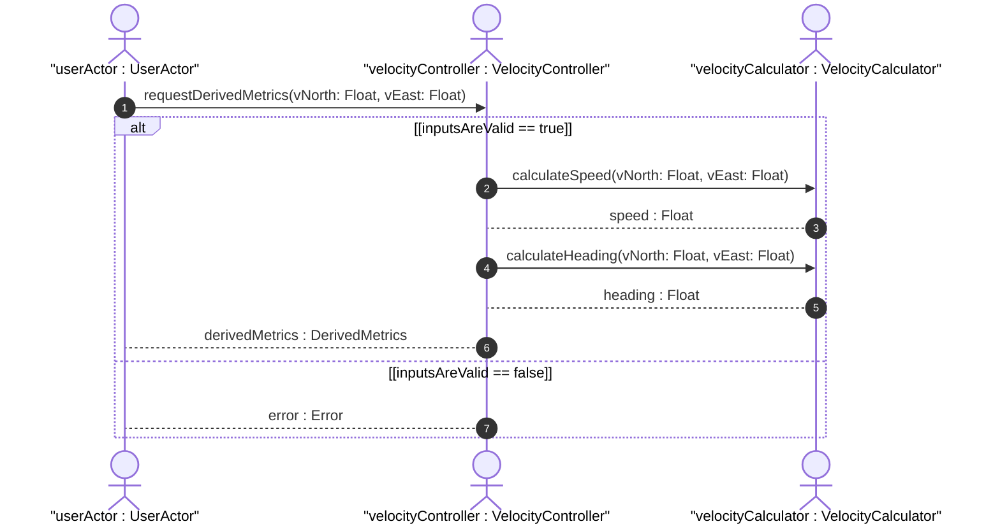

# User Story: Derive Speed and Heading

## Parent Epic
- [ ] #5 - [epic-02-geo-location](https://github.com/gintatkinson/3dgs-032/blob/main/docs/epics/epic-02-geo-location.md) (Contains the base geo-location requirements under which velocity is calculated)

## Domain Object Mapping
- **Primary Domain Objects:** Velocity
- **Actor/Role:** UserActor (Triggers the calculation)

## BDD Scenario (OOA/OOD Realization)
**Given** velocity components v-north and v-east are available
**When** the UserActor requests the derived speed and heading
**Then** the VelocityCalculator derives the speed using sqrt(v-north^2 + v-east^2) and heading using arctan(v-east / v-north)
**And** the VelocityController returns the derived values

## UML Sequence Diagram

## Operational Context
To derive the two-dimensional heading and speed, one would use the following formulas: speed = sqrt(v-north^2 + v-east^2), heading = arctan(v-east / v-north)

## Required Features Matrix
- [ ] #13 - [Velocity](https://github.com/gintatkinson/3dgs-032/blob/main/docs/features/feat-12-velocity.md) (Provides the base attributes v-north and v-east used for derivation)

## Source References
Structural Schema: [ietf-geo-location@2022-02-11.yang](file:///Users/perkunas/jail/3dgs-032/schema/ietf-geo-location@2022-02-11.yang)
Normative Specification: [RFC 9179](https://www.rfc-editor.org/info/rfc9179)
