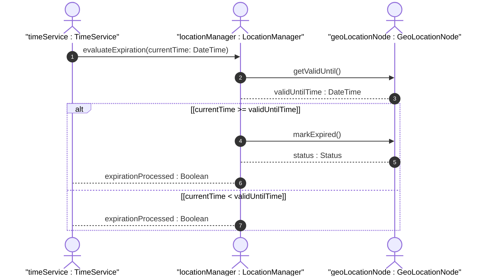
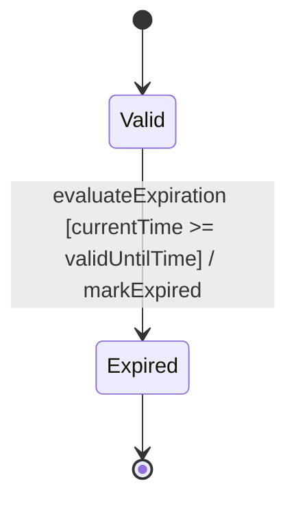

# User Story: Temporal Expiration Scenario

## Parent Epic
- [x] #5 - [epic-02-geo-location](https://github.com/gintatkinson/3dgs-032/tree/main/docs/epics/epic-02-geo-location.md) (Provides the foundational geo-location timing attributes)

## Domain Object Mapping
- **Primary Domain Objects:** GeoLocation
- **Actor/Role:** TimeService

## BDD Scenario (OOA/OOD Realization)
**Given** a GeoLocation record exists with a specified `valid-until` timestamp
**When** the current system time meets or exceeds the `valid-until` timestamp
**Then** the GeoLocation record is transitioned to an expired state and is no longer considered valid

## UML Sequence Diagram

## UML State Machine Diagram

## Operational Context
valid-until: The timestamp for which this geo-location is valid until. If unspecified, the geo-location has no specific expiration time.

## Required Features Matrix
- [x] #1 - [Geo-Location Timing Attributes](https://github.com/gintatkinson/3dgs-032/tree/main/docs/features/feat-06-geo-location-grouping.md) (Provides the structural definition for the valid-until attribute)

## Source References
Structural Schema: [ietf-geo-location](https://github.com/YangModels/yang/blob/main/standard/ietf/RFC/ietf-geo-location%402022-02-11.yang)
Normative Specification: [RFC 9179 Section 2.6](https://www.rfc-editor.org/info/rfc9179)
