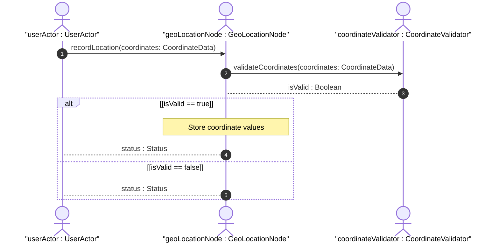

# User Story: Record Geo-Location Coordinates

## Parent Epic
- [x] #5 - [epic-02-geo-location](https://github.com/gintatkinson/3dgs-032/tree/main/docs/epics/epic-02-geo-location.md) (Contains the overarching specification for geo-location records)

## Domain Object Mapping
- **Primary Domain Objects:** GeoLocation, Location, Ellipsoid, Cartesian
- **Actor/Role:** UserActor

## BDD Scenario (OOA/OOD Realization)
**Given** a set of location coordinate values
**When** the user records the location
**Then** the location is stored using either the ellipsoid or cartesian choice structure

## UML Sequence Diagram

## Operational Context
"Location. This is the location on, or relative to, the astronomical object. It is specified using two or three coordinate values. ... latitude, longitude, and an optional height, or as Cartesian coordinates of x, y, and z."

## Required Features Matrix
- [ ] #11 - [Location Choice](https://github.com/gintatkinson/3dgs-032/tree/main/docs/features/feat-09-location-choice.md) (Provides the container choice between ellipsoid and cartesian)
- [ ] #12 - [Location Ellipsoid](https://github.com/gintatkinson/3dgs-032/tree/main/docs/features/feat-10-location-ellipsoid.md) (Provides latitude, longitude, and height coordinate attributes)
- [ ] #14 - [Location Cartesian](https://github.com/gintatkinson/3dgs-032/tree/main/docs/features/feat-11-location-cartesian.md) (Provides x, y, z coordinate attributes)

## Source References
Structural Schema: [ietf-geo-location@2022-02-11.yang](https://github.com/YangModels/yang/blob/main/standard/ietf/RFC/ietf-geo-location%402022-02-11.yang)
Normative Specification: [RFC 9179](https://www.rfc-editor.org/info/rfc9179)
