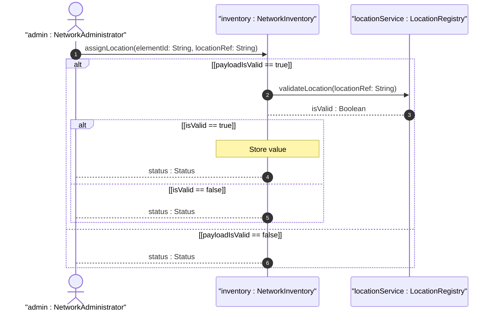
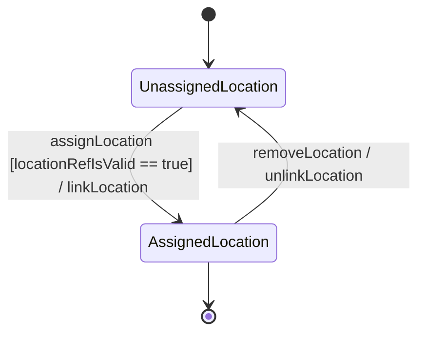

# User Story: Assign Facility Location

## Parent Epic
- [ ] #36 - [Network Inventory Location](https://github.com/gintatkinson/3dgs-032/blob/main/docs/epics/epic-01-ni-location.md) (semantic linkage: parent bounded context)

## Domain Object Mapping
- **Primary Domain Objects:** NetworkElement, Component, Location, FacilityLocation
- **Actor/Role:** NetworkAdministrator

## BDD Scenario (OOA/OOD Realization)
**Given** a facility location is defined in the network inventory with its building, room, and rack details
**When** the NetworkAdministrator assigns the location reference to a Network Element or Component
**Then** the system validates the reference and links the equipment to the specified facility location

## UML Sequence Diagram

## UML State Machine Diagram

## Operational Context
"Network Elements (NEs) can be grouped by location to provide more information for network planning, deployment, and maintenance... The Network Inventory location model is to record physical locations, such as sites, building, equipment rooms, racks, and so on... The location model augments the base network inventory to enrich NEs with location information."

## Required Features Matrix
- [ ] #31 - [Locations Feature](https://github.com/gintatkinson/3dgs-032/blob/main/docs/features/feat-01-locations.md) (semantic linkage: Provides the base location container and registry)
- [ ] #33 - [Facility Location](https://github.com/gintatkinson/3dgs-032/blob/main/docs/features/feat-03-facility-location.md) (semantic linkage: Provides the specific facility details to be assigned)
- [ ] #35 - [Network Element and Component Location Augments](https://github.com/gintatkinson/3dgs-032/blob/main/docs/features/feat-05-ne-location.md) (semantic linkage: Provides the augmentation to network element to accept a location reference)

## Source References
Structural Schema: [ietf-ni-location.yang](schema/ietf-ni-location.yang)
Normative Specification: [draft-ietf-ivy-network-inventory-location](docs/draft-ietf-ivy-network-inventory-location.md)

