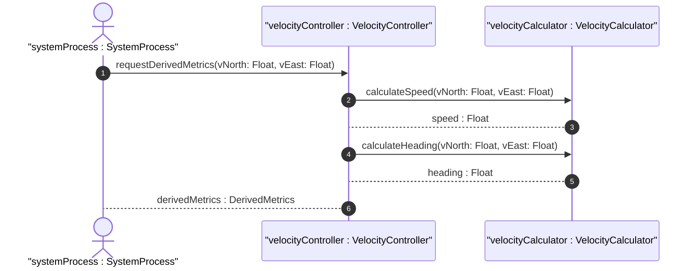

# User Story: Velocity Conversion to Speed and Heading

## Parent Epic
- [x] #5 - [epic-01-geo-location](https://github.com/gintatkinson/3dgs-032/tree/main/docs/epics/epic-01-geo-location.md) (Contains the timing attributes for geo-location)

## Domain Object Mapping
- **Primary Domain Objects:** Velocity
- **Actor/Role:** System Process

## BDD Scenario (OOA/OOD Realization)
**Given** a geo-location record containing a valid Velocity container with v-north and v-east vector components
**When** the velocity data is processed for spatial metrics or read by a consumer
**Then** the system delegates to a calculator object to derive the scalar speed and heading from the velocity vector components

## UML Sequence Diagram

## Operational Context
"If the object is in motion, the velocity vector describes this motion at the time given by the timestamp. For a formula to convert these values to speed and heading, see RFC 9179."

## Required Features Matrix
- [ ] #15 - [Velocity](https://github.com/gintatkinson/3dgs-032/tree/main/docs/features/feat-07-velocity.md) (Provides the v-north, v-east, v-up attributes and calculator interfaces required for the conversion)

## Source References
Structural Schema: [ietf-geo-location.yang](https://github.com/gintatkinson/3dgs-032/blob/main/schema/ietf-geo-location.yang)
Normative Specification: [RFC 9179](https://www.rfc-editor.org/info/rfc9179)

