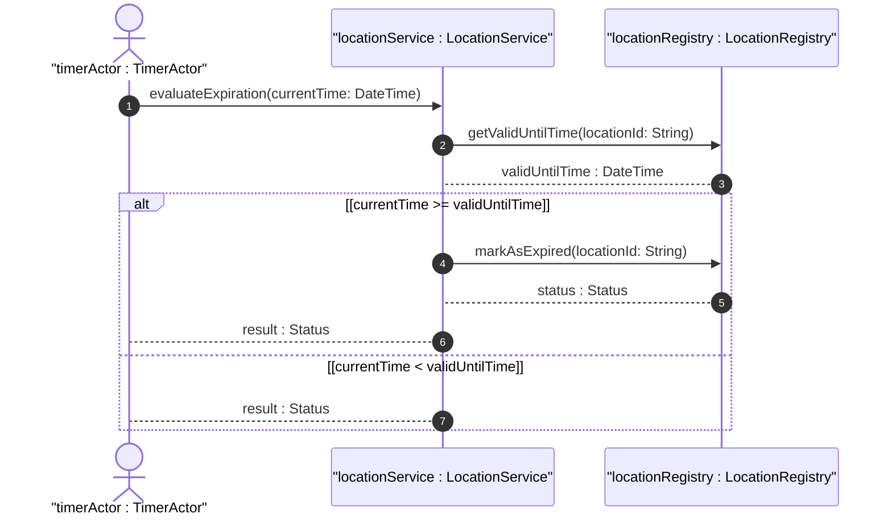
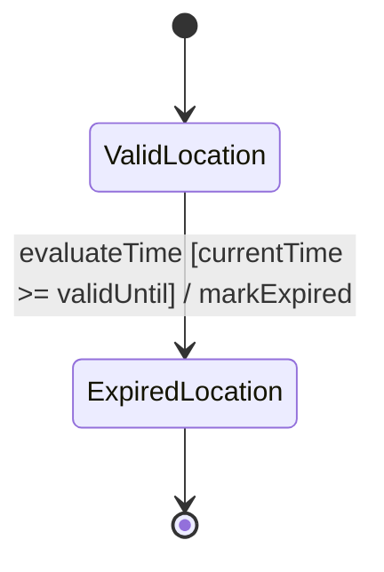

# User Story: Expire Geo Location Data

## Parent Epic
- [ ] #36 - [Network Inventory Location](https://github.com/gintatkinson/3dgs-032/blob/main/docs/epics/epic-01-ni-location.md) (semantic linkage: parent bounded context)

## Domain Object Mapping
- **Primary Domain Objects:** `geo-location`, `valid-until`
- **Actor/Role:** System Timer

## BDD Scenario (OOA/OOD Realization)
**Given** a geo-location record containing a valid-until timestamp
**When** the current system time is equal to or greater than the valid-until timestamp
**Then** the geo-location record transitions to an expired state and is no longer considered valid

## UML Sequence Diagram

## UML State Machine Diagram

## Operational Context
The timestamp for which this geo-location is valid until. If unspecified, the geo-location has no specific expiration time.

## Required Features Matrix
- [ ] #32 - [Feature: Geo Location](https://github.com/gintatkinson/3dgs-032/blob/main/docs/features/feat-02-geo-location.md) (semantic linkage: requires geo-location and valid-until fields to be defined)

## Source References
Structural Schema: [ietf-geo-location.yang](file:///Users/perkunas/jail/3dgs-032/schema/ietf-geo-location.yang)
Normative Specification: [RFC 9179](https://www.rfc-editor.org/info/rfc9179)

