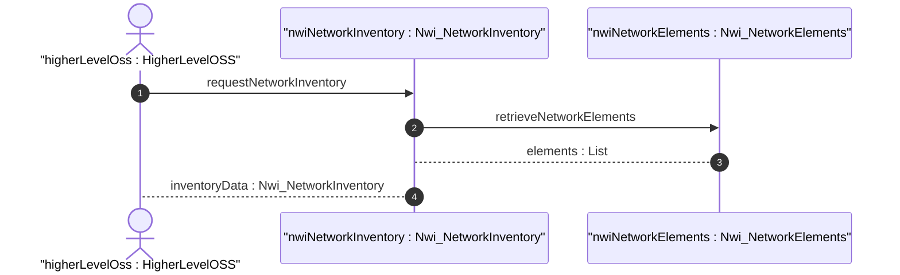

# User Story: Northbound Network Inventory Reporting

## Parent Epic
- [ ] #1 - [Network Inventory](https://github.com/gintatkinson/digital-pipeline-repo/blob/main/docs/epics/epic-03-network-inventory.md) (Provides the base epic for the inventory capability)

## Domain Object Mapping
- **Primary Domain Objects:** `Nwi_NetworkInventory`, `Nwi_NetworkElements`
- **Actor/Role:** `HigherLevelOSS` (Higher level hierarchical network controller or Inventory OSS)

## BDD Scenario (OOA/OOD Realization)
**Given** a network controller managing the network inventory
**When** a higher-level hierarchical network controller or Inventory OSS requests discovery of the network inventory information
**Then** the network controller provides read-only network inventory data including network elements

## UML Sequence Diagram

## UML State Machine Diagram
*(Not applicable as this is a stateless read-only reporting scenario without state transitions)*

## Operational Context
"This information can be provided by a network controller to a higher level hierarchical network controller, to an Inventory OSS or to any other type of application which needs to discover the network inventory information. For example, in the context of ACTN, the network inventory YANG data model can be used at the MPI interfaces, as defined in [RFC8453]"

## Required Features Matrix
- [ ] #14 - [Network Inventory Root](https://github.com/gintatkinson/digital-pipeline-repo/blob/main/docs/features/feat-14-network-inventory.md) (Provides the root container layout for inventory data)
- [ ] #15 - [Network Elements](https://github.com/gintatkinson/digital-pipeline-repo/blob/main/docs/features/feat-15-network-elements.md) (Provides the detailed list of network elements to report)

## Source References
Structural Schema: [ietf-network-inventory.yang](https://datatracker.ietf.org/doc/html/draft-ietf-ivy-network-inventory-yang)
Normative Specification: [draft-ietf-ivy-network-inventory-yang.txt](https://datatracker.ietf.org/doc/html/draft-ietf-ivy-network-inventory-yang)
