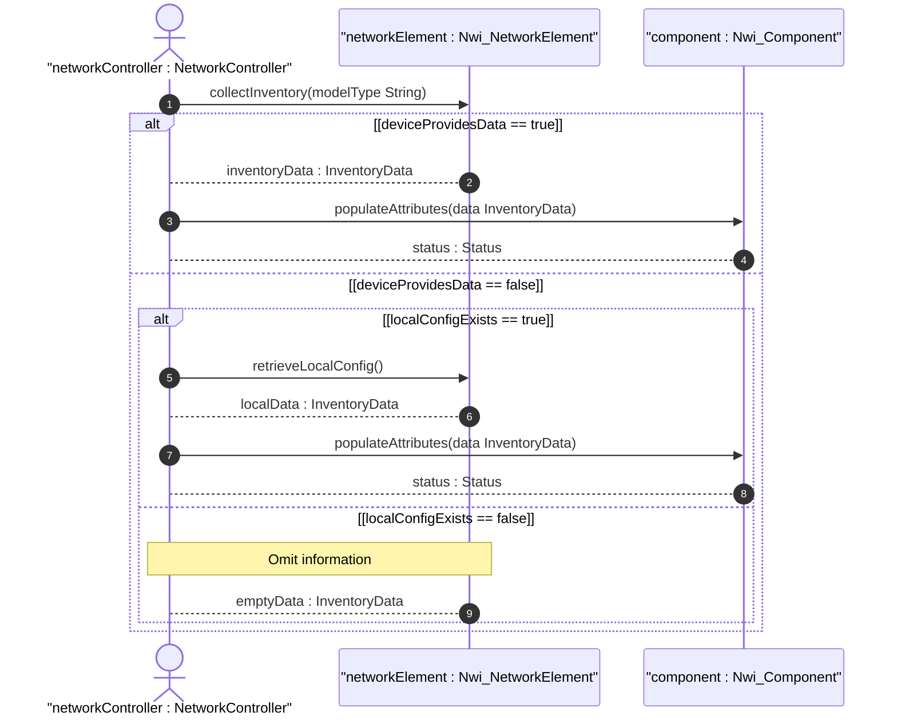

# User Story: Device-level Inventory Collection

## Parent Epic
- [ ] #TBD - [Network Inventory](https://github.com/gintatkinson/digital-pipeline-repo/blob/main/docs/epics/epic-03-network-inventory.md) (Organizes structural data for inventory)

## Domain Object Mapping
- **Primary Domain Objects:** Nwi_NetworkElement, Nwi_Component
- **Actor/Role:** NetworkController

## BDD Scenario (OOA/OOD Realization)
**Given** physical network elements are deployed in the network
**When** the Network Controller initiates an inventory collection using device-supported models
**Then** the hardware and software inventory data is collected and mapped to network-element and component records
**And** any information not provided by the device is omitted unless known via local configuration

## UML Sequence Diagram

## Operational Context
"For example, the network controller can collect this information by reading it from the devices using the device model supported by the devices. This model does not constraint the device models used on the device: the YANG data model defined in [RFC8348] is an option but other options (e.g., vendor specific interfaces or YANG data models) are also allowed. In case some information is not provided by the device, the network controller SHALL omit this information unless this information is known by other sources of information (e.g., through local configuration within the network controller)."

## Required Features Matrix
- [ ] #TBD - [Network Elements](https://github.com/gintatkinson/digital-pipeline-repo/blob/main/docs/features/feat-15-network-elements.md) (Provides the base structural model for storing collected network element data)
- [ ] #TBD - [Components](https://github.com/gintatkinson/digital-pipeline-repo/blob/main/docs/features/feat-16-components.md) (Provides the structural model for hardware and software attributes collected from the device)

## Source References
Structural Schema: [ietf-network-inventory.yang](https://datatracker.ietf.org/doc/html/draft-ietf-ivy-network-inventory-yang)
Normative Specification: [draft-ietf-ivy-network-inventory-yang.txt](https://datatracker.ietf.org/doc/html/draft-ietf-ivy-network-inventory-yang)
