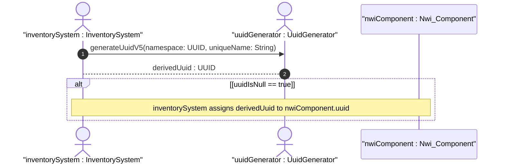
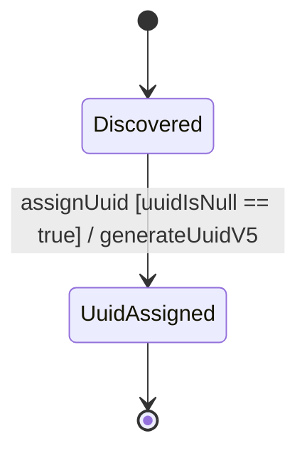

# User Story: Component UUID v5 Derivation

## Parent Epic
- [ ] #TBD - [Network Inventory](https://github.com/gintatkinson/digital-pipeline-repo/blob/main/docs/epics/epic-03-network-inventory.md) (Derives unique identifiers for inventory structure)

## Domain Object Mapping
- **Primary Domain Objects:** Nwi_Component
- **Actor/Role:** Inventory System

## BDD Scenario (OOA/OOD Realization)
**Given** a newly discovered component that lacks a natively assigned UUID
**When** the component is ingested into the network inventory
**Then** a UUID v5 is derived and assigned using a namespace UUID and the component's unique identification parameters

## UML Sequence Diagram

## UML State Machine Diagram

## Operational Context
The Universally Unique Identifier (UUID) of the inventory object, assigned by the server. Such identifiers are widely implemented with systems and guaranteed to be globally unique. If no value is discovered, the server MAY set the value of this node to a locally unique value in the operational state.

## Required Features Matrix
- [ ] #TBD - [Components](https://github.com/gintatkinson/digital-pipeline-repo/blob/main/docs/features/feat-16-components.md) (Requires UUID derivation for component identities)

## Source References
Structural Schema: [ietf-network-inventory.yang](file:///Users/perkunas/jail/3dgs-032/schema/ietf-network-inventory.yang)
Normative Specification: [draft-ietf-ivy-network-inventory-yang](file:///Users/perkunas/jail/3dgs-032/docs/draft-ietf-ivy-network-inventory-yang.txt)
